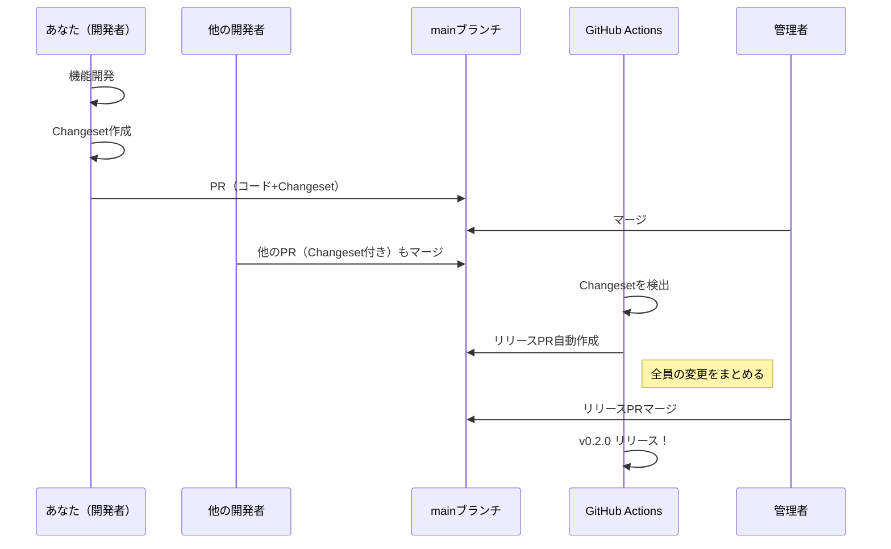
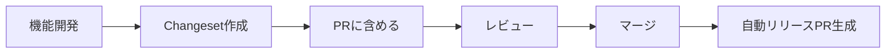
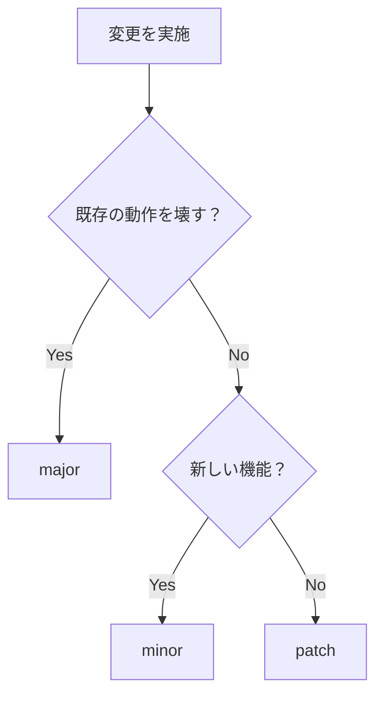

# Changeset開発者ガイド

## 1. はじめに理解すること

### 1.1 リリースの仕組み（3行で）

1. **あなた（開発者）**: 機能開発時にChangesetを作成してPRに含める
2. **GitHub Actions**: Changesetを集めてリリースPRを自動作成
3. **管理者**: リリースPRをマージしてリリース実行

### 1.2 全体の流れ



## 2. Changesetとは

Changesetは、あなたが行った変更の「リリース予約票」です。これを作成しておくと、次回のリリースに自動的に含まれます。

## 3. いつChangesetを作成するか

### ✅ Changesetが必要な場合

- **新機能の追加**
- **バグ修正**
- **パフォーマンス改善**
- **破壊的変更**
- **ドキュメントの大幅な更新**（ユーザーに影響がある場合）

### ❌ Changesetが不要な場合

- **内部的なリファクタリング**（ユーザーから見て変化なし）
- **開発環境の設定変更**
- **テストの追加・修正**（機能自体に変更なし）
- **タイポ修正**（軽微なもの）
- **コメントの追加・修正**

## 4. 開発フロー

### 4.1 基本的な流れ



### 4.2 具体的な手順

#### Step 1: ブランチを作成して開発

```bash
# フィーチャーブランチを作成
git checkout -b feature/add-dark-mode

# 開発作業を実施
# ... コードを編集 ...

# 変更を確認
git status
git diff
```

#### Step 2: Changesetを作成

```bash
# 対話式でChangesetを作成
pnpm changeset:add

# または短縮形
pnpm changeset
```

対話式プロンプトで以下を選択：

1. **影響を受けるパッケージを選択**

   ```text
   🦋 Which packages would you like to include?
   → nextjs-boilerplate を選択（スペースで選択、エンターで確定）
   ```

2. **バージョンタイプを選択**

   ```text
   🦋 Which packages should have a major bump?
   → major変更があれば選択（通常はスキップ）

   🦋 Which packages should have a minor bump?
   → 新機能の場合は選択

   🦋 The following packages will be patch bumped:
   → バグ修正の場合は自動的にpatch
   ```

3. **変更内容を記述**

   ```text
   🦋 Please enter a summary for this change
   → ユーザー視点で変更内容を記述（日本語OK）

   例: "ダークモードの切り替え機能を追加"
   ```

#### Step 3: 生成されたファイルを確認

```bash
# 生成されたChangesetファイルを確認
ls .changeset/
# 例: fuzzy-lions-eat.md のようなランダムな名前

# 内容を確認
cat .changeset/fuzzy-lions-eat.md
```

生成されるファイルの例：

```markdown
---
'nextjs-boilerplate': minor
---

ダークモードの切り替え機能を追加
```

#### Step 4: コミットしてPRを作成

```bash
# Changesetを含めてコミット
git add .
git commit -m "feat: add dark mode support with changeset"

# プッシュしてPRを作成
git push origin feature/add-dark-mode
```

## 5. バージョンタイプの選び方

### Semantic Versioning (X.Y.Z)

| タイプ    | バージョン変更 | 使用場面   | 例                                      |
| --------- | -------------- | ---------- | --------------------------------------- |
| **major** | X.0.0          | 破壊的変更 | APIの削除、引数の変更、動作の大幅な変更 |
| **minor** | 0.X.0          | 新機能追加 | 新しいコンポーネント、新しいオプション  |
| **patch** | 0.0.X          | バグ修正   | エラー修正、タイポ修正、小さな改善      |

### 判断フローチャート



## 6. 良いChangeset メッセージの書き方

### ✅ 良い例

```markdown
---
'nextjs-boilerplate': minor
---

ダークモードのサポートを追加

- ヘッダーにトグルボタンを配置
- システム設定と連動するオプションを追加
- LocalStorageで設定を永続化
```

### ❌ 悪い例

```markdown
---
'nextjs-boilerplate': minor
---

コード修正
```

### ポイント

1. **ユーザー視点で記述**
   - ❌ "DarkModeContext.tsxを追加"
   - ✅ "ダークモード機能を追加"

2. **変更の影響を明確に**
   - ❌ "バグ修正"
   - ✅ "ダークモード切り替え時の画面ちらつきを修正"

3. **簡潔かつ具体的に**
   - 1行目：変更の要約
   - 2行目以降：詳細（必要に応じて）

## 7. 複数の変更を含むPRの場合

### 複数のChangesetを作成

異なる種類の変更は別々のChangesetとして作成：

```bash
# 1つ目: 新機能
pnpm changeset
# → minor: ダークモード機能を追加

# 2つ目: バグ修正
pnpm changeset
# → patch: ナビゲーションメニューの表示崩れを修正
```

## 8. Changesetの修正

### 作成済みのChangesetを編集

```bash
# .changeset内のMarkdownファイルを直接編集
vim .changeset/fuzzy-lions-eat.md
```

### Changesetを削除

```bash
# 不要なChangesetファイルを削除
rm .changeset/fuzzy-lions-eat.md
```

## 9. CI/CDとの連携

### PRマージ後の流れ

1. **mainブランチへマージ**
   - あなたのChangesetがmainブランチに含まれる

2. **自動リリースPR作成**
   - GitHub Actionsが全てのChangesetを集約
   - バージョン番号を計算
   - CHANGELOGを生成
   - リリースPRを自動作成

3. **リリース実行**
   - リリース管理者がPRを承認・マージ
   - 自動的にタグ作成とGitHub Release生成

## 10. よくある質問

### Q: Changesetを忘れてマージしてしまった

A: 後から追加可能です：

```bash
# mainから新しいブランチを作成
git checkout main
git pull
git checkout -b add-missing-changeset

# Changesetを追加
pnpm changeset

# PRを作成してマージ
```

### Q: バージョンタイプを間違えた

A: マージ前なら`.changeset`内のファイルを編集：

```yaml
---
'nextjs-boilerplate': patch # ← ここを修正
---
```

### Q: 空のChangesetを作成したい

A: リリース不要な変更の場合：

```bash
pnpm changeset --empty
```

## 11. チェックリスト

PR作成前の確認事項：

- [ ] 変更はユーザーに影響するか？
  - Yes → Changeset必要
  - No → Changeset不要
- [ ] Changesetのバージョンタイプは適切か？
  - 破壊的変更 → major
  - 新機能 → minor
  - バグ修正 → patch
- [ ] Changesetのメッセージは分かりやすいか？
  - ユーザー視点で記述されているか
  - 変更内容が明確か
- [ ] `pnpm release:check`でエラーが出ないか？

## 12. トラブルシューティング

### エラー: "No changesets found"

```bash
# Changesetの状態を確認
pnpm release:check

# Changesetを追加
pnpm changeset
```

### エラー: "Some packages have been changed but no changesets were found"

パッケージに変更があるのにChangesetがない場合のエラー。以下のいずれかで対処：

1. Changesetを追加する
2. 空のChangesetを追加する（リリース不要な変更の場合）

```bash
pnpm changeset --empty
```

## 13. 参考リンク

- [Changesets公式ドキュメント](https://github.com/changesets/changesets)
- [セマンティックバージョニング](https://semver.org/lang/ja/)
- [プロジェクトのリリース自動化システム設計書](./release-automation-system.md)

---

_最終更新: 2025年1月13日_
_バージョン: 1.0.0_
