# リリース自動化システム設計書

## 1. システム概要

### 1.1 基本的な仕組み

このシステムは、**開発者**、**GitHub Actions**、**プロジェクト管理者**の3者が協調して動作する自動リリースシステムです。

#### 登場人物と役割

| 登場人物               | 役割                    | 必要な作業                                   |
| ---------------------- | ----------------------- | -------------------------------------------- |
| **開発者**             | 機能開発とChangeset作成 | Changesetファイルを作成してPRに含める        |
| **GitHub Actions**     | 自動化処理              | リリースPR作成、バージョン計算、リリース実行 |
| **プロジェクト管理者** | リリース判断            | リリースPRをレビューしてマージ               |

### 1.2 リリースフローの全体像

```mermaid
sequenceDiagram
    participant Dev as 開発者
    participant Main as mainブランチ
    participant GHA as GitHub Actions
    participant Manager as プロジェクト管理者
    participant Release as リリース

    Note over Dev,Release: 日常の開発フェーズ（繰り返し）
    Dev->>Dev: 機能開発
    Dev->>Dev: pnpm changeset:add でChangeset作成
    Dev->>Main: PR作成（コード + Changeset）
    Manager->>Main: PRレビュー & マージ
    Main->>Main: Changesetが蓄積される

    Note over Dev,Release: リリース準備フェーズ（自動）
    GHA->>GHA: mainブランチ監視
    GHA->>GHA: Changesetを検出
    GHA->>Main: リリースPRを自動作成/更新
    Note right of GHA: ・バージョン番号計算<br/>・CHANGELOG生成<br/>・Changeset統合

    Note over Dev,Release: リリース実行フェーズ（管理者判断）
    Manager->>Manager: リリースPR確認
    Manager->>Manager: リリースタイミング判断
    Manager->>Main: リリースPRマージ
    GHA->>Release: タグ作成
    GHA->>Release: GitHub Release作成
    GHA->>Release: アセットアップロード
```



### 1.3 重要なポイント

#### 🔄 **Changesetは「リリース予約票」**

- 開発者が作成するChangesetは、次回リリースに含めたい変更の記録
- 複数のChangesetが蓄積され、まとめてリリースされる

#### 🤖 **リリースPRは自動生成**

- 人間がバージョン番号を考える必要なし
- CHANGELOGも自動生成
- 複数の変更を1つのリリースにまとめる

#### 👤 **最終判断は人間**

- リリースPRのマージ = リリース実行のトリガー
- タイミングは管理者が制御（金曜夕方を避ける等）

### 1.4 具体例で理解する

```text
月曜日: 開発者A「ダークモード追加」→ Changeset付きPR → マージ
火曜日: 開発者B「バグ修正」→ Changeset付きPR → マージ
水曜日: 開発者C「性能改善」→ Changeset付きPR → マージ

木曜日: GitHub Actions「リリースPR作成しました（v0.2.0予定）」
        内容: 3つの変更をまとめたCHANGELOG

金曜日: 管理者「今日はやめておこう」→ 何もしない

月曜日: 管理者「よし、リリースしよう」→ リリースPRマージ
        → v0.2.0 リリース完了！
```

## 2. アーキテクチャ

### 2.1 コンポーネント構成

```mermaid
graph TB
    subgraph "開発フロー"
        A[開発者] --> B[Changeset作成]
        B --> C[PRマージ]
    end

    subgraph "GitHub Actions"
        C --> D[release.yml]
        D --> E{変更検出}
        E -->|changesetあり| F[リリースPR作成]
        E -->|手動トリガー| G[バージョンバンプ]
        F --> H[PRマージ]
        H --> I[リリース実行]
        G --> I
    end

    subgraph "リリース処理"
        I --> J[GitHub Release作成]
        I --> K[アーティファクトアップロード]
        I --> L[メトリクス生成]
        I --> M[通知送信]
        J --> N[古いリリース削除]
    end
```



### 2.2 使用技術

- **Changesets**: バージョン管理とCHANGELOG生成
- **GitHub Actions**: CI/CDパイプライン
- **GitHub CLI (gh)**: GitHub APIの操作
- **Bash Scripts**: 自動化スクリプト

## 3. ワークフロー詳細

### 3.1 リリースワークフロー (release.yml)

#### トリガー条件

```yaml
on:
  push:
    branches: [main] # mainブランチへのプッシュ
  workflow_dispatch: # 手動実行
    inputs:
      version: # バージョンタイプ選択
        type: choice
        options: [patch, minor, major]
      prerelease: # プレリリース識別子
        type: choice
        options: ['', beta, alpha, rc]
```

#### ジョブ構成

1. **check-changes**: Changesetの存在確認とリリース条件判定
2. **release**: リリースPR作成またはリリース実行
3. **cleanup**: 古いプレリリースの削除

### 3.2 処理フロー

#### 3.2.1 自動リリースフロー（Changesets経由）

```text
1. 開発者がchangesetを作成
   └─ pnpm changeset:add

2. mainブランチへマージ
   └─ GitHub Actions起動

3. Changesetの検出
   └─ scripts/ci/check-changesets.sh

4. リリースPR自動作成
   └─ changesets/action@v1

5. リリースPR承認・マージ

6. タグ作成とGitHub Release生成
   └─ scripts/ci/create-github-release.sh
```

#### 3.2.2 手動リリースフロー（workflow_dispatch）

```text
1. GitHub Actions UIから手動実行
   └─ バージョンタイプとプレリリースを選択

2. バージョンバンプ実行
   └─ scripts/ci/manual-version-bump.sh

3. 自動コミットとタグ作成

4. GitHub Release生成
   └─ scripts/ci/create-github-release.sh
```

## 4. スクリプト詳細

### 4.1 主要スクリプト一覧

| スクリプト名                  | 用途                              | 実行タイミング      |
| ----------------------------- | --------------------------------- | ------------------- |
| `check-changesets.sh`         | Changesetの存在確認とリリース判定 | ワークフロー開始時  |
| `manual-version-bump.sh`      | 手動バージョンアップ処理          | workflow_dispatch時 |
| `create-github-release.sh`    | GitHub Release作成                | リリース実行時      |
| `cleanup-old-prereleases.sh`  | 古いプレリリース削除              | リリース完了後      |
| `generate-release-metrics.sh` | リリースメトリクス生成            | リリース実行時      |
| `upload-build-artifacts.sh`   | ビルド成果物アップロード          | リリース実行時      |
| `update-changeset-config.sh`  | Changeset設定の動的更新           | ワークフロー実行時  |

### 4.2 check-changesets.sh

**概要**: Changesetの存在確認とリリース実行条件の判定

**出力**:

- `has-changesets`: Changesetが存在するか（true/false）
- `should-release`: リリースを実行すべきか（true/false）

**判定ロジック**:

```bash
# Changesetの存在確認
find .changeset -name '*.md' ! -name 'README.md'

# リリース条件
# 1. workflow_dispatch イベント
# 2. タグプッシュ (v* パターン)
```

### 4.3 manual-version-bump.sh

**概要**: 手動リリース時のバージョン更新処理

**処理内容**:

1. 現在のバージョン取得
2. Changeset作成（create-changeset.sh呼び出し）
3. バージョン更新（changeset version実行）
4. Gitコミットとタグ作成
5. リモートへプッシュ

### 4.4 create-github-release.sh

**概要**: GitHub Releaseの作成とリリースノート生成

**機能**:

- CHANGELOGからリリースノート抽出
- プレリリースフラグのサポート
- GitHub CLI (gh) を使用したRelease作成

**リリースノート抽出ロジック**:

```bash
# CHANGELOGから該当バージョンのセクションを抽出
awk -v version="$VERSION" '
  /^## / {
    if ($2 == version) { found = 1; next }
    else if (found) { exit }
  }
  found { print }
' CHANGELOG.md
```

### 4.5 cleanup-old-prereleases.sh

**概要**: 古いプレリリースバージョンの自動削除

**主要機能**:

- ページネーション対応のリリース取得
- 設定可能な保持期間（デフォルト30日）
- 最新N件の保持（デフォルト5件）
- ドライラン機能
- 対話的確認プロンプト

**オプション**:

```bash
--dry-run    # 削除対象の確認のみ（実際には削除しない）
--days N     # N日より古いリリースを削除（デフォルト: 30）
--keep N     # 最新N件は保持（デフォルト: 5）
--force      # 確認プロンプトをスキップ
```

**削除対象の判定条件**:

1. プレリリースである（prerelease: true）
2. ドラフトでない（draft: false）
3. 作成日が指定日数より古い
4. 最新N件より古い
5. セマンティックバージョニングのプレリリースパターンに一致
   - 例: `v1.0.0-beta.1`, `v2.0.0-alpha.3`

### 4.6 generate-release-metrics.sh

**概要**: リリース時のメトリクス収集と記録

**収集メトリクス**:

- バージョン番号
- リリース日時
- コミットSHA
- ビルド時間
- バンドルサイズ
- テストカバレッジ

**出力先**:

- `release-metrics.json`: メトリクスデータ
- GitHub Step Summary: UI表示用サマリー

## 5. Changesets設定

### 5.1 設定ファイル構成

**.changeset/config.json**:

```json
{
  "changelog": [
    "@changesets/changelog-github",
    {
      "repo": "WILL_BE_AUTO_REPLACED"
    }
  ],
  "commit": false, // 自動コミット無効（GitHub Actionsで制御）
  "access": "restricted", // プライベートパッケージ
  "baseBranch": "main"
}
```

### 5.2 動的設定更新

`update-changeset-config.sh`により、実行時にリポジトリ名を動的に設定:

- `"WILL_BE_AUTO_REPLACED"`というプレースホルダー値を`GITHUB_REPOSITORY`環境変数で自動置換
- この値は手動で設定する必要はなく、GitHub Actions実行時に自動的に正しい値に更新される
- フォーク時やボイラープレート利用時も自動で対応

## 6. パッケージ設定

### 6.1 package.json スクリプト

```json
{
  "scripts": {
    "changeset": "changeset",
    "changeset:add": "changeset add",
    "changeset:version": "changeset version",
    "changeset:publish": "changeset publish",
    "release": "pnpm build && pnpm changeset:publish",
    "release:check": "changeset status --verbose"
  }
}
```

### 6.2 依存関係

- `@changesets/cli`: ^2.29.5
- `@changesets/changelog-github`: ^0.5.1

## 7. セキュリティと権限

### 7.1 GitHub Actions権限

```yaml
permissions:
  contents: write # リリース作成、タグプッシュ
  pull-requests: write # PR作成、コメント投稿
  issues: write # Issue操作
  packages: write # パッケージ公開（将来対応）
```

### 7.2 トークン管理

- `GITHUB_TOKEN`: GitHub Actionsデフォルトトークン使用
- 追加の認証情報は不要（GitHub CLIが自動認証）

## 8. エラーハンドリング

### 8.1 スクリプトエラー処理

全スクリプトで以下を実装:

```bash
set -euo pipefail  # エラー時即座に終了
```

### 8.2 リトライ戦略

- API呼び出し: 0.5秒の遅延を挟んでレート制限回避
- ページネーション: 最大50ページまで取得

### 8.3 フォールバック

- CHANGELOGが存在しない場合: デフォルトメッセージ使用
- メトリクス取得失敗時: "N/A"表示

## 9. 運用ガイドライン

### 9.1 日常的なリリース作業

#### 開発者の作業

1. **機能開発完了時**:

   ```bash
   # Changesetを作成
   pnpm changeset:add

   # 変更タイプを選択（patch/minor/major）
   # 変更内容を記述
   ```

2. **PRにChangesetを含めてマージ**

#### リリース管理者の作業

1. **リリースPRの確認**:
   - 自動生成されたPRをレビュー
   - CHANGELOGの内容確認
   - バージョン番号の妥当性確認

2. **リリース実行**:
   - リリースPRをマージ → 自動でリリース完了

### 9.2 緊急リリース手順

1. GitHub Actions → Release workflow → Run workflow
2. バージョンタイプ選択（patch/minor/major）
3. プレリリース識別子選択（必要に応じて）
4. 実行 → 自動でリリース完了

### 9.3 プレリリース運用

#### ベータ版リリース例

```bash
# プレリリースモード開始
pnpm changeset pre enter beta

# 変更を追加
pnpm changeset:add

# バージョン更新
pnpm changeset:version

# プレリリースモード終了
pnpm changeset pre exit
```

### 9.4 メンテナンス作業

#### 古いプレリリースのクリーンアップ

自動実行されるが、手動実行も可能:

```bash
# ドライラン（確認のみ）
./scripts/ci/cleanup-old-prereleases.sh --dry-run

# 7日以上古いものを削除
./scripts/ci/cleanup-old-prereleases.sh --days 7

# 最新3件のみ保持
./scripts/ci/cleanup-old-prereleases.sh --keep 3
```

## 10. トラブルシューティング

### 10.1 よくある問題と対処法

| 問題                     | 原因                  | 対処法                          |
| ------------------------ | --------------------- | ------------------------------- |
| リリースPRが作成されない | Changesetが存在しない | `.changeset/`ディレクトリを確認 |
| バージョンが更新されない | Changeset設定エラー   | config.jsonの設定確認           |
| GitHub Release作成失敗   | 権限不足              | GitHub Actions権限設定確認      |
| プレリリース削除失敗     | APIレート制限         | 時間を置いて再実行              |

### 10.2 デバッグ方法

1. **GitHub Actions ログ確認**:
   - 各ステップの詳細ログを展開
   - エラーメッセージの確認

2. **ローカルでのスクリプトテスト**:

   ```bash
   # 環境変数を設定してテスト
   export GITHUB_REPOSITORY="owner/repo"
   export GITHUB_TOKEN="your-token"
   ./scripts/ci/check-changesets.sh
   ```

3. **Changesets状態確認**:
   ```bash
   pnpm release:check
   ```

## 11. 参考資料

### 外部ドキュメント

- [Changesets公式ドキュメント](https://github.com/changesets/changesets)
- [GitHub Actions ドキュメント](https://docs.github.com/en/actions)
- [GitHub CLI (gh) リファレンス](https://cli.github.com/manual/)
- [セマンティックバージョニング](https://semver.org/lang/ja/)

### 関連ファイル

- `.github/workflows/release.yml`: リリースワークフロー定義
- `.changeset/config.json`: Changesets設定
- `scripts/ci/`: 自動化スクリプト群
- `docs/work_dir/release-automation-guide.md`: ユーザー向けガイド
- `docs/work_dir/github_actions_ci_design.md`: CI/CD設計書

---

_最終更新: 2025年8月13日_
_バージョン: 1.0.0_
