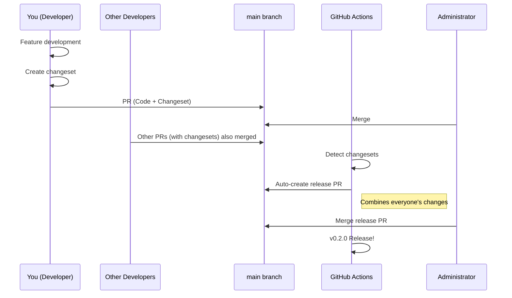
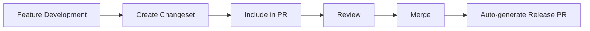
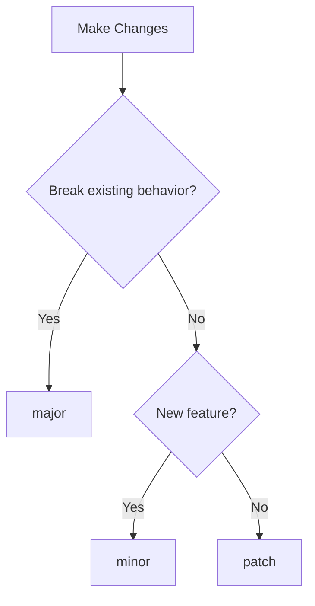

# Changeset Developer Guide

## 1. What You Need to Understand First

### 1.1 Release Mechanism (In 3 Lines)

1. **You (Developer)**: Create changesets during feature development and include them in PRs
2. **GitHub Actions**: Automatically collect changesets and create release PRs
3. **Administrator**: Merge release PRs to execute releases

### 1.2 Overall Flow



## 2. What is a Changeset

A changeset is a "release reservation ticket" for the changes you made. By creating this, your changes will be automatically included in the next release.

## 3. When to Create Changesets

### ✅ Changeset Required

- **Adding new features**
- **Bug fixes**
- **Performance improvements**
- **Breaking changes**
- **Major documentation updates** (when affecting users)

### ❌ Changeset Not Required

- **Internal refactoring** (no visible changes to users)
- **Development environment configuration changes**
- **Adding/modifying tests** (no changes to functionality itself)
- **Typo fixes** (minor ones)
- **Adding/modifying comments**

## 4. Development Flow

### 4.1 Basic Flow



### 4.2 Specific Steps

#### Step 1: Create Branch and Develop

```bash
# Create feature branch
git checkout -b feature/add-dark-mode

# Perform development work
# ... edit code ...

# Check changes
git status
git diff
```

#### Step 2: Create Changeset

```bash
# Create changeset interactively
pnpm changeset:add

# Or shorthand
pnpm changeset
```

Select the following in interactive prompts:

1. **Select affected packages**

   ```text
   🦋 Which packages would you like to include?
   → Select nextjs-boilerplate (space to select, enter to confirm)
   ```

2. **Select version type**

   ```text
   🦋 Which packages should have a major bump?
   → Select if there are major changes (usually skip)

   🦋 Which packages should have a minor bump?
   → Select for new features

   🦋 The following packages will be patch bumped:
   → Automatically patch for bug fixes
   ```

3. **Describe changes**

   ```text
   🦋 Please enter a summary for this change
   → Describe changes from user perspective (Japanese OK)

   Example: "Add dark mode toggle functionality"
   ```

#### Step 3: Check Generated Files

```bash
# Check generated changeset files
ls .changeset/
# Example: random name like fuzzy-lions-eat.md

# Check contents
cat .changeset/fuzzy-lions-eat.md
```

Example of generated file:

```markdown
---
'nextjs-boilerplate': minor
---

Add dark mode toggle functionality
```

#### Step 4: Commit and Create PR

```bash
# Commit including changeset
git add .
git commit -m "feat: add dark mode support with changeset"

# Push and create PR
git push origin feature/add-dark-mode
```

## 5. How to Choose Version Types

### Semantic Versioning (X.Y.Z)

| Type      | Version Change | Use Case           | Example                                           |
| --------- | -------------- | ------------------ | ------------------------------------------------- |
| **major** | X.0.0          | Breaking changes   | API removal, argument changes, major behavior changes |
| **minor** | 0.X.0          | New features       | New components, new options                       |
| **patch** | 0.0.X          | Bug fixes          | Error fixes, typo fixes, small improvements      |

### Decision Flowchart



## 6. How to Write Good Changeset Messages

### ✅ Good Examples

```markdown
---
'nextjs-boilerplate': minor
---

Add dark mode support

- Place toggle button in header
- Add option to sync with system settings
- Persist settings in LocalStorage
```

### ❌ Bad Examples

```markdown
---
'nextjs-boilerplate': patch
---

Fix stuff
```

### Writing Guidelines

1. **Use user perspective**: Describe what users will experience
2. **Be specific**: Explain what exactly was changed
3. **Use bullet points**: For multiple changes, use clear bullet points
4. **Avoid technical jargon**: Keep it accessible to non-developers

## 7. Common Patterns

### New Feature

```markdown
---
'nextjs-boilerplate': minor
---

Add user authentication system

- Login/logout functionality
- JWT token management
- Protected route support
- User profile management
```

### Bug Fix

```markdown
---
'nextjs-boilerplate': patch
---

Fix form validation error messages not displaying correctly

Previously, validation errors would not appear in form fields.
Now all validation errors are properly displayed to users.
```

### Breaking Change

```markdown
---
'nextjs-boilerplate': major
---

BREAKING: Update API response format

- All API responses now use camelCase instead of snake_case
- Update your client code to handle the new format
- Migration guide available in documentation
```

## 8. FAQ

### Q: What if I forget to create a changeset?

A: You can create a changeset separately and submit it as another PR before the release.

### Q: Can I modify a changeset after creation?

A: Yes, you can edit the `.changeset/*.md` files directly before merging.

### Q: What if multiple developers work on the same feature?

A: Each developer should create their own changeset. They will be combined automatically during release.

### Q: How do I handle dependencies between changes?

A: All changesets in the same release will be included together, so dependencies are handled automatically.

## 9. Troubleshooting

### Problem: `pnpm changeset` command not found

**Solution:**
```bash
# Install changesets CLI
pnpm install -g @changesets/cli

# Or use npx
npx changeset
```

### Problem: Changeset not appearing in release PR

**Causes:**
- Changeset not committed to main branch
- Changeset file format is incorrect

**Solution:**
- Verify changeset file exists in `.changeset/` directory
- Check file format matches examples above

### Problem: Wrong version bump applied

**Solution:**
- Edit the changeset file directly
- Change the version type in the frontmatter

## 10. Related Documentation

- [GitHub Release Automation](../infrastructure/release-automation-system.en.md)
- [Semantic Versioning](https://semver.org/)
- [Changesets Documentation](https://github.com/changesets/changesets)