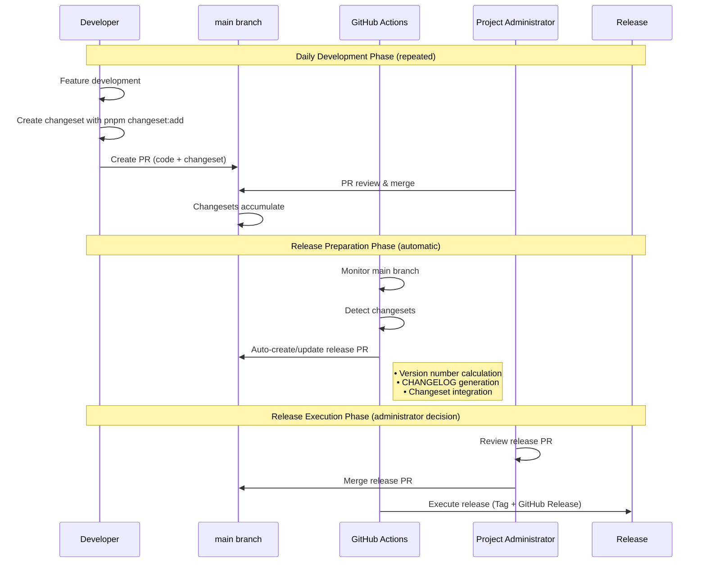
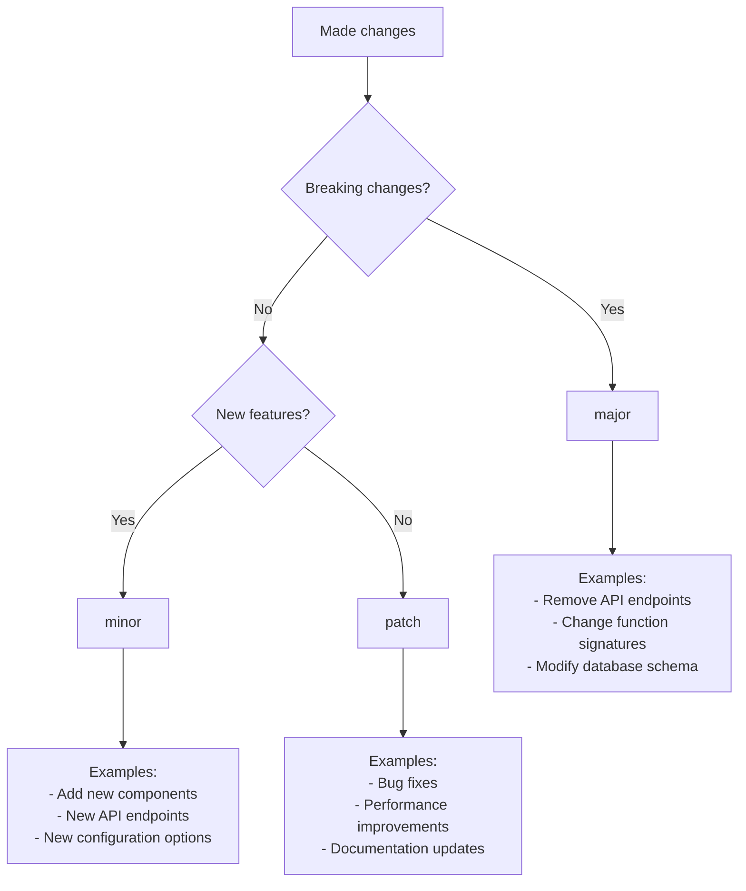

# Release Automation System Design Document

## 1. Introduction - Problems This System Solves

### Challenges of Traditional Release Work

Release work typically required the following manual tasks:

- Manually deciding version numbers (0.1.0 → 0.2.0? 0.1.1?)
- Manually writing CHANGELOG (collecting who changed what)
- Manually creating Git tags
- Manually creating GitHub Releases

These tasks were **tedious, error-prone, and person-dependent**.

### Solutions This System Provides

This system **almost fully automates** these tasks:

- Developers only need to add a small memo called "Changeset" to their changes
- Everything else is automatically handled for version management and releases
- Administrators only need to make the final "release/don't release" decision

## 2. Basic System Concepts

### 2.1 Most Important Understanding: Two Types of PRs

This system has **two types of PRs (Pull Requests)**:

| PR Type           | Creator                | Content                    | When Merged                                    |
| ----------------- | ---------------------- | -------------------------- | ---------------------------------------------- |
| **Development PR** | Developer (human)      | Code changes + Changeset   | Code is reflected in main (**not released yet**) |
| **Release PR**     | GitHub Actions (auto)  | Version update + CHANGELOG | **Actually released**                          |

This distinction is most important. **Merging a development PR does not trigger a release**.

### 2.2 What is a Changeset

**Changeset = Description document for changes to include in the next release**

```
Example: You add a "dark mode feature".
1. Write code
2. Create changeset (record "Added dark mode feature")
3. Create PR (code + changeset)
4. Merge → Code is reflected but not released yet
```

### 2.3 Why Not Release Immediately

**Reason: To bundle multiple changes for planned releases**

```
Monday: Person A "Add feature X" → Merge (still v0.1.0)
Tuesday: Person B "Fix bug" → Merge (still v0.1.0)
Wednesday: Person C "Add feature Y" → Merge (still v0.1.0)

Thursday: "Release PR" automatically created
          "Would you like to release these 3 changes as v0.2.0?"

Friday: Administrator merges release PR → v0.2.0 released!
```

If released immediately, versions would become too granular: v0.1.1, v0.1.2, v0.1.3...

## 3. System Operation Flow

### 3.1 Actors and Roles

| Actor                    | Role                        | Required Work                               |
| ------------------------ | --------------------------- | ------------------------------------------- |
| **Developer**            | Feature development & Changeset creation | Create changeset files and include in PR |
| **GitHub Actions**       | Automation processing       | Release PR creation, version calculation, release execution |
| **Project Administrator** | Release decisions           | Review and merge release PRs               |

### 3.2 Overall Release Flow



### 3.3 Detailed Phase Description

#### Phase 1: Daily Development (Developer Work)

**What Happens**:
1. Developer develops features/fixes bugs
2. Developer creates changeset describing the change
3. Developer creates PR including code + changeset
4. Administrator reviews and merges PR

**Key Point**: **Merging development PR ≠ Release**. It just accumulates changesets.

#### Phase 2: Release Preparation (Automated)

**What Happens**:
1. GitHub Actions detects accumulated changesets
2. Automatically calculates new version number
3. Generates CHANGELOG from changeset content
4. Creates/updates "Release PR"

**Automation Benefits**: No manual version number decisions or CHANGELOG writing needed.

#### Phase 3: Release Execution (Administrator Decision)

**What Happens**:
1. Administrator reviews release PR content
2. Administrator decides release timing and merges PR
3. GitHub Actions automatically executes release

**Administrator Control**: Final release timing remains under human control.

## 4. Technical Implementation Details

### 4.1 Changeset File Format

**Location**: `.changeset/[random-name].md`

**Format Example**:

```markdown
---
'nextjs-boilerplate': minor
---

Add dark mode toggle feature

- Add theme toggle button in header
- Implement system preference detection
- Add localStorage persistence
```

**File Structure**:
- **Frontmatter**: Version type specification (`major` | `minor` | `patch`)
- **Body**: User-friendly change description

### 4.2 Version Calculation Rules

**Semantic Versioning (X.Y.Z)**:

| Change Type | Version Impact | Example                    |
| ----------- | -------------- | -------------------------- |
| `major`     | X.0.0          | Breaking changes           |
| `minor`     | 0.X.0          | New features               |
| `patch`     | 0.0.X          | Bug fixes                  |

**Calculation Algorithm**:
```
Multiple changesets → Take highest impact
patch + minor + patch → minor version up
major + anything → major version up
```

### 4.3 GitHub Actions Configuration

**Workflow File**: `.github/workflows/release.yml`

**Key Components**:

```yaml
name: Release
on:
  push:
    branches: [main]

jobs:
  release:
    runs-on: ubuntu-latest
    steps:
      - uses: actions/checkout@v4
      
      - name: Create Release Pull Request
        uses: changesets/action@v1
        with:
          publish: pnpm release
        env:
          GITHUB_TOKEN: ${{ secrets.GITHUB_TOKEN }}
          NPM_TOKEN: ${{ secrets.NPM_TOKEN }}
```

### 4.4 Release PR Content

**Automatically Generated Content**:

1. **package.json version update**
2. **CHANGELOG.md generation**
3. **Changeset file cleanup**

**Example Release PR**:

```markdown
# Release v0.2.0

## Changes
- Add dark mode feature (@developer1)
- Fix login bug (@developer2)
- Improve performance (@developer3)

## Package Changes
- nextjs-boilerplate: 0.1.0 → 0.2.0
```

## 5. Developer Workflow Guide

### 5.1 Basic Development Flow

```bash
# 1. Create feature branch
git checkout -b feature/dark-mode

# 2. Develop feature
# ... code changes ...

# 3. Create changeset
pnpm changeset:add
# Interactive prompt will guide you through:
# - Select packages (nextjs-boilerplate)
# - Choose version type (patch/minor/major)
# - Write description

# 4. Commit everything
git add .
git commit -m "feat: add dark mode support"

# 5. Create PR
git push origin feature/dark-mode
# Create PR on GitHub including changeset
```

### 5.2 Changeset Creation Guidelines

**Good Changeset Examples**:

```markdown
---
'nextjs-boilerplate': minor
---

Add user authentication system

- JWT-based login/logout
- Protected route middleware
- User profile management
```

**Bad Changeset Examples**:

```markdown
---
'nextjs-boilerplate': patch
---

Fixed stuff
```

**Writing Guidelines**:
- **Be specific**: Describe what users will experience
- **Use user perspective**: Not technical implementation details
- **Include context**: Why this change was needed

### 5.3 Version Type Decision Guide



## 6. Administrator Workflow Guide

### 6.1 Release PR Review

**What to Check**:

1. **Version Appropriateness**: Does the version bump match the changes?
2. **CHANGELOG Quality**: Are changes clearly described?
3. **Timing**: Is now a good time to release?
4. **Dependencies**: Are all required changes included?

### 6.2 Release Timing Strategies

**Regular Release Schedule**:
```
Weekly releases: Every Friday
Sprint releases: End of each sprint
Emergency releases: Critical bugs only
```

**Release Decision Matrix**:

| Situation | Action |
| --------- | ------ |
| Critical bug fixes | Release immediately |
| Minor features | Wait for weekly schedule |
| Major features | Plan dedicated release |
| Breaking changes | Coordinate with team |

### 6.3 Emergency Release Process

**When Needed**: Critical security vulnerabilities, production-breaking bugs

**Process**:
1. Create hotfix branch from main
2. Apply minimal fix with changeset
3. Create PR and merge immediately
4. Merge release PR as soon as it's created

## 7. Monitoring and Maintenance

### 7.1 Release Health Monitoring

**Key Metrics**:
- Release frequency
- Time from changeset to release
- Number of reverted releases
- Changeset quality scores

**Monitoring Commands**:
```bash
# Check pending changesets
pnpm changeset status

# Verify release readiness
pnpm changeset version --dry-run

# View release history
git tag --sort=-version:refname | head -10
```

### 7.2 Common Issues and Solutions

**Issue**: Release PR not created

**Diagnosis**:
```bash
# Check for changesets
ls .changeset/

# Verify GitHub Actions
gh run list --workflow=release.yml
```

**Solution**: Ensure changesets exist and GitHub Actions have proper permissions.

**Issue**: Version calculation incorrect

**Diagnosis**: Review changeset version types

**Solution**: Edit changeset files manually before merge.

## 8. Advanced Configuration

### 8.1 Custom Release Process

**Custom GitHub Release Content**:

```typescript
// .changeset/config.json
{
  "changelog": [
    "@changesets/changelog-github",
    {
      "repo": "owner/repo",
      "templatePath": "./scripts/release-template.md"
    }
  ]
}
```

### 8.2 Release Hooks

**Pre-release Validation**:

```bash
# scripts/pre-release.sh
#!/bin/bash
echo "Running pre-release checks..."

# Run tests
pnpm test

# Security audit
pnpm audit

# Build verification
pnpm build

echo "Pre-release checks passed!"
```

## 9. Benefits and Best Practices

### 9.1 System Benefits

**For Developers**:
- Focus on code, not release mechanics
- Consistent contribution tracking
- Clear change attribution

**For Project Management**:
- Predictable release process
- Clear change visibility
- Risk reduction through automation

**For Users**:
- Regular, planned releases
- Clear changelog communication
- Stable version progression

### 9.2 Best Practices

**Changeset Creation**:
- Create changesets for every user-facing change
- Write clear, user-focused descriptions
- Choose appropriate version types

**Release Management**:
- Review release PRs thoroughly
- Maintain regular release schedule
- Communicate releases to stakeholders

**Team Coordination**:
- Train team on changeset workflow
- Establish version type guidelines
- Document release decision criteria

## 10. Troubleshooting Guide

### 10.1 Common Scenarios

**Scenario**: Forgot to add changeset

**Solution**:
```bash
# Add changeset separately
pnpm changeset:add
# Create new PR with just the changeset
```

**Scenario**: Wrong version type selected

**Solution**:
```bash
# Edit changeset file directly
vim .changeset/[changeset-file].md
# Update version type in frontmatter
```

**Scenario**: Need to skip CI for documentation

**Solution**: Use `[skip ci]` in commit message for non-code changes.

### 10.2 Emergency Procedures

**Revert Release**:
```bash
# Revert Git tag
git tag -d v1.2.3
git push origin :refs/tags/v1.2.3

# Delete GitHub Release
gh release delete v1.2.3
```

**Hotfix Release**:
```bash
# Create hotfix branch
git checkout -b hotfix/critical-bug main

# Fix and create changeset
pnpm changeset:add

# Fast-track merge and release
```

---

## Summary

This release automation system provides:

1. **Automated Version Management**: No manual version decisions
2. **Collaborative Change Tracking**: Clear attribution and history
3. **Controlled Release Process**: Human oversight with automation benefits
4. **Consistent Documentation**: Automatic CHANGELOG generation
5. **Risk Reduction**: Standardized, tested release process

The system balances automation benefits with human control, ensuring reliable and predictable releases while reducing manual overhead.

---

## Related Documentation

- [Changeset Developer Guide](../development/changeset-developer-guide.en.md) - Detailed changeset usage
- [GitHub Actions Best Practices](./github-actions-best-practices.en.md) - CI/CD workflow design
- [Development Guidelines](../development/development-guidelines.en.md) - General development practices