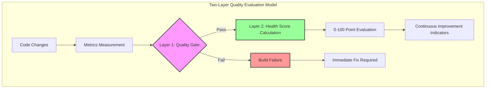
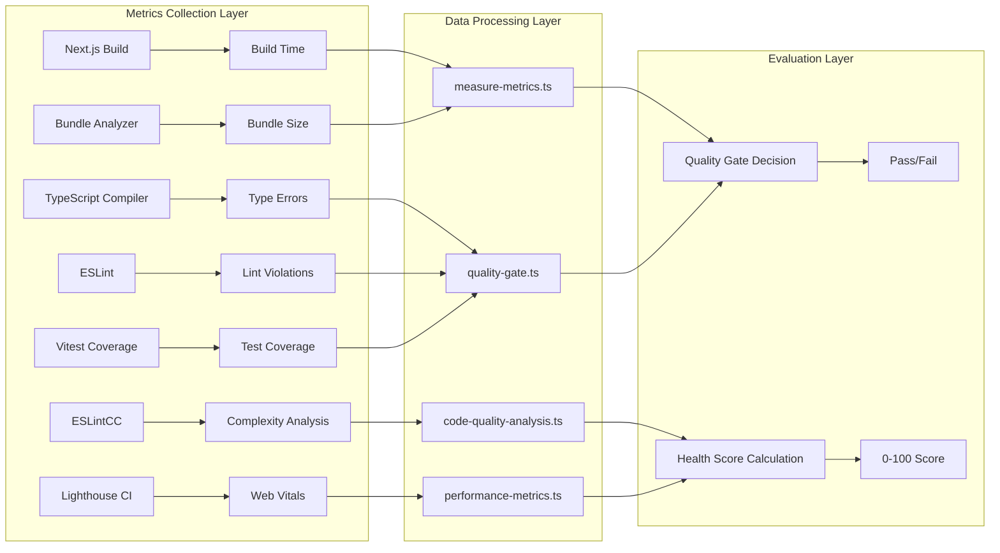
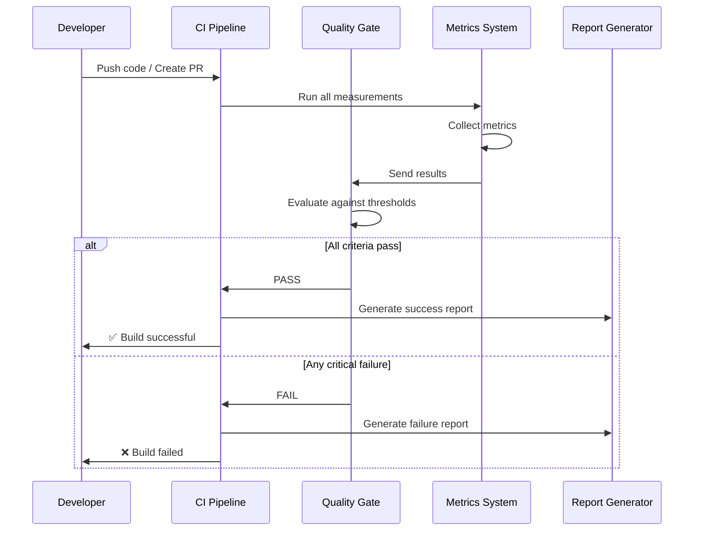

# Quality Metrics & Quality Gate Architecture Design Document

## Table of Contents

1. [Overview](#overview)
2. [Design Philosophy and Principles](#design-philosophy-and-principles)
3. [Metrics Measurement System](#metrics-measurement-system)
4. [Quality Gate System](#quality-gate-system)
5. [Health Score Calculation](#health-score-calculation)
6. [CI/CD Integration](#cicd-integration)
7. [Implementation Details](#implementation-details)
8. [Developer Guide](#developer-guide)

## Overview

This project implements a comprehensive metrics measurement and quality gate system designed to quantitatively measure software quality and drive continuous improvement. The system is designed based on industry-standard quality models and scientific evidence, providing objective indicators for development teams to maintain high-quality code.

### System Purpose

1. **Quality Visualization**: Quantitative measurement of code quality and performance
2. **Early Problem Detection**: Early detection of issues through automated quality checks
3. **Continuous Improvement**: Measuring the effectiveness of improvement activities through metrics tracking
4. **Standardization**: Application of consistent quality standards compliant with industry standards

> Implementation Alignment (Current Status Summary)
>
> This document includes future design vision. Main points where current implementation differs:
>
> - quality-gate.ts uses minimum 60% coverage (warning at 70%) for Fail judgment. Unified Report uses 80% standard for scoring/capping.
> - Duplication rate Fail is handled by Unified Report side, not directly failed by quality-gate.ts.
> - Lighthouse runs by default with desktop settings only. minScore is Performance/Acc/Best/SEO=0.90.
> - Duplication detection uses jscpd (sonarjs as supplementary).
> - Thresholds are principally SOT in `scripts/constants/quality-metrics.ts`, but quality-gate.ts has provisional defaults.

## Design Philosophy and Principles

### 1. Scientifically-Based Design

All metrics and thresholds are based on the following international standards and research results:

- **ISO/IEC 25010**: Software quality model (especially maintainability and performance efficiency)
- **McCabe's Complexity Theory**: Recommendation for cyclomatic complexity below 10
- **Core Web Vitals**: Web performance standards defined by Google
- **SonarQube Quality Gate**: Industry-standard quality gate conditions

### 2. Objectivity and Reproducibility of Measurement

All metrics are measured by automated tools, ensuring objectivity and reproducibility by eliminating human judgment. Measurement environments and methods are standardized to always produce the same results for the same codebase.

### 3. Two-Layer Evaluation Model

Quality evaluation consists of two layers:

1. **Quality Gate (Binary Decision)**: Pass/Fail judgment for essential conditions. Build fails on Fail
2. **Health Score (0-100 points)**: Quantification of overall quality. Used as improvement guidance



## Metrics Measurement System

The metrics measurement system is a mechanism for quantitatively measuring and continuously monitoring the quality of the codebase. This system automatically measures how well the code written by developers maintains quality, whether there are performance issues, and whether it is in a maintainable state.

Measurement is fully automated and runs automatically when PRs are created or during builds. This enables early detection of quality degradation and allows issues to be addressed before they reach the production environment. Additionally, since measurement results are recorded as numerical values, it's possible to track quality trends over time and objectively evaluate the effectiveness of improvement activities.

### System Architecture



### Core Metrics Categories

#### 1. Code Quality Metrics

**Test Coverage**

- **Measurement**: Line coverage, branch coverage, function coverage
- **Target**: ≥80% for production code
- **Quality Gate**: ≥60% (fails below this threshold)
- **Scientific Basis**: Studies show coverage above 80% significantly reduces bug rates

**Code Complexity**

- **Measurement**: Cyclomatic complexity per function
- **Target**: ≤10 per function
- **Quality Gate**: No functions >20 complexity
- **Scientific Basis**: McCabe's research on maintainability correlation

**Code Duplication**

- **Measurement**: Percentage of duplicated code blocks
- **Target**: ≤3%
- **Quality Gate**: ≤5%
- **Tool**: jscpd for precise duplication detection

#### 2. Performance Metrics

**Bundle Size**

- **Measurement**: Main bundle size and chunk sizes
- **Target**: <250KB main bundle
- **Quality Gate**: <500KB main bundle
- **Impact**: Direct correlation with loading performance

**Core Web Vitals**

- **LCP (Largest Contentful Paint)**: ≤2.5s
- **FID (First Input Delay)**: ≤100ms
- **CLS (Cumulative Layout Shift)**: ≤0.1
- **Quality Gate**: All metrics must meet "Good" thresholds

#### 3. Maintainability Metrics

**Type Safety**

- **Measurement**: TypeScript strict mode compliance
- **Target**: 0 type errors
- **Quality Gate**: 0 type errors (strict enforcement)

**Code Style Compliance**

- **Measurement**: ESLint violations
- **Target**: 0 violations
- **Quality Gate**: 0 errors, <10 warnings

---

## Quality Gate System

The Quality Gate System acts as a binary checkpoint that determines whether code changes meet the minimum quality requirements before they can be merged or deployed. This system prevents low-quality code from entering the main codebase by implementing strict pass/fail criteria.

### Quality Gate Criteria

```typescript
// Quality Gate Implementation
export interface QualityGateResult {
  passed: boolean;
  checks: QualityCheck[];
  summary: {
    totalChecks: number;
    passedChecks: number;
    failedChecks: number;
    criticalFailures: number;
  };
}

export interface QualityCheck {
  name: string;
  category: 'security' | 'performance' | 'maintainability' | 'reliability';
  status: 'pass' | 'fail' | 'warning';
  actualValue: number;
  threshold: number;
  description: string;
  recommendation?: string;
}

export const QUALITY_GATE_THRESHOLDS = {
  // Critical thresholds (build fails if not met)
  testCoverage: {
    minimum: 60, // Must have at least 60% coverage
    target: 80, // Target for health score
  },
  typeErrors: {
    maximum: 0, // No type errors allowed
  },
  eslintErrors: {
    maximum: 0, // No ESLint errors allowed
  },
  complexityMax: {
    maximum: 20, // No function can exceed 20 complexity
  },

  // Performance thresholds
  bundleSize: {
    maximum: 500 * 1024, // 500KB maximum
    target: 250 * 1024, // 250KB target
  },
  buildTime: {
    maximum: 300, // 5 minutes maximum
    target: 120, // 2 minutes target
  },

  // Core Web Vitals (Lighthouse)
  performance: {
    minimum: 0.9, // 90% minimum score
  },
  accessibility: {
    minimum: 0.9, // 90% minimum score
  },
  bestPractices: {
    minimum: 0.9, // 90% minimum score
  },
  seo: {
    minimum: 0.9, // 90% minimum score
  },
};
```

### Quality Gate Execution Flow



---

## Health Score Calculation

The Health Score provides a holistic view of code quality as a single number from 0-100. Unlike the binary Quality Gate, the Health Score offers nuanced feedback and helps teams understand overall quality trends.

### Scoring Algorithm

```typescript
export interface HealthScoreComponents {
  codeQuality: {
    weight: 30;
    components: {
      testCoverage: { weight: 40; score: number };
      complexity: { weight: 30; score: number };
      duplication: { weight: 30; score: number };
    };
  };
  performance: {
    weight: 25;
    components: {
      bundleSize: { weight: 30; score: number };
      webVitals: { weight: 70; score: number };
    };
  };
  maintainability: {
    weight: 25;
    components: {
      typeErrors: { weight: 50; score: number };
      eslintCompliance: { weight: 50; score: number };
    };
  };
  reliability: {
    weight: 20;
    components: {
      buildStability: { weight: 60; score: number };
      testReliability: { weight: 40; score: number };
    };
  };
}

export const calculateHealthScore = (metrics: QualityMetrics): HealthScore => {
  const components = {
    codeQuality: calculateCodeQualityScore(metrics),
    performance: calculatePerformanceScore(metrics),
    maintainability: calculateMaintainabilityScore(metrics),
    reliability: calculateReliabilityScore(metrics),
  };

  const totalScore =
    components.codeQuality * 0.3 +
    components.performance * 0.25 +
    components.maintainability * 0.25 +
    components.reliability * 0.2;

  return {
    overall: Math.round(totalScore),
    components,
    grade: getGrade(totalScore),
    recommendations: generateRecommendations(components),
  };
};

const getGrade = (score: number): string => {
  if (score >= 90) return 'A';
  if (score >= 80) return 'B';
  if (score >= 70) return 'C';
  if (score >= 60) return 'D';
  return 'F';
};
```

### Component Score Calculations

#### Code Quality Score (30% weight)

```typescript
const calculateCodeQualityScore = (metrics: QualityMetrics): number => {
  // Test Coverage (40% of code quality)
  const coverageScore = Math.min(100, (metrics.testCoverage / 0.8) * 100);

  // Complexity (30% of code quality)
  const complexityScore =
    metrics.averageComplexity <= 5
      ? 100
      : metrics.averageComplexity <= 10
        ? 80
        : metrics.averageComplexity <= 15
          ? 60
          : 30;

  // Duplication (30% of code quality)
  const duplicationScore =
    metrics.duplicationRate <= 0.03
      ? 100
      : metrics.duplicationRate <= 0.05
        ? 80
        : metrics.duplicationRate <= 0.1
          ? 60
          : 30;

  return coverageScore * 0.4 + complexityScore * 0.3 + duplicationScore * 0.3;
};
```

#### Performance Score (25% weight)

```typescript
const calculatePerformanceScore = (metrics: QualityMetrics): number => {
  // Bundle Size (30% of performance)
  const bundleScore =
    metrics.bundleSize <= 250000
      ? 100
      : metrics.bundleSize <= 400000
        ? 80
        : metrics.bundleSize <= 500000
          ? 60
          : 30;

  // Web Vitals (70% of performance)
  const vitalsScore =
    (metrics.lighthouse.performance * 100 +
      (metrics.lighthouse.lcp <= 2.5 ? 100 : 50) +
      (metrics.lighthouse.fid <= 100 ? 100 : 50) +
      (metrics.lighthouse.cls <= 0.1 ? 100 : 50)) /
    4;

  return bundleScore * 0.3 + vitalsScore * 0.7;
};
```

---

## CI/CD Integration

The quality metrics system is fully integrated into the CI/CD pipeline to ensure that every code change is automatically evaluated against quality standards.

### GitHub Actions Workflow

```yaml
name: Quality Gates
on:
  pull_request:
    branches: [main, develop]
  push:
    branches: [main, develop]

jobs:
  quality-gate:
    runs-on: ubuntu-latest
    steps:
      - uses: actions/checkout@v4

      - name: Setup Node.js
        uses: actions/setup-node@v4
        with:
          node-version: '20'
          cache: 'pnpm'

      - name: Install dependencies
        run: pnpm install --frozen-lockfile

      - name: Run type checking
        run: pnpm typecheck

      - name: Run linting
        run: pnpm lint:ci

      - name: Run tests with coverage
        run: pnpm test:coverage

      - name: Build application
        run: pnpm build

      - name: Analyze bundle size
        run: pnpm analyze:bundle

      - name: Run Lighthouse CI
        run: pnpm lighthouse:ci

      - name: Run quality gate evaluation
        run: pnpm quality:gate

      - name: Generate quality report
        run: pnpm quality:report

      - name: Upload quality report
        uses: actions/upload-artifact@v4
        with:
          name: quality-report
          path: reports/quality/
```

### Quality Report Generation

```typescript
export const generateQualityReport = async (metrics: QualityMetrics): Promise<QualityReport> => {
  const qualityGateResult = evaluateQualityGate(metrics);
  const healthScore = calculateHealthScore(metrics);

  const report: QualityReport = {
    timestamp: new Date().toISOString(),
    commit: process.env.GITHUB_SHA,
    branch: process.env.GITHUB_REF_NAME,

    qualityGate: qualityGateResult,
    healthScore,
    metrics,

    recommendations: generateRecommendations(healthScore),
    trends: await calculateTrends(metrics),

    artifacts: {
      coverageReport: 'reports/coverage/index.html',
      lighthouseReport: 'reports/lighthouse/index.html',
      bundleReport: 'reports/bundle/index.html',
    },
  };

  // Generate markdown summary for PR comments
  const summary = generateMarkdownSummary(report);

  // Save detailed JSON report
  await fs.writeFile('reports/quality/report.json', JSON.stringify(report, null, 2));
  await fs.writeFile('reports/quality/summary.md', summary);

  return report;
};
```

---

## Implementation Details

### Core Implementation Files

```
scripts/
├── quality/
│   ├── measure-metrics.ts      # Main metrics collection
│   ├── quality-gate.ts         # Quality gate evaluation
│   ├── health-score.ts         # Health score calculation
│   ├── report-generator.ts     # Report generation
│   └── trend-analyzer.ts       # Historical trend analysis
├── constants/
│   └── quality-metrics.ts      # Thresholds and configuration
└── utils/
    ├── file-utils.ts          # File system utilities
    └── metrics-utils.ts       # Metric calculation utilities
```

### Metrics Collection Implementation

```typescript
// scripts/quality/measure-metrics.ts
export const collectMetrics = async (): Promise<QualityMetrics> => {
  const startTime = Date.now();

  // Collect all metrics in parallel for efficiency
  const [
    testCoverage,
    complexityMetrics,
    duplicationMetrics,
    bundleMetrics,
    lighthouseMetrics,
    buildMetrics,
  ] = await Promise.all([
    collectTestCoverage(),
    collectComplexityMetrics(),
    collectDuplicationMetrics(),
    collectBundleMetrics(),
    collectLighthouseMetrics(),
    collectBuildMetrics(),
  ]);

  const collectionTime = Date.now() - startTime;

  return {
    timestamp: new Date().toISOString(),
    collectionTimeMs: collectionTime,

    // Code Quality
    testCoverage,
    complexity: complexityMetrics,
    duplication: duplicationMetrics,

    // Performance
    bundle: bundleMetrics,
    lighthouse: lighthouseMetrics,

    // Build & Infrastructure
    build: buildMetrics,

    // Metadata
    environment: {
      nodeVersion: process.version,
      platform: process.platform,
      ciEnvironment: process.env.CI || 'local',
    },
  };
};
```

### Quality Gate Evaluation

```typescript
// scripts/quality/quality-gate.ts
export const evaluateQualityGate = (metrics: QualityMetrics): QualityGateResult => {
  const checks: QualityCheck[] = [];

  // Critical checks that must pass
  checks.push(
    createCheck(
      'Test Coverage',
      'reliability',
      metrics.testCoverage.overall,
      THRESHOLDS.testCoverage.minimum
    ),
    createCheck(
      'Type Errors',
      'maintainability',
      metrics.typescript.errors,
      THRESHOLDS.typeErrors.maximum,
      'lte' // Less than or equal
    ),
    createCheck(
      'ESLint Errors',
      'maintainability',
      metrics.eslint.errors,
      THRESHOLDS.eslintErrors.maximum,
      'lte'
    ),
    createCheck(
      'Bundle Size',
      'performance',
      metrics.bundle.mainSize,
      THRESHOLDS.bundleSize.maximum,
      'lte'
    )
  );

  // Performance checks
  if (metrics.lighthouse) {
    checks.push(
      createCheck(
        'Performance Score',
        'performance',
        metrics.lighthouse.performance,
        THRESHOLDS.performance.minimum
      ),
      createCheck(
        'Accessibility Score',
        'performance',
        metrics.lighthouse.accessibility,
        THRESHOLDS.accessibility.minimum
      )
    );
  }

  const failedChecks = checks.filter((check) => check.status === 'fail');
  const criticalFailures = failedChecks.filter(
    (check) =>
      check.category === 'security' ||
      (check.category === 'maintainability' && check.name.includes('Error'))
  );

  return {
    passed: failedChecks.length === 0,
    checks,
    summary: {
      totalChecks: checks.length,
      passedChecks: checks.filter((c) => c.status === 'pass').length,
      failedChecks: failedChecks.length,
      criticalFailures: criticalFailures.length,
    },
  };
};
```

---

## Developer Guide

### Running Quality Checks Locally

```bash
# Run all quality checks
pnpm quality:check

# Run individual components
pnpm test:coverage      # Test coverage
pnpm lint:ci           # ESLint with strict settings
pnpm typecheck         # TypeScript checking
pnpm build             # Build and bundle analysis
pnpm lighthouse:ci     # Lighthouse performance audit

# Generate quality report
pnpm quality:report

# View quality dashboard
pnpm quality:dashboard
```

### Understanding Quality Reports

Quality reports are generated in multiple formats:

1. **JSON Report** (`reports/quality/report.json`) - Complete metrics data
2. **Markdown Summary** (`reports/quality/summary.md`) - Human-readable summary
3. **HTML Dashboard** (`reports/quality/index.html`) - Interactive visualization

### Improving Quality Scores

#### Test Coverage Improvement

```bash
# Identify uncovered files
pnpm test:coverage:detailed

# Run coverage for specific files
pnpm test:coverage -- src/components/Button.tsx
```

#### Complexity Reduction

```bash
# Find high-complexity functions
pnpm analyze:complexity

# Get detailed complexity report
pnpm analyze:complexity:detailed
```

#### Bundle Size Optimization

```bash
# Analyze bundle composition
pnpm analyze:bundle

# Find large dependencies
pnpm analyze:bundle:deps
```

### Quality Gate Configuration

Quality thresholds can be customized in `scripts/constants/quality-metrics.ts`:

```typescript
export const QUALITY_THRESHOLDS = {
  // Adjust for your project needs
  testCoverage: {
    minimum: 60, // Quality gate threshold
    target: 80, // Health score target
    excellent: 90, // Excellent rating
  },

  complexity: {
    functionMax: 10, // Per function
    fileAverage: 5, // Average per file
    projectAverage: 3, // Project-wide average
  },

  performance: {
    bundleSize: {
      main: 250 * 1024, // 250KB
      chunks: 100 * 1024, // 100KB per chunk
    },
    lighthouse: {
      performance: 0.9,
      accessibility: 0.95,
      bestPractices: 0.9,
      seo: 0.9,
    },
  },
};
```

### Custom Metrics

Add custom metrics by extending the measurement system:

```typescript
// scripts/quality/custom-metrics.ts
export const collectCustomMetrics = async (): Promise<CustomMetrics> => {
  return {
    // Your custom metrics here
    apiResponseTime: await measureApiResponseTime(),
    databaseQueryCount: await countDatabaseQueries(),
    cacheHitRate: await measureCachePerformance(),
  };
};

// Register in main metrics collection
// scripts/quality/measure-metrics.ts
export const collectMetrics = async (): Promise<QualityMetrics> => {
  // ... existing metrics
  const customMetrics = await collectCustomMetrics();

  return {
    // ... existing metrics
    custom: customMetrics,
  };
};
```

---

## Summary

This quality metrics and quality gate architecture provides:

1. **Comprehensive Quality Measurement** - Automated collection of code quality, performance, and maintainability metrics
2. **Objective Standards** - Science-based thresholds and evaluation criteria
3. **Continuous Monitoring** - Integrated CI/CD pipeline with automated quality gates
4. **Actionable Insights** - Detailed reports with specific recommendations for improvement
5. **Trend Analysis** - Historical tracking of quality metrics over time

The system ensures that quality is not just measured but actively maintained and improved through automated enforcement and clear feedback loops. By implementing this architecture, teams can maintain high standards while moving fast and delivering features confidently.

---

## Related Documentation

- [Testing Guidelines](./testing-guidelines.en.md) - Comprehensive testing strategies
- [Performance Guidelines](./performance-guidelines.en.md) - Performance optimization techniques
- [Review Checklist](./review-checklist.en.md) - Code review quality standards
