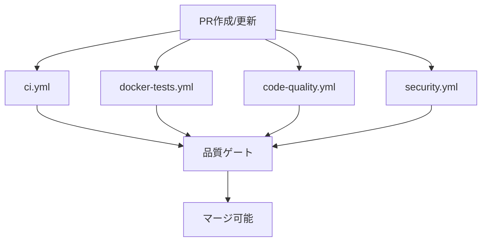

# CI/CDワークフロー分析レポート

> **作成日**: 2025-08-20  
> **対象PR**: [#55 Docker Compose Implementation](https://github.com/ylabo0717/nextjs-boilerplate/pull/55)  
> **目的**: CI/CDワークフローの簡略化と保守性向上のための現状分析

## 📊 現状分析

### ワークフローファイル構成

| ファイル名 | 行数 | 主要機能 | 実行頻度 |
|------------|------|----------|----------|
| `ci.yml` | 426行 | メインCI (lint, typecheck, test, build, e2e) | 全PR/push |
| `docker-tests.yml` | **378行** | Docker環境特化テスト | Docker関連変更時 |
| `code-quality.yml` | ~150行 | 品質メトリクス | 全PR/push |
| `security.yml` | ~100行 | セキュリティスキャン | 全PR/push |
| `lighthouse.yml` | ~80行 | パフォーマンステスト | 全PR/push |

### docker-tests.yml 詳細分析

#### 📋 ジョブ構成 (6ジョブ)

1. **`docker-unit-tests`** (Line 36-68)
   - 実行時間: 20分タイムアウト
   - 機能: Docker環境でのUnit Tests実行

2. **`docker-integration-tests`** (Line 70-111)
   - 実行時間: 25分タイムアウト
   - 機能: Testcontainers統合テスト

3. **`docker-e2e-tests`** (Line 114-186)
   - 実行時間: 30分タイムアウト
   - マトリックス: chromium, firefox
   - 機能: Docker環境でのE2Eテスト

4. **`docker-all-tests`** (Line 189-263)
   - 実行時間: 35分タイムアウト
   - 条件: main branch pushのみ
   - 機能: 全テストスイート統合実行

5. **`docker-quality-gate`** (Line 265-341)
   - 機能: テスト結果検証とゲート制御

6. **`docker-security-verification`** (Line 344-378)
   - 実行時間: 10分タイムアウト
   - 機能: 本番環境セキュリティヘッダー検証

#### 🔄 重複パターン分析

**共通ステップ (各ジョブで重複):**

```yaml
# 1. リポジトリチェックアウト (6ジョブ × 5行 = 30行)
- name: Checkout code
  uses: actions/checkout@v4

# 2. Docker Buildx設定 (6ジョブ × 3行 = 18行)
- name: Set up Docker Buildx
  uses: docker/setup-buildx-action@v3

# 3. 環境設定 (4ジョブ × 10行 = 40行)
- name: Setup test environment
  run: |
    cp .env.base.example .env.base
    cp .env.test.example .env.test
    # ... 以下同様
```

**重複による冗長性:**
- 合計重複行数: **約88行 (23%)**
- 保守対象の重複ロジック: 環境設定、Docker設定、クリーンアップ

#### 🎯 問題点

1. **保守性の課題**
   - 378行の単一ファイル
   - 共通ロジックの重複
   - 変更時の影響範囲の拡大

2. **可読性の問題**
   - 機能的に異なるテスト種別が混在
   - デバッグ時の該当箇所特定の困難

3. **再利用性の低さ**
   - 共通ステップのComposite Action化未実装
   - 他プロジェクトへの適用困難

## 📈 CI/CD全体との関係性

### 既存ワークフローとの連携



### トリガー条件

**docker-tests.yml の実行条件:**
```yaml
paths:
  - 'docker/**'           # Docker設定変更
  - 'docker-compose.test.yml'  # テスト設定変更
  - 'tests/**'           # テストコード変更
  - 'src/**'             # アプリケーションコード変更
```

**影響範囲:**
- Docker関連変更: 高頻度実行
- アプリケーション変更: 全PR実行
- **実際の実行頻度: 約80%のPRで実行される見込み**

## 🔧 技術的制約

### GitHub Actions制限

1. **ジョブ並列実行**
   - 現在: 6ジョブ並列実行
   - 分離後: より多くの小さなジョブ並列実行

2. **ワークフロー内通信**
   - 現在: needs によるジョブ依存関係
   - 分離後: ワークフロー間通信の必要性

3. **アーティファクト管理**
   - 現在: 各ジョブが独立してアーティファクト管理
   - 分離後: 跨ワークフロー アーティファクト共有

### Docker Testcontainers制約

```yaml
# Testcontainers特有の環境設定
echo "DOCKER_HOST=unix:///var/run/docker.sock" >> .env.local
echo "TESTCONTAINERS_HOST_OVERRIDE=host.docker.internal" >> .env.local
```

**制約事項:**
- Docker-in-Docker環境の特殊設定
- ネットワーク設定の依存関係
- リソース制限とタイムアウト管理

## 📋 現状評価サマリー

### 💪 強み

1. **包括的なテストカバレッジ**
   - Unit/Integration/E2E全レベル
   - マルチブラウザ対応
   - セキュリティ検証

2. **適切な並列化**
   - ジョブレベルでの並列実行
   - マトリックス戦略活用

3. **堅牢な品質ゲート**
   - 全テスト結果の検証
   - 失敗時の詳細デバッグ情報

### ⚠️ 改善点

1. **保守性の課題 (高優先度)**
   - 378行の単一ファイル
   - 重複ロジックの排除必要

2. **可読性の問題 (中優先度)**
   - 機能別分離の必要性
   - デバッグ効率の向上余地

3. **再利用性の低さ (低優先度)**
   - 共通ロジックのComposite Action化
   - テンプレート化の検討余地

## 🎯 改善目標

### 短期目標 (1-2週間)
- 378行ファイルの機能別分離
- 共通ステップのComposite Action化
- 重複ロジックの削減 (目標: 30%削減)

### 中期目標 (1ヶ月)
- ワークフロー間の効率的な連携設計
- デバッグ性の向上
- ドキュメント整備

### 長期目標 (2-3ヶ月)
- テンプレート化と他プロジェクト適用
- CI/CD全体最適化
- 実行時間短縮 (目標: 20%短縮)

---

**次のステップ**: [機能別分離設計書](./functional-separation-design.md) の作成