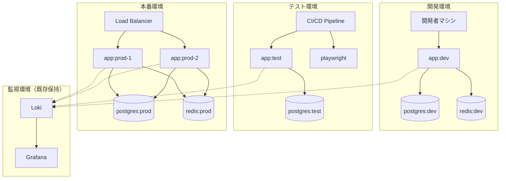
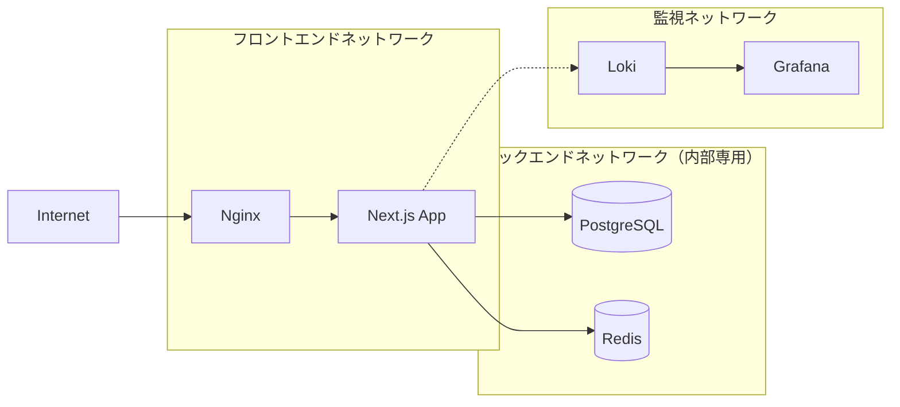

# Docker Compose設計ドキュメント

## 1. 設計背景と課題認識

### 1.1 現状の課題

本プロジェクトは現在、ネイティブNode.js環境での開発・テスト・デプロイが行われているが、以下の課題が存在する：

**開発環境の課題**：

- 環境差異による「ローカルでは動く」問題の発生リスク
- 新規開発者のセットアップ時間とトラブル
- 依存関係の管理とバージョン不整合

**テスト環境の課題**：

- CI/CD環境とローカル環境の差異
- テスト実行環境の再現性不足
- 並列テスト実行時のリソース競合

**デプロイ・運用の課題**：

- 本番環境での環境差異リスク
- スケーリング時の複雑性
- 監視・ログ管理の分散

### 1.2 既存資産の評価

**保持すべき価値のある資産**：

1. **Lokiログシステム**（`docker-compose.loki.yml`）
   - 既に稼働中の監視・ログ可視化環境
   - Grafanaダッシュボードによる可視化
   - 開発チームの運用ノウハウ蓄積

2. **包括的テストスイート**
   - Unit Tests（Vitest）
   - Integration Tests（Vitest + Testcontainers）
   - E2E Tests（Playwright）
   - 高いテストカバレッジと品質保証

3. **開発フロー**
   - ホットリロード・デバッグ環境
   - 型チェック・リンティング・フォーマット
   - Git hooks による品質管理

**技術スタック**：

- Next.js 15.4.6 (App Router) + TypeScript
- Tailwind CSS 4.0
- pnpm パッケージマネージャー
- ESLint + Prettier + Husky

## 2. 設計哲学と基本方針

### 2.1 設計哲学

**「漸進的コンテナ化」**
既存の価値を破壊することなく、段階的にコンテナ化の利益を享受する。革命ではなく進化のアプローチを取る。

**「開発者体験ファースト」**
コンテナ化により開発効率が低下してはならない。むしろ開発体験を向上させる手段としてDockerを活用する。

**「テスト互換性の絶対保証」**
既存のテストスイートは100%の互換性を保つ。品質保証プロセスに一切の断絶を起こさない。

### 2.2 設計原則

#### 原則1: 段階的移行（Gradual Migration）

```
現在のワークフロー → ハイブリッド運用 → 完全コンテナ化
```

- 既存環境とDocker環境の並行運用期間を設ける
- 各フェーズで十分な検証を行う
- ロールバック可能性を常に保持

#### 原則2: 環境等価性（Environment Parity）

```
開発環境 ≈ テスト環境 ≈ 本番環境
```

- 12-Factor Appの「Dev/Prod Parity」原則に従う
- 環境差異によるバグを根本的に排除
- 設定の外部化とシークレット管理

#### 原則3: 単一責任とサービス分離

```
アプリケーション | データベース | キャッシュ | 監視
      ↓              ↓           ↓       ↓
   app container | postgres | redis | loki+grafana
```

- 各サービスは独立してスケール可能
- 障害の局所化とデバッグの容易性
- 依存関係の明示化

#### 原則4: 設定の階層化と再利用性

```
base config → environment override → runtime config
```

- DRY原則に基づく設定の共通化
- 環境固有の設定のみをオーバーライド
- 設定変更の影響範囲の最小化

## 3. アーキテクチャ設計

### 3.1 全体アーキテクチャ



### 3.2 サービス設計方針

#### アプリケーションサービス（app）

**責務**: Next.jsアプリケーションの実行
**設計判断**:

- Multi-stage buildによる環境別最適化
- 開発時のホットリロード保持
- 本番時のセキュリティ強化

#### データ永続化サービス

**責務**: アプリケーションデータの永続化
**設計判断**:

- PostgreSQL採用（スケーラビリティとACID特性）
- 環境別データベース分離
- バックアップ・復旧戦略の組み込み

#### キャッシュサービス

**責務**: セッション・キャッシュデータの高速アクセス
**設計判断**:

- Redis採用（パフォーマンスと柔軟性）
- 揮発性データの適切な管理
- クラスタリング対応

#### 監視・ログサービス（既存保持）

**責務**: システム監視とログ管理
**設計判断**:

- 既存Loki環境の完全保持
- 新システムとの統合アプローチ
- ダッシュボード・アラートの継続運用

### 3.3 ネットワーク設計



**ネットワーク分離の設計判断**:

- **フロントエンド**: 外部アクセス可能
- **バックエンド**: 内部通信のみ（`internal: true`）
- **監視**: 独立ネットワークで運用継続

## 4. 環境戦略と設定管理

### 4.1 環境分離戦略

#### 開発環境の設計思想

**目標**: 開発効率の最大化と学習コストの最小化

**特徴的な設計判断**:

- ホットリロードの完全保持
- デバッグポート開放（9229）
- ボリュームマウントによる即座の反映
- 開発用データベース・Redisの軽量化

#### テスト環境の設計思想

**目標**: CI/CDパイプラインとの完全統合

**特徴的な設計判断**:

- 既存Testcontainers戦略の保持
- Playwright公式イメージ活用
- 並列テスト実行対応
- テストデータの分離と管理

#### 本番環境の設計思想

**目標**: 可用性・セキュリティ・パフォーマンスの最適化

**特徴的な設計判断**:

- Multi-replica対応
- Docker Secretsによるシークレット管理
- ヘルスチェックと自動復旧
- リソース制限と監視

### 4.2 設定継承モデル

```
基盤設定（docker-compose.yml）
    ↓ 継承
環境別オーバーライド
    ↓ 実行時
実際の動作環境
```

**設計の利点**:

- 設定の重複排除（DRY原則）
- 環境差異の明示化
- 変更影響の局所化
- メンテナンス性の向上

## 5. 品質保証戦略

### 5.1 テスト互換性保証

**基本方針**: 既存テストスイートの100%動作保証

**具体的保証内容**:

1. **Unit Tests**: Vitestの完全動作
2. **Integration Tests**: Testcontainers環境の保持
3. **E2E Tests**: Playwright環境の最適化
4. **Loki Tests**: 既存統合テストの継続

**実現アプローチ**:

- 段階的移行による互換性検証
- 既存テスト環境とDocker環境の並行運用
- パフォーマンス劣化の監視と最適化

### 5.2 品質ゲート


**各ゲートの基準**:

- Build: 5分以内での完了
- Tests: 既存実行時間の150%以内
- Security: 既知脆弱性ゼロ
- Performance: レスポンス時間維持

## 6. セキュリティ設計

### 6.1 多層防御アプローチ

**ネットワークレベル**:

- 内部ネットワークの分離
- 最小権限の原則適用
- ファイアウォールルール

**アプリケーションレベル**:

- 非rootユーザーでの実行
- 読み取り専用ファイルシステム
- セキュリティヘッダー設定

**データレベル**:

- 暗号化通信（TLS）
- シークレット外部管理
- 定期的なパスワードローテーション

### 6.2 シークレット管理戦略

```
開発環境: .env ファイル（リポジトリ管理）
    ↓
テスト環境: CI/CD変数（プラットフォーム管理）
    ↓
本番環境: Docker Secrets（ランタイム管理）
```

**段階的セキュリティ強化**:

- 環境に応じた適切なセキュリティレベル
- 開発効率とセキュリティのバランス
- 監査証跡の確保

## 7. パフォーマンス設計

### 7.1 ビルド最適化戦略

**Multi-stage Build**:

```
base → dependencies → development
           ↓
      test → production
```

**最適化ポイント**:

- レイヤーキャッシュの最大活用
- 不要ファイルの除外（.dockerignore）
- 依存関係インストールの分離

### 7.2 実行時最適化

**リソース配分**:

- 開発環境: 応答性重視
- テスト環境: 並列性重視
- 本番環境: 安定性重視

**ボリューム戦略**:

- Named volumeによるデータ永続化
- Bind mountによる開発効率
- tmpfsによる一時データ高速化

## 8. 運用・保守性設計

### 8.1 監視・ログ戦略

**既存Loki環境の活用**:

- 運用ノウハウの継続活用
- ダッシュボード・アラートの保持
- ログフォーマットの標準化

**新規監視要素**:

- コンテナヘルスチェック
- リソース使用量監視
- サービス間通信監視

### 8.2 バックアップ・災害復旧

**データ保護**:

- データベースの定期バックアップ
- 設定ファイルのバージョン管理
- 秘密情報の安全な保管

**復旧戦略**:

- RTO（Recovery Time Objective）: 15分
- RPO（Recovery Point Objective）: 1時間
- 自動復旧メカニズムの組み込み

---

## 次のステップ

この設計ドキュメントを基に、具体的な実装計画（implementation-plan.md）と環境別設定詳細（environment-configurations.md）を策定し、段階的な実装を進める。
