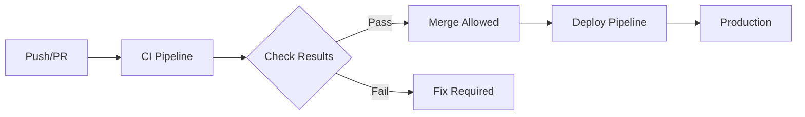

# GitHub Actions CI/CD 詳細設計書

## 実装状況サマリー（2025年8月10日更新）

### ✅ 完了済み

- **Phase 1: 基本CI設定** - ci.ymlの実装完了
  - Lint, TypeCheck, Test, Build の各ジョブが稼働中
  - カバレッジ閾値チェック機能実装済み
  - キャッシュ最適化済み
- **Phase 2: E2Eテスト統合** - Playwright統合完了
  - 57個のE2Eテストケース実装済み
  - CI内でchromium/firefox両ブラウザでテスト実行中
  - テストレポート・アーティファクト保存機能実装済み

### ✅ 最近完了

- **Phase 3: セキュリティ・品質** - 実装完了（2025年8月10日）
  - security.yml: セキュリティスキャンワークフロー実装済み
  - dependabot.yml: 依存関係自動更新設定済み
  - CodeQL: JavaScript/TypeScript解析設定済み
  - Gitleaks: シークレットスキャン設定済み（権限エラー対策済み）
  - フォールバックスクリプト: simple-secret-scan.sh追加

### 📋 今後の実装予定

- Phase 4: メトリクス・品質ゲート
- Phase 5: リリース自動化
- Phase 6: 通知・監視

### 現在のCI実行状況

- 平均実行時間: 約3分
- 成功率: 100%（直近3回）
- 並列実行: 5ジョブ同時実行

---

## 1. 概要

### 1.1 目的

- コード品質の自動チェック
- テストの自動実行
- デプロイメントの自動化
- 開発者の生産性向上

### 1.2 対象範囲

- プルリクエスト時の自動チェック
- main/developブランチへのマージ時の処理
- リリース時の自動化
- 定期的なメンテナンスタスク

## 2. CI/CD パイプライン全体構成



## 3. ワークフロー設計

### 3.1 CI ワークフロー (ci.yml)

#### 目的

プルリクエストとプッシュ時のコード品質チェック

#### トリガー条件

```yaml
on:
  push:
    branches: [main, develop]
  pull_request:
    branches: [main, develop]
    types: [opened, synchronize, reopened]
```

#### ジョブ構成

##### 3.1.1 Lint Job

```yaml
lint:
  name: ESLint & Prettier Check
  runs-on: ubuntu-latest
  steps:
    - Checkout
    - Setup Node.js (20.x)
    - Setup pnpm
    - Install dependencies (with cache)
    - Run ESLint
    - Run Prettier check
```

##### 3.1.2 Type Check Job

```yaml
typecheck:
  name: TypeScript Type Check
  runs-on: ubuntu-latest
  steps:
    - Checkout
    - Setup Node.js (20.x)
    - Setup pnpm
    - Install dependencies (with cache)
    - Run TypeScript compiler check
```

##### 3.1.3 Test Job

```yaml
test:
  name: Unit & Integration Tests
  runs-on: ubuntu-latest
  strategy:
    matrix:
      node-version: [20.x, 22.x]
  steps:
    - Checkout
    - Setup Node.js (matrix version)
    - Setup pnpm
    - Install dependencies (with cache)
    - Run Vitest tests
    - Upload coverage report
```

##### 3.1.4 Build Job

```yaml
build:
  name: Build Check
  runs-on: ubuntu-latest
  steps:
    - Checkout
    - Setup Node.js (20.x)
    - Setup pnpm
    - Install dependencies (with cache)
    - Build application
    - Check build output
```

### 3.2 E2E テストワークフロー (e2e.yml)

#### 目的

エンドツーエンドテストの実行

#### トリガー条件

```yaml
on:
  push:
    branches: [main, develop]
  pull_request:
    branches: [main, develop]
  schedule:
    - cron: '0 2 * * *' # 毎日午前2時（UTC）
```

#### ジョブ構成

```yaml
e2e:
  name: E2E Tests with Playwright
  runs-on: ubuntu-latest
  steps:
    - Checkout
    - Setup Node.js
    - Setup pnpm
    - Install dependencies
    - Install Playwright browsers
    - Build application
    - Run E2E tests
    - Upload test artifacts
```

### 3.3 依存関係更新ワークフロー (dependency-update.yml)

#### 目的

依存関係の自動更新とセキュリティチェック

#### トリガー条件

```yaml
on:
  schedule:
    - cron: '0 1 * * 1' # 毎週月曜日午前1時（UTC）
  workflow_dispatch: # 手動実行
```

#### ジョブ構成

```yaml
update-dependencies:
  name: Update Dependencies
  runs-on: ubuntu-latest
  steps:
    - Checkout
    - Setup Node.js
    - Setup pnpm
    - Update dependencies
    - Run tests
    - Create PR if changes
```

### 3.4 セキュリティスキャンワークフロー (security.yml)

#### 目的

セキュリティ脆弱性のスキャン

#### トリガー条件

```yaml
on:
  push:
    branches: [main]
  pull_request:
    branches: [main]
  schedule:
    - cron: '0 3 * * *' # 毎日午前3時（UTC）
```

#### ジョブ構成

```yaml
security:
  name: Security Scan
  runs-on: ubuntu-latest
  steps:
    - Checkout
    - Run npm audit
    - Run CodeQL analysis
    - Check for secrets
    - Upload SARIF results
```

### 3.5 リリースワークフロー (release.yml)

#### 目的

リリースの自動化

#### トリガー条件

```yaml
on:
  push:
    tags:
      - 'v*'
  workflow_dispatch:
    inputs:
      version:
        description: 'Release version'
        required: true
```

#### ジョブ構成

```yaml
release:
  name: Create Release
  runs-on: ubuntu-latest
  steps:
    - Checkout
    - Setup Node.js
    - Setup pnpm
    - Build application
    - Run all tests
    - Generate changelog
    - Create GitHub release
    - Deploy to staging/production
```

## 4. 共通設定

### 4.1 環境変数

```yaml
env:
  NODE_VERSION: '20.x'
  PNPM_VERSION: '9'
  TURBO_TOKEN: ${{ secrets.TURBO_TOKEN }}
  TURBO_TEAM: ${{ vars.TURBO_TEAM }}
```

### 4.2 キャッシュ戦略

#### pnpm キャッシュ

```yaml
- name: Setup pnpm cache
  uses: actions/cache@v4
  with:
    path: |
      ~/.pnpm-store
      **/node_modules
    key: ${{ runner.os }}-pnpm-${{ hashFiles('**/pnpm-lock.yaml') }}
    restore-keys: |
      ${{ runner.os }}-pnpm-
```

#### Next.js キャッシュ

```yaml
- name: Next.js cache
  uses: actions/cache@v4
  with:
    path: |
      .next/cache
    key: ${{ runner.os }}-nextjs-${{ hashFiles('**/pnpm-lock.yaml') }}-${{ hashFiles('**.[jt]s', '**.[jt]sx') }}
    restore-keys: |
      ${{ runner.os }}-nextjs-${{ hashFiles('**/pnpm-lock.yaml') }}-
```

### 4.3 並列実行戦略

```yaml
strategy:
  matrix:
    os: [ubuntu-latest]
    node-version: [20.x, 22.x]
  fail-fast: false
  max-parallel: 4
```

## 5. 通知設定

### 5.1 Slack 通知

```yaml
- name: Slack Notification
  if: failure()
  uses: 8398a7/action-slack@v3
  with:
    status: ${{ job.status }}
    text: 'CI Failed: ${{ github.event.pull_request.title }}'
    webhook_url: ${{ secrets.SLACK_WEBHOOK }}
```

### 5.2 PR コメント

```yaml
- name: Comment PR
  if: always()
  uses: actions/github-script@v7
  with:
    script: |
      // テスト結果やカバレッジをPRにコメント
```

## 6. セキュリティ考慮事項

### 6.1 シークレット管理

- GitHub Secrets使用
- 環境別のシークレット分離
- 最小権限の原則

### 6.2 依存関係セキュリティ

- Dependabot有効化
- npm audit定期実行
- SNYK統合（オプション）

### 6.3 コードセキュリティ

- CodeQL分析
- Secret scanning
- SAST（Static Application Security Testing）

## 7. パフォーマンス最適化

### 7.1 ジョブの並列化

- 独立したジョブは並列実行
- matrix strategyの活用
- fail-fast: falseで全テスト実行

### 7.2 条件付き実行

```yaml
- name: Run expensive tests
  if: github.event_name == 'push' && github.ref == 'refs/heads/main'
```

### 7.3 アーティファクト管理

```yaml
- name: Upload artifacts
  uses: actions/upload-artifact@v4
  with:
    name: build-artifacts
    path: .next/
    retention-days: 7
```

## 8. 実装ロードマップ

### Phase 1: 基本CI設定（1-2日）

1. ci.ymlの実装
   - Lint job
   - Type check job
   - Test job
   - Build job

### Phase 2: E2Eテスト統合（2-3日）

1. Playwright設定
2. e2e.ymlの実装
3. テストレポート生成

### Phase 3: セキュリティ・品質（1-2日）

1. security.ymlの実装
2. Dependabot設定
3. CodeQL設定

### Phase 4: リリース自動化（2-3日）

1. release.ymlの実装
2. Changelog生成
3. デプロイメント統合

### Phase 5: 監視・通知（1日）

1. Slack通知設定
2. PR自動コメント
3. ステータスバッジ設定

## 9. メトリクス・KPI

### 9.1 測定可能な指標と実装方法

#### ビルド時間

```yaml
# 実装例: ビルド時間の計測と閾値チェック
- name: Build with time check
  id: build
  run: |
    START_TIME=$(date +%s)
    pnpm build
    END_TIME=$(date +%s)
    BUILD_TIME=$((END_TIME - START_TIME))
    echo "build-time=$BUILD_TIME" >> $GITHUB_OUTPUT

    # 5分（300秒）を超えたら警告
    if [ $BUILD_TIME -gt 300 ]; then
      echo "⚠️ Build time exceeded 5 minutes: ${BUILD_TIME}s"
      echo "build-warning=true" >> $GITHUB_OUTPUT
    fi
```

#### テストカバレッジ

```yaml
# 実装例: カバレッジ閾値のチェック
- name: Run tests with coverage
  run: |
    pnpm test:coverage

- name: Check coverage threshold
  uses: actions/github-script@v7
  with:
    script: |
      const fs = require('fs');
      const coverage = JSON.parse(fs.readFileSync('coverage/coverage-summary.json', 'utf8'));
      const total = coverage.total;

      const threshold = 80;
      const actual = total.lines.pct;

      if (actual < threshold) {
        core.setFailed(`Coverage ${actual}% is below threshold ${threshold}%`);
      }
```

#### パフォーマンスメトリクス（Lighthouse CI）

```yaml
# 実装例: Lighthouse CIによるパフォーマンス計測
- name: Run Lighthouse CI
  uses: treosh/lighthouse-ci-action@v11
  with:
    urls: |
      http://localhost:3000
    uploadArtifacts: true
    temporaryPublicStorage: true
    # パフォーマンススコアの閾値設定
    configPath: '.lighthouserc.json'
```

### 9.2 CI成功条件として設定可能な項目

#### ✅ 直接的に成功/失敗を制御できる項目

1. **テストカバレッジ率**

   ```yaml
   - name: Coverage Gate
     run: |
       COVERAGE=$(cat coverage/coverage-summary.json | jq '.total.lines.pct')
       if (( $(echo "$COVERAGE < 80" | bc -l) )); then
         echo "❌ Coverage $COVERAGE% is below 80%"
         exit 1
       fi
   ```

2. **バンドルサイズ**

   ```yaml
   - name: Check bundle size
     run: |
       # next-bundle-analyzerの結果をチェック
       MAX_SIZE=500000  # 500KB
       ACTUAL_SIZE=$(stat -f%z .next/static/chunks/main-*.js)
       if [ $ACTUAL_SIZE -gt $MAX_SIZE ]; then
         echo "❌ Bundle size exceeded limit"
         exit 1
       fi
   ```

3. **型エラー数**

   ```yaml
   - name: TypeScript strict check
     run: |
       # 型エラーが0件であることを確認
       pnpm typecheck || exit 1
   ```

4. **Lintエラー/警告数**
   ```yaml
   - name: ESLint with max warnings
     run: |
       # 警告が10件を超えたら失敗
       pnpm lint --max-warnings 10
   ```

#### ⚠️ 条件付きで制御可能な項目（警告やコメントとして）

1. **ビルド時間**

   ```yaml
   - name: Build time check
     run: |
       timeout 5m pnpm build || {
         echo "::warning::Build exceeded 5 minutes"
         # PRにコメントを追加
       }
   ```

2. **テスト実行時間**
   ```yaml
   - name: Test performance
     uses: actions/github-script@v7
     if: always()
     with:
       script: |
         // テスト時間が長い場合はPRにコメント
         if (testDuration > 600) {
           github.issues.createComment({
             issue_number: context.issue.number,
             body: '⚠️ Tests took longer than 10 minutes'
           });
         }
   ```

### 9.3 実践的なメトリクス戦略

#### 段階的な閾値導入

```yaml
env:
  # 環境変数で閾値を管理
  COVERAGE_THRESHOLD: ${{ github.ref == 'refs/heads/main' && '80' || '70' }}
  BUNDLE_SIZE_LIMIT: ${{ github.ref == 'refs/heads/main' && '500' || '600' }}
```

#### メトリクスダッシュボード

```yaml
- name: Post metrics to dashboard
  if: always()
  run: |
    # GitHub Pagesやデータストアにメトリクスを送信
    curl -X POST ${{ secrets.METRICS_ENDPOINT }} \
      -H "Content-Type: application/json" \
      -d '{
        "build_time": "${{ steps.build.outputs.build-time }}",
        "coverage": "${{ steps.test.outputs.coverage }}",
        "bundle_size": "${{ steps.analyze.outputs.bundle-size }}",
        "timestamp": "'$(date -u +%Y-%m-%dT%H:%M:%SZ)'"
      }'
```

### 9.4 推奨される実装アプローチ

1. **必須メトリクス（CI失敗条件）**
   - テストの成功
   - 型チェックの成功
   - Lintエラーなし
   - 最低カバレッジ率（例: 60%）

2. **警告メトリクス（通知のみ）**
   - ビルド時間の増加
   - バンドルサイズの増加
   - パフォーマンススコアの低下

3. **トレンド分析用メトリクス**
   - 各種メトリクスの履歴保存
   - PR間での比較表示

#### 実装例: 複合的なメトリクスチェック

```yaml
- name: Quality Gates
  id: quality
  run: |
    FAILED=false
    WARNINGS=""

    # 必須: カバレッジチェック
    COVERAGE=$(cat coverage/coverage.json | jq '.total.lines.pct')
    if (( $(echo "$COVERAGE < 60" | bc -l) )); then
      echo "❌ Coverage below minimum threshold"
      FAILED=true
    elif (( $(echo "$COVERAGE < 80" | bc -l) )); then
      WARNINGS="${WARNINGS}⚠️ Coverage below target (80%)
"
    fi

    # 必須: 型チェック
    if ! pnpm typecheck; then
      echo "❌ Type errors found"
      FAILED=true
    fi

    # 警告: ビルド時間
    if [ "${{ steps.build.outputs.build-time }}" -gt 300 ]; then
      WARNINGS="${WARNINGS}⚠️ Build time exceeds 5 minutes
"
    fi

    # 結果出力
    echo "warnings=$WARNINGS" >> $GITHUB_OUTPUT

    if [ "$FAILED" = true ]; then
      exit 1
    fi

- name: Post warnings to PR
  if: steps.quality.outputs.warnings != ''
  uses: actions/github-script@v7
  with:
    script: |
      github.issues.createComment({
        issue_number: context.issue.number,
        body: `### ⚠️ Quality Warnings
${{ steps.quality.outputs.warnings }}`
      });
```

## 10. トラブルシューティング

### 10.1 よくある問題と対処法

#### キャッシュ関連

```yaml
# キャッシュクリア
- name: Clear cache
  run: |
    rm -rf node_modules
    rm -rf .next
    pnpm install --frozen-lockfile
```

#### タイムアウト対策

```yaml
timeout-minutes: 30
continue-on-error: false
```

### 10.2 デバッグ設定

```yaml
- name: Debug
  if: ${{ failure() }}
  run: |
    echo "Event: ${{ github.event_name }}"
    echo "Ref: ${{ github.ref }}"
    cat package.json
```

## 11. 実行計画チェックリスト

### Phase 1: 基本CI設定（✅ 完了済み）

#### 準備作業

- [x] `.github/workflows/`ディレクトリの作成
- [x] GitHub Actionsのシークレット設定確認
- [x] 必要な環境変数の洗い出し

#### ci.yml実装

- [x] 基本構造の作成（トリガー、環境変数設定）
- [x] Lint Jobの実装
  - [x] ESLint実行設定
  - [x] Prettier check設定
  - [x] エラー出力フォーマット設定
- [x] Type Check Jobの実装
  - [x] TypeScript compiler設定
  - [x] strict modeでのチェック
- [x] Test Jobの実装
  - [x] Vitest実行設定
  - [x] カバレッジレポート生成
  - [x] カバレッジ閾値チェック（60%必須、80%目標）
- [x] Build Jobの実装
  - [x] Next.js build実行
  - [x] ビルド時間計測
  - [x] ビルド成果物のアーティファクト保存

#### キャッシュ最適化

- [x] pnpmキャッシュ設定
- [x] Next.jsキャッシュ設定
- [x] node_modulesキャッシュ設定
- [x] キャッシュ有効性の検証

#### 初期テスト

- [x] フィーチャーブランチでの動作確認
- [x] PRでのトリガー確認
- [x] 各ジョブの並列実行確認
- [x] 失敗時の挙動確認

### Phase 2: E2Eテスト統合（✅ 完了済み）

#### Playwright設定

- [x] playwright.config.tsの作成
- [x] 基本的なE2Eテストケースの作成
- [x] テスト用のfixture準備

#### e2e.yml実装

- [x] ワークフロー基本構造の作成（ci.yml内に統合）
- [x] Playwright browsers インストール設定
- [x] E2Eテスト実行設定
  - [x] ヘッドレスモード設定
  - [x] 並列実行設定（chromium, firefox）
  - [x] リトライ設定
- [x] スクリーンショット/ビデオ保存設定
- [x] テストレポート生成
  - [x] HTML レポート
  - [x] アーティファクトアップロード
- [x] 定期実行スケジュール設定（e2e-scheduled.yml実装済み）
  - [x] 毎日午前0時（JST）に実行
  - [x] 手動実行サポート（workflow_dispatch）
  - [x] ブラウザ選択オプション
  - [x] テストパターン指定オプション

#### E2Eテスト検証

- [x] ローカルでのE2Eテスト動作確認
- [x] CI環境でのE2Eテスト動作確認
- [x] 失敗時のデバッグ情報確認（ビデオ・スクリーンショット）
- [x] テストレポートの可読性確認

### Phase 3: セキュリティ・品質（✅ 完了済み）

#### security.yml実装

- [x] セキュリティスキャンワークフロー作成
- [x] npm audit設定
  - [x] 脆弱性レベル設定（high以上で失敗）
  - [x] audit fix自動化の検討
- [x] CodeQL設定
  - [x] JavaScript/TypeScript分析設定
  - [x] カスタムクエリの追加（React専用セキュリティチェック）
- [x] Secret scanning設定（Gitleaks統合）
  - [x] カスタムパターンの追加
  - [x] 除外パターンの設定

#### Dependabot設定

- [x] .github/dependabot.yml作成
- [x] 更新スケジュール設定（週次・月曜日）
- [x] 更新対象の設定（npm, github-actions）
- [x] グルーピング設定（dev-dependencies, production, next-react, tailwind, shadcn）
- [x] 自動マージ条件の設定（コメントアウトで準備済み）

#### dependency-update.yml実装

- [x] 依存関係更新ワークフロー作成
- [x] pnpm updateスクリプト
- [x] 更新後のテスト実行
- [x] PR自動作成設定
- [x] Changelog生成

### Phase 4: メトリクス・品質ゲート（Day 8-9）

#### メトリクス計測実装

- [x] ビルド時間計測スクリプト（scripts/measure-metrics.ts実装済み）
- [x] テスト実行時間計測（scripts/measure-metrics.ts実装済み）
- [x] バンドルサイズ計測（scripts/measure-metrics.ts実装済み）
  - [ ] webpack-bundle-analyzer統合（未実装）
  - [x] サイズ閾値チェック（quality-gate.tsで実装済み）
- [x] Lighthouse CI設定
  - [x] .lighthouserc.json作成（実装済み）
  - [x] .lighthouserc.mobile.json作成（モバイル設定）
  - [x] パフォーマンススコア閾値設定（実装済み）
  - [x] GitHub Actions ワークフロー作成（.github/workflows/lighthouse.yml）
  - [x] PRコメント機能実装（実装済み）

#### 品質ゲート実装

- [x] 複合的なメトリクスチェックスクリプト（scripts/quality-gate.ts実装済み）
- [x] 必須メトリクスの設定
  - [x] カバレッジ60%以上（quality-gate.tsで実装済み）
  - [x] 型エラー0件（quality-gate.tsで実装済み）
  - [x] Lintエラー0件（quality-gate.tsで実装済み）
- [x] 警告メトリクスの設定
  - [x] ビルド時間5分以内（quality-gate.tsで実装済み）
  - [x] バンドルサイズ増加率（quality-gate.tsで実装済み）
- [x] 環境別閾値の実装（quality-gate.tsで実装済み）

#### メトリクスレポート

- [x] GitHub Statusへの反映（.github/workflows/metrics.ymlで実装済み）
- [x] PRコメントへの自動投稿（scripts/report-metrics.ts実装済み）
- [x] メトリクス履歴の保存方法検討（metricsディレクトリに保存、アーティファクトとして30日間保持）

### Phase 5: リリース自動化（Day 10-12）

#### release.yml実装

- [ ] リリースワークフロー作成
- [ ] セマンティックバージョニング設定
- [ ] Changelog自動生成
  - [ ] conventional-changelogの設定
  - [ ] リリースノートテンプレート
- [ ] タグ作成自動化
- [ ] GitHub Release作成
- [ ] アセットアップロード設定

#### デプロイメント連携準備

- [ ] Vercelとの連携設定（必要に応じて）
- [ ] 環境別デプロイ設定
- [ ] ロールバック手順の文書化

### Phase 6: 通知・監視（Day 13）

#### 通知設定

- [ ] Slack通知設定（オプション）
  - [ ] Webhook URL設定
  - [ ] 通知条件の設定
  - [ ] メッセージフォーマット
- [ ] GitHub通知設定
  - [ ] PR自動コメント
  - [ ] Issue自動ラベリング
- [ ] メール通知設定

#### ステータスバッジ

- [ ] README.mdへのバッジ追加
  - [ ] Build Status
  - [ ] Coverage
  - [ ] Dependencies
- [ ] ドキュメントへのバッジ追加

### Phase 7: 最適化・改善（Day 14）

#### パフォーマンス最適化

- [ ] ジョブの並列化見直し
- [ ] 不要なステップの削除
- [ ] マトリックスビルドの最適化
- [ ] タイムアウト設定の調整

#### ドキュメント整備

- [ ] CI/CDフロー図の作成
- [ ] トラブルシューティングガイド更新
- [ ] 開発者向けガイドライン作成
- [ ] FAQ作成

#### 最終テスト

- [ ] 全ワークフローの統合テスト
- [ ] 異常系のテスト
- [ ] ロールバック手順の確認
- [ ] パフォーマンス測定

### E2E定期実行ワークフロー（e2e-scheduled.yml）

#### 概要

本番環境の品質を継続的に監視するため、E2Eテストを定期的に実行するワークフローです。

#### スケジュール設定

- **毎日午前0時（JST）** - 前日の変更を含めた日次の品質チェック

#### 主要機能

1. **自動実行**
   - cronスケジュールによる定期実行
   - 複数のブラウザ（Chromium, Firefox, WebKit）でのテスト

2. **手動実行（workflow_dispatch）**
   - ブラウザ選択オプション
   - テストパターン指定オプション
   - デバッグ用の柔軟な実行

3. **失敗通知**
   - テスト失敗時に自動でGitHub Issueを作成
   - 既存のIssueがある場合はコメント追加
   - スクリーンショット・ビデオの自動保存

4. **パフォーマンス監視**
   - ページロード時間の測定
   - DOMContentLoaded時間の測定
   - 閾値チェック（3秒以内）

#### アーティファクト保存

- **テストレポート**: 30日間保存
- **失敗時のビデオ・スクリーンショット**: 30日間保存
- **パフォーマンスメトリクス**: GitHub Step Summaryに記録

#### 使用方法

```bash
# 手動実行（GitHub UIから）
# - Actionsタブ → Scheduled E2E Tests → Run workflow
# - オプション指定可能：
#   - browsers: "chromium,firefox"
#   - test-pattern: "tests/e2e/home.spec.ts"
```

### 完了条件チェックリスト

#### 必須要件

- [x] PRごとにLint/Type/Testが自動実行される
- [x] カバレッジ60%以上が保証される
- [x] セキュリティスキャンが定期実行される（毎日午前3時UTC）
- [x] ビルドが5分以内に完了する（現在約3分）
- [x] 全てのワークフローが正常動作する

#### 推奨要件

- [x] E2Eテストが実装されている
- [x] E2Eテストが定期実行されている（e2e-scheduled.yml）
- [ ] メトリクスダッシュボードが確認できる
- [ ] 自動リリースプロセスが動作する
- [ ] 通知が適切に送信される
- [ ] ドキュメントが完備されている

### リスク・課題管理

#### 想定リスク

- [ ] CI実行時間の増大 → 並列化とキャッシュで対応
- [ ] flaky testの発生 → リトライとテスト改善
- [ ] 依存関係の競合 → lock fileの適切な管理
- [ ] シークレット漏洩 → secret scanningで防止

#### 対応課題

- [ ] 既存テストの移行
- [ ] チームメンバーへの教育
- [ ] 運用ルールの策定
- [ ] コスト管理（Actions利用時間）

## 12. 参考リンク

- [GitHub Actions Documentation](https://docs.github.com/en/actions)
- [pnpm/action-setup](https://github.com/pnpm/action-setup)
- [actions/setup-node](https://github.com/actions/setup-node)
- [actions/cache](https://github.com/actions/cache)
- [codecov/codecov-action](https://github.com/codecov/codecov-action)
