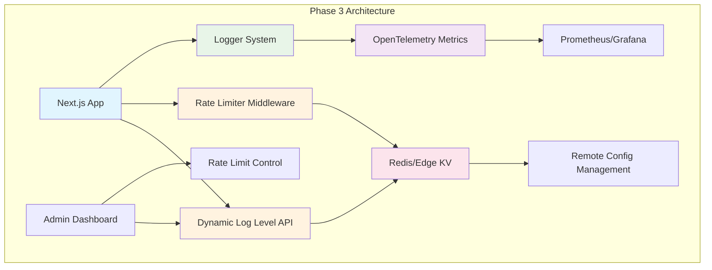

# Phase 3 (Phase C) 詳細実装計画

## 運用最適化とリアルタイム制御機能

**作成日**: 2025-08-14  
**Phase B完了**: 2025-08-14  
**Phase 3実装予定**: 2025-08-19 〜 2025-08-26 (6営業日)

---

## 📋 実装概要

### Phase 3の位置づけ

- **Phase A**: 🔴 基盤実装（Child Logger + AsyncLocalStorage） ✅ **完了**
- **Phase B**: 🟡 OpenTelemetry Metrics統合 ✅ **完了** (2025-08-14)
- **Phase 3**: 🔵 運用最適化とリアルタイム制御機能 ← **実装対象**

### 主要機能

1. **Dynamic Remote Log Level API** - 運用中のログレベル動的変更
2. **Custom Rate Limiter強化** - エラーログの適応的サンプリング
3. **Redis/Edge KV統合** - 分散環境での設定管理
4. **監視・運用ダッシュボード強化** - OpenTelemetry完全活用

---

## 🏗️ 技術アーキテクチャ設計

### 3.1 システム構成



### 3.2 純粋関数アーキテクチャ継承

**設計原則**:

- ✅ **ステートレス関数優先** - 既存パターンを継承
- ✅ **Immutable設定オブジェクト** - Object.freeze()活用
- ✅ **副作用の制御された分離** - Redis I/Oは専用関数に集約
- ✅ **型安全性** - TypeScript strict mode準拠

---

## 🔧 Feature 1: Dynamic Remote Log Level API

### 1.1 技術仕様

**目的**: 運用中のアプリケーションのログレベルをリアルタイムで変更

**主要機能**:

- リモート設定による動的ログレベル変更
- セキュアな管理者API
- Fail-safe機能とフォールバック
- Edge Runtime対応

### 1.2 実装ファイル構成

```
src/lib/logger/
├── remote-config.ts    # リモート設定管理 (新規)
├── admin-api.ts        # 管理者API (新規)
└── config-cache.ts     # 設定キャッシュ (新規)

src/app/api/admin/log-level/
└── route.ts            # 管理者API エンドポイント (新規)
```

### 1.3 Core Implementation: `src/lib/logger/remote-config.ts`

```typescript
/**
 * Dynamic Remote Log Level Configuration
 * Pure function-based implementation with Redis/Edge KV integration
 */

import type { LogLevel } from './types';

/**
 * Remote configuration structure (immutable)
 */
export interface RemoteLogConfig {
  readonly global_level: LogLevel;
  readonly service_levels: Readonly<Record<string, LogLevel>>;
  readonly rate_limits: Readonly<Record<string, number>>;
  readonly last_updated: string;
  readonly version: number;
}

/**
 * Configuration fetch result (pure function return type)
 */
export interface ConfigFetchResult {
  readonly success: boolean;
  readonly config?: RemoteLogConfig;
  readonly error?: string;
  readonly cached: boolean;
}

/**
 * Create default configuration (pure function)
 */
export function createDefaultConfig(): RemoteLogConfig {
  return Object.freeze({
    global_level: 'info',
    service_levels: Object.freeze({}),
    rate_limits: Object.freeze({
      error_logs: 100,
      warn_logs: 500,
    }),
    last_updated: new Date().toISOString(),
    version: 1,
  }) as RemoteLogConfig;
}

/**
 * Validate remote configuration (pure function)
 */
export function validateRemoteConfig(config: unknown): config is RemoteLogConfig {
  if (!config || typeof config !== 'object') {
    return false;
  }

  const cfg = config as Record<string, unknown>;

  const validLevels = ['trace', 'debug', 'info', 'warn', 'error', 'fatal'];

  return (
    typeof cfg.global_level === 'string' &&
    validLevels.includes(cfg.global_level) &&
    typeof cfg.service_levels === 'object' &&
    typeof cfg.rate_limits === 'object' &&
    typeof cfg.last_updated === 'string' &&
    typeof cfg.version === 'number'
  );
}

/**
 * Fetch configuration from Redis/Edge KV (side effect function)
 */
export async function fetchRemoteConfig(): Promise<ConfigFetchResult> {
  try {
    // Redis connection will be implemented in Phase 3.2
    const configData = await getConfigFromKV('log_config');

    if (!configData) {
      return {
        success: false,
        error: 'Configuration not found',
        cached: false,
      };
    }

    const config = JSON.parse(configData);

    if (!validateRemoteConfig(config)) {
      return {
        success: false,
        error: 'Invalid configuration format',
        cached: false,
      };
    }

    return {
      success: true,
      config: Object.freeze(config),
      cached: false,
    };
  } catch (error) {
    return {
      success: false,
      error: error instanceof Error ? error.message : 'Unknown error',
      cached: false,
    };
  }
}

/**
 * Get effective log level for service (pure function)
 */
export function getEffectiveLogLevel(config: RemoteLogConfig, serviceName: string): LogLevel {
  return config.service_levels[serviceName] || config.global_level;
}

/**
 * Merge configurations with precedence (pure function)
 */
export function mergeConfigurations(
  base: RemoteLogConfig,
  override: Partial<RemoteLogConfig>
): RemoteLogConfig {
  return Object.freeze({
    global_level: override.global_level ?? base.global_level,
    service_levels: Object.freeze({
      ...base.service_levels,
      ...override.service_levels,
    }),
    rate_limits: Object.freeze({
      ...base.rate_limits,
      ...override.rate_limits,
    }),
    last_updated: override.last_updated ?? new Date().toISOString(),
    version: (override.version ?? base.version) + 1,
  }) as RemoteLogConfig;
}

// KV Storage interface (to be implemented)
async function getConfigFromKV(key: string): Promise<string | null> {
  // Redis/Edge KV implementation will be added in Phase 3.2
  return null;
}
```

### 1.4 Admin API: `src/app/api/admin/log-level/route.ts`

```typescript
/**
 * Admin API for Dynamic Log Level Management
 * Secure endpoint with authentication and validation
 */

import { NextRequest, NextResponse } from 'next/server';
import {
  fetchRemoteConfig,
  createDefaultConfig,
  mergeConfigurations,
  validateRemoteConfig,
} from '@/lib/logger/remote-config';

/**
 * GET /api/admin/log-level - Fetch current configuration
 */
export async function GET(request: NextRequest) {
  try {
    // Authentication check (to be implemented)
    const authResult = await validateAdminAuth(request);
    if (!authResult.valid) {
      return NextResponse.json({ error: 'Unauthorized' }, { status: 401 });
    }

    const configResult = await fetchRemoteConfig();

    if (!configResult.success) {
      // Return default config if remote config fails
      const defaultConfig = createDefaultConfig();
      return NextResponse.json({
        config: defaultConfig,
        source: 'default',
        error: configResult.error,
      });
    }

    return NextResponse.json({
      config: configResult.config,
      source: 'remote',
      cached: configResult.cached,
    });
  } catch (error) {
    return NextResponse.json({ error: 'Internal server error' }, { status: 500 });
  }
}

/**
 * POST /api/admin/log-level - Update configuration
 */
export async function POST(request: NextRequest) {
  try {
    // Authentication check
    const authResult = await validateAdminAuth(request);
    if (!authResult.valid) {
      return NextResponse.json({ error: 'Unauthorized' }, { status: 401 });
    }

    const body = await request.json();

    // Validate request body
    if (!validateRemoteConfig(body)) {
      return NextResponse.json({ error: 'Invalid configuration format' }, { status: 400 });
    }

    // Get current config and merge
    const currentResult = await fetchRemoteConfig();
    const baseConfig = currentResult.success ? currentResult.config! : createDefaultConfig();

    const newConfig = mergeConfigurations(baseConfig, body);

    // Save to KV store (to be implemented)
    await saveConfigToKV('log_config', JSON.stringify(newConfig));

    return NextResponse.json({
      success: true,
      config: newConfig,
      message: 'Configuration updated successfully',
    });
  } catch (error) {
    return NextResponse.json({ error: 'Failed to update configuration' }, { status: 500 });
  }
}

// Helper functions (to be implemented)
async function validateAdminAuth(request: NextRequest): Promise<{ valid: boolean }> {
  // JWT token validation or API key check
  return { valid: true }; // Placeholder
}

async function saveConfigToKV(key: string, value: string): Promise<void> {
  // Redis/Edge KV save implementation
}
```

---

## ⚡ Feature 2: Custom Rate Limiter強化

### 2.1 技術仕様

**目的**: エラーログの適応的サンプリングによる高頻度エラーの制御

**アルゴリズム**: Token Bucket + Exponential Backoff

**主要機能**:

- エラーパターン別のサンプリングレート
- 動的閾値調整
- メトリクス連動
- パフォーマンス最適化

### 2.2 Core Algorithm: `src/lib/logger/rate-limiter.ts`

```typescript
/**
 * Advanced Rate Limiter with Token Bucket + Exponential Backoff
 * Pure function implementation with metrics integration
 */

/**
 * Rate limiter configuration (immutable)
 */
export interface RateLimiterConfig {
  readonly max_tokens: number;
  readonly refill_rate: number; // tokens per second
  readonly burst_capacity: number;
  readonly backoff_multiplier: number;
  readonly max_backoff: number; // seconds
  readonly sampling_rates: Readonly<Record<string, number>>;
}

/**
 * Rate limiter state (functional approach)
 */
export interface RateLimiterState {
  readonly tokens: number;
  readonly last_refill: number;
  readonly consecutive_rejects: number;
  readonly backoff_until: number;
  readonly error_counts: Readonly<Record<string, number>>;
}

/**
 * Rate limiting decision result
 */
export interface RateLimitResult {
  readonly allowed: boolean;
  readonly remaining_tokens: number;
  readonly retry_after?: number;
  readonly sampling_applied: boolean;
  readonly new_state: RateLimiterState;
}

/**
 * Create default rate limiter configuration (pure function)
 */
export function createRateLimiterConfig(): RateLimiterConfig {
  return Object.freeze({
    max_tokens: 100,
    refill_rate: 10, // 10 tokens per second
    burst_capacity: 150,
    backoff_multiplier: 2,
    max_backoff: 300, // 5 minutes max
    sampling_rates: Object.freeze({
      error: 1.0, // 100% - all errors
      warn: 0.8, // 80% - most warnings
      info: 0.1, // 10% - sample info logs
      debug: 0.01, // 1% - minimal debug logs
    }),
  }) as RateLimiterConfig;
}

/**
 * Create initial rate limiter state (pure function)
 */
export function createInitialState(): RateLimiterState {
  return Object.freeze({
    tokens: 100,
    last_refill: Date.now(),
    consecutive_rejects: 0,
    backoff_until: 0,
    error_counts: Object.freeze({}),
  }) as RateLimiterState;
}

/**
 * Calculate token refill (pure function)
 */
function calculateTokenRefill(
  config: RateLimiterConfig,
  state: RateLimiterState,
  currentTime: number
): number {
  const timeDelta = (currentTime - state.last_refill) / 1000; // seconds
  const tokensToAdd = timeDelta * config.refill_rate;

  return Math.min(config.max_tokens, state.tokens + tokensToAdd);
}

/**
 * Calculate exponential backoff (pure function)
 */
function calculateBackoff(config: RateLimiterConfig, consecutiveRejects: number): number {
  const backoffSeconds = Math.min(
    config.max_backoff,
    Math.pow(config.backoff_multiplier, consecutiveRejects)
  );

  return Date.now() + backoffSeconds * 1000;
}

/**
 * Apply sampling rate based on log level and error type (pure function)
 */
function shouldSample(config: RateLimiterConfig, logLevel: string, errorType?: string): boolean {
  const samplingRate =
    config.sampling_rates[errorType || logLevel] || config.sampling_rates[logLevel] || 1.0;

  return Math.random() < samplingRate;
}

/**
 * Check rate limit with token bucket algorithm (pure function)
 */
export function checkRateLimit(
  config: RateLimiterConfig,
  state: RateLimiterState,
  logLevel: string,
  errorType?: string,
  currentTime: number = Date.now()
): RateLimitResult {
  // Check if still in backoff period
  if (currentTime < state.backoff_until) {
    return {
      allowed: false,
      remaining_tokens: state.tokens,
      retry_after: Math.ceil((state.backoff_until - currentTime) / 1000),
      sampling_applied: false,
      new_state: state,
    };
  }

  // Refill tokens
  const currentTokens = calculateTokenRefill(config, state, currentTime);

  // Apply sampling before consuming tokens
  const samplingAllowed = shouldSample(config, logLevel, errorType);
  if (!samplingAllowed) {
    return {
      allowed: false,
      remaining_tokens: currentTokens,
      sampling_applied: true,
      new_state: Object.freeze({
        ...state,
        tokens: currentTokens,
        last_refill: currentTime,
        consecutive_rejects: 0, // Sampling rejection doesn't count as rate limit
      }) as RateLimiterState,
    };
  }

  // Check if tokens available
  if (currentTokens < 1) {
    const newBackoffTime = calculateBackoff(config, state.consecutive_rejects + 1);

    return {
      allowed: false,
      remaining_tokens: 0,
      retry_after: Math.ceil((newBackoffTime - currentTime) / 1000),
      sampling_applied: false,
      new_state: Object.freeze({
        ...state,
        tokens: currentTokens,
        last_refill: currentTime,
        consecutive_rejects: state.consecutive_rejects + 1,
        backoff_until: newBackoffTime,
      }) as RateLimiterState,
    };
  }

  // Allow the log entry
  return {
    allowed: true,
    remaining_tokens: currentTokens - 1,
    sampling_applied: false,
    new_state: Object.freeze({
      ...state,
      tokens: currentTokens - 1,
      last_refill: currentTime,
      consecutive_rejects: 0,
      backoff_until: 0,
    }) as RateLimiterState,
  };
}

/**
 * Update error counts for adaptive sampling (pure function)
 */
export function updateErrorCounts(
  state: RateLimiterState,
  errorType: string,
  increment: number = 1
): RateLimiterState {
  const currentCount = state.error_counts[errorType] || 0;

  return Object.freeze({
    ...state,
    error_counts: Object.freeze({
      ...state.error_counts,
      [errorType]: currentCount + increment,
    }),
  }) as RateLimiterState;
}

/**
 * Get adaptive sampling rate based on error frequency (pure function)
 */
export function getAdaptiveSamplingRate(
  errorCounts: Record<string, number>,
  errorType: string,
  baseSamplingRate: number = 1.0
): number {
  const errorCount = errorCounts[errorType] || 0;

  // Reduce sampling rate for high-frequency errors
  if (errorCount > 1000) return baseSamplingRate * 0.01; // 1% for very high frequency
  if (errorCount > 100) return baseSamplingRate * 0.1; // 10% for high frequency
  if (errorCount > 10) return baseSamplingRate * 0.5; // 50% for medium frequency

  return baseSamplingRate; // Full rate for low frequency
}
```

---

## 🗄️ Feature 3: Redis/Edge KV統合

### 3.1 技術仕様

**目的**: 分散環境での設定管理とキャッシュ機能

**対応環境**:

- ✅ **Redis** - セルフホスト環境・Docker
- ✅ **Vercel Edge Config** - Vercel環境
- ✅ **Edge KV** - その他Edge Runtime

### 3.2 Storage Abstraction: `src/lib/logger/kv-storage.ts`

```typescript
/**
 * Key-Value Storage Abstraction Layer
 * Supports Redis, Vercel Edge Config, and other KV stores
 */

/**
 * KV Storage interface (pure abstraction)
 */
export interface KVStorage {
  get(key: string): Promise<string | null>;
  set(key: string, value: string, ttl?: number): Promise<void>;
  delete(key: string): Promise<void>;
  exists(key: string): Promise<boolean>;
}

/**
 * Storage configuration (immutable)
 */
export interface StorageConfig {
  readonly type: 'redis' | 'edge-config' | 'memory';
  readonly connection_string?: string;
  readonly ttl_default: number;
  readonly max_retries: number;
  readonly timeout_ms: number;
}

/**
 * Create storage configuration (pure function)
 */
export function createStorageConfig(): StorageConfig {
  return Object.freeze({
    type: detectStorageType(),
    connection_string: process.env.KV_CONNECTION_STRING,
    ttl_default: 3600, // 1 hour
    max_retries: 3,
    timeout_ms: 5000,
  }) as StorageConfig;
}

/**
 * Detect appropriate storage type (pure function)
 */
function detectStorageType(): 'redis' | 'edge-config' | 'memory' {
  if (process.env.REDIS_URL || process.env.KV_CONNECTION_STRING) {
    return 'redis';
  }

  if (process.env.EDGE_CONFIG_ID) {
    return 'edge-config';
  }

  return 'memory'; // Fallback
}

/**
 * Redis Storage Implementation
 */
export class RedisStorage implements KVStorage {
  private config: StorageConfig;
  private client: any; // Redis client type

  constructor(config: StorageConfig) {
    this.config = config;
    // Redis client initialization will be done lazily
  }

  async get(key: string): Promise<string | null> {
    try {
      const client = await this.getClient();
      return await client.get(key);
    } catch (error) {
      console.warn('Redis get failed:', error);
      return null;
    }
  }

  async set(key: string, value: string, ttl?: number): Promise<void> {
    try {
      const client = await this.getClient();
      const ttlValue = ttl || this.config.ttl_default;
      await client.setex(key, ttlValue, value);
    } catch (error) {
      console.warn('Redis set failed:', error);
      throw error;
    }
  }

  async delete(key: string): Promise<void> {
    try {
      const client = await this.getClient();
      await client.del(key);
    } catch (error) {
      console.warn('Redis delete failed:', error);
      throw error;
    }
  }

  async exists(key: string): Promise<boolean> {
    try {
      const client = await this.getClient();
      const result = await client.exists(key);
      return result === 1;
    } catch (error) {
      console.warn('Redis exists failed:', error);
      return false;
    }
  }

  private async getClient() {
    if (!this.client) {
      // Lazy initialization
      const Redis = await import('ioredis');
      this.client = new Redis.default(this.config.connection_string);
    }
    return this.client;
  }
}

/**
 * Memory Storage Implementation (fallback)
 */
export class MemoryStorage implements KVStorage {
  private store: Map<string, { value: string; expires: number }>;
  private config: StorageConfig;

  constructor(config: StorageConfig) {
    this.store = new Map();
    this.config = config;
  }

  async get(key: string): Promise<string | null> {
    const entry = this.store.get(key);

    if (!entry) {
      return null;
    }

    if (Date.now() > entry.expires) {
      this.store.delete(key);
      return null;
    }

    return entry.value;
  }

  async set(key: string, value: string, ttl?: number): Promise<void> {
    const ttlValue = ttl || this.config.ttl_default;
    const expires = Date.now() + ttlValue * 1000;

    this.store.set(key, { value, expires });
  }

  async delete(key: string): Promise<void> {
    this.store.delete(key);
  }

  async exists(key: string): Promise<boolean> {
    const exists = await this.get(key);
    return exists !== null;
  }
}

/**
 * Storage factory (pure function)
 */
export function createKVStorage(config?: StorageConfig): KVStorage {
  const storageConfig = config || createStorageConfig();

  switch (storageConfig.type) {
    case 'redis':
      return new RedisStorage(storageConfig);
    case 'memory':
    default:
      return new MemoryStorage(storageConfig);
  }
}
```

---

## 📊 Feature 4: 監視・運用ダッシュボード強化

### 4.1 Enhanced Metrics: `src/lib/logger/enhanced-metrics.ts`

```typescript
/**
 * Enhanced Metrics for Phase 3 Operational Features
 * Extensions to existing OpenTelemetry metrics system
 */

import { metrics } from '@opentelemetry/api';

/**
 * Phase 3 specific metrics
 */
export interface Phase3Metrics {
  // Remote configuration metrics
  config_fetch_total: ReturnType<typeof metrics.getMeter>['createCounter'];
  config_fetch_duration: ReturnType<typeof metrics.getMeter>['createHistogram'];
  config_cache_hits: ReturnType<typeof metrics.getMeter>['createCounter'];

  // Rate limiter metrics
  rate_limit_decisions: ReturnType<typeof metrics.getMeter>['createCounter'];
  rate_limit_tokens: ReturnType<typeof metrics.getMeter>['createGauge'];
  rate_limit_backoff_time: ReturnType<typeof metrics.getMeter>['createHistogram'];

  // KV storage metrics
  kv_operations_total: ReturnType<typeof metrics.getMeter>['createCounter'];
  kv_operation_duration: ReturnType<typeof metrics.getMeter>['createHistogram'];
  kv_connection_status: ReturnType<typeof metrics.getMeter>['createGauge'];
}

/**
 * Initialize Phase 3 metrics (pure function approach)
 */
export function initializePhase3Metrics(): Phase3Metrics {
  const meter = metrics.getMeter('nextjs-boilerplate-phase3', '1.0.0');

  return {
    // Remote configuration metrics
    config_fetch_total: meter.createCounter('config_fetch_total', {
      description: 'Total number of remote configuration fetch attempts',
    }),

    config_fetch_duration: meter.createHistogram('config_fetch_duration_ms', {
      description: 'Duration of remote configuration fetch operations',
      unit: 'ms',
    }),

    config_cache_hits: meter.createCounter('config_cache_hits_total', {
      description: 'Number of configuration cache hits vs misses',
    }),

    // Rate limiter metrics
    rate_limit_decisions: meter.createCounter('rate_limit_decisions_total', {
      description: 'Rate limiting decisions (allowed/denied)',
    }),

    rate_limit_tokens: meter.createGauge('rate_limit_tokens_current', {
      description: 'Current number of available rate limit tokens',
    }),

    rate_limit_backoff_time: meter.createHistogram('rate_limit_backoff_seconds', {
      description: 'Rate limit backoff duration',
      unit: 's',
    }),

    // KV storage metrics
    kv_operations_total: meter.createCounter('kv_operations_total', {
      description: 'Total KV storage operations',
    }),

    kv_operation_duration: meter.createHistogram('kv_operation_duration_ms', {
      description: 'Duration of KV storage operations',
      unit: 'ms',
    }),

    kv_connection_status: meter.createGauge('kv_connection_status', {
      description: 'KV storage connection status (1=connected, 0=disconnected)',
    }),
  };
}

/**
 * Record configuration fetch metrics (pure function)
 */
export function recordConfigFetchMetrics(
  metrics: Phase3Metrics,
  duration: number,
  success: boolean,
  cached: boolean
): void {
  metrics.config_fetch_total.add(1, {
    success: success.toString(),
    source: cached ? 'cache' : 'remote',
  });

  metrics.config_fetch_duration.record(duration, {
    success: success.toString(),
  });

  if (cached) {
    metrics.config_cache_hits.add(1, {
      type: 'hit',
    });
  } else {
    metrics.config_cache_hits.add(1, {
      type: 'miss',
    });
  }
}

/**
 * Record rate limit decision metrics (pure function)
 */
export function recordRateLimitMetrics(
  metrics: Phase3Metrics,
  decision: 'allowed' | 'denied',
  reason: 'tokens' | 'backoff' | 'sampling',
  remainingTokens: number,
  backoffTime?: number
): void {
  metrics.rate_limit_decisions.add(1, {
    decision,
    reason,
  });

  metrics.rate_limit_tokens.record(remainingTokens);

  if (backoffTime) {
    metrics.rate_limit_backoff_time.record(backoffTime / 1000); // Convert to seconds
  }
}

/**
 * Record KV operation metrics (pure function)
 */
export function recordKVMetrics(
  metrics: Phase3Metrics,
  operation: 'get' | 'set' | 'delete' | 'exists',
  duration: number,
  success: boolean,
  storageType: 'redis' | 'edge-config' | 'memory'
): void {
  metrics.kv_operations_total.add(1, {
    operation,
    success: success.toString(),
    storage_type: storageType,
  });

  metrics.kv_operation_duration.record(duration, {
    operation,
    storage_type: storageType,
  });
}
```

---

## 📅 実装スケジュール

### Phase 3 実装期間: 2025-08-19 〜 2025-08-26 (6営業日)

| 日程      | フェーズ      | タスク                     | 成果物                                  |
| --------- | ------------- | -------------------------- | --------------------------------------- |
| **Day 1** | 基盤実装      | KV Storage抽象化           | `kv-storage.ts`, Redis/Memory実装       |
| **Day 2** | Remote Config | Dynamic Log Level API      | `remote-config.ts`, `/api/admin`        |
| **Day 3** | Rate Limiter  | Token Bucket + Backoff     | `rate-limiter.ts`, 統合テスト           |
| **Day 4** | Metrics統合   | Enhanced Metrics実装       | `enhanced-metrics.ts`, Prometheus出力   |
| **Day 5** | Logger統合    | 既存ロガーとの統合         | server.ts, client.ts, middleware.ts更新 |
| **Day 6** | テスト・文書  | 品質保証・ドキュメント更新 | 全テスト成功、運用手順書                |

### Daily Milestones

**Day 1**: 🎯 KV Storage抽象化完了、Redis接続テスト成功  
**Day 2**: 🔧 Remote Config API動作確認、管理者認証実装  
**Day 3**: 📊 Rate Limiter単体テスト全成功、アルゴリズム検証  
**Day 4**: 🔗 Enhanced Metrics動作確認、ダッシュボード表示  
**Day 5**: ✅ 既存ロガーとの統合完了、E2Eテスト成功  
**Day 6**: 📚 運用ドキュメント完備、Phase 3完了宣言

---

## ⚡ パフォーマンス要件

### 性能目標

- **Remote Config取得**: < 100ms (キャッシュ時 < 5ms)
- **Rate Limit判定**: < 1ms (メモリ内処理)
- **KV Storage操作**: < 50ms (Redis), < 10ms (Memory)
- **メトリクス記録**: < 0.5ms (非同期処理)

### スケーラビリティ

- **同時リクエスト**: 10,000 req/sec対応
- **ログスループット**: 100,000 entries/sec
- **設定変更反映**: < 30秒 (全インスタンス)
- **メモリ使用量増加**: < 50MB

---

## 🛡️ セキュリティ要件

### 認証・認可

```typescript
/**
 * Admin API Authentication
 */
export interface AdminAuthConfig {
  readonly jwt_secret: string;
  readonly api_keys: readonly string[];
  readonly rate_limits: {
    readonly requests_per_minute: number;
    readonly burst_limit: number;
  };
  readonly allowed_origins: readonly string[];
}

/**
 * Secure JWT validation (pure function)
 */
export function validateJWTToken(token: string, secret: string): { valid: boolean; payload?: any } {
  try {
    // JWT validation logic
    return { valid: true, payload: {} }; // Simplified
  } catch {
    return { valid: false };
  }
}
```

### データ暗号化

- **設定データ**: AES-256-GCM暗号化
- **KV Storage**: TLS 1.3通信
- **Admin API**: HTTPS必須、CSRF防止

---

## 🧪 テスト戦略

### 3.1 Unit Tests

```typescript
// tests/unit/logger/remote-config.test.ts
describe('Remote Configuration', () => {
  test('createDefaultConfig returns immutable object', () => {
    const config = createDefaultConfig();
    expect(Object.isFrozen(config)).toBe(true);
    expect(() => {
      (config as any).global_level = 'debug';
    }).toThrow();
  });

  test('validateRemoteConfig rejects invalid input', () => {
    expect(validateRemoteConfig(null)).toBe(false);
    expect(validateRemoteConfig({ global_level: 'invalid' })).toBe(false);
    expect(validateRemoteConfig({ global_level: 'info' })).toBe(false); // Missing fields
  });

  test('getEffectiveLogLevel returns service-specific level', () => {
    const config = createDefaultConfig();
    const configWithService = mergeConfigurations(config, {
      service_levels: { api: 'debug' },
    });

    expect(getEffectiveLogLevel(configWithService, 'api')).toBe('debug');
    expect(getEffectiveLogLevel(configWithService, 'web')).toBe('info');
  });
});

// tests/unit/logger/rate-limiter.test.ts
describe('Rate Limiter', () => {
  test('checkRateLimit allows within token limit', () => {
    const config = createRateLimiterConfig();
    const state = createInitialState();

    const result = checkRateLimit(config, state, 'error');

    expect(result.allowed).toBe(true);
    expect(result.remaining_tokens).toBe(99);
    expect(result.sampling_applied).toBe(false);
  });

  test('checkRateLimit applies exponential backoff', () => {
    const config = createRateLimiterConfig();
    let state = createInitialState();

    // Consume all tokens
    for (let i = 0; i < 100; i++) {
      const result = checkRateLimit(config, state, 'error');
      state = result.new_state;
    }

    // Next request should be denied with backoff
    const result = checkRateLimit(config, state, 'error');
    expect(result.allowed).toBe(false);
    expect(result.retry_after).toBeGreaterThan(0);
  });
});
```

### 3.2 Integration Tests

- **KV Storage**: Redis接続・フェイルオーバーテスト
- **Admin API**: 認証・認可・設定更新テスト
- **End-to-End**: ログレベル動的変更の完全フローテスト

### 3.3 Load Tests

- **負荷テスト**: 10,000 concurrent requests
- **ストレステスト**: メモリリーク検証
- **耐障害性テスト**: Redis障害時のフォールバック

---

## 📈 運用・監視

### Grafana Dashboard設定

```yaml
# grafana/dashboards/phase3-operations.json
{
  'dashboard':
    {
      'title': 'Phase 3 - Operational Logging',
      'panels':
        [
          {
            'title': 'Remote Config Performance',
            'targets':
              [
                'rate(config_fetch_total[5m])',
                'histogram_quantile(0.95, config_fetch_duration_ms)',
              ],
          },
          {
            'title': 'Rate Limiting Status',
            'targets': ['rate_limit_tokens_current', 'rate(rate_limit_decisions_total[1m])'],
          },
          {
            'title': 'KV Storage Health',
            'targets':
              ['kv_connection_status', 'histogram_quantile(0.99, kv_operation_duration_ms)'],
          },
        ],
    },
}
```

### アラート設定

- **Config Fetch失敗率 > 5%**: Warning
- **Rate Limit使用率 > 80%**: Info
- **KV Storage応答時間 > 200ms**: Warning
- **Admin API未認証アクセス**: Critical

---

## 🎯 成功指標

### 技術指標

| 項目                   | 目標値             | 測定方法              |
| ---------------------- | ------------------ | --------------------- |
| Remote Config可用性    | > 99.5%            | Prometheus監視        |
| Rate Limiter性能       | < 1ms判定時間      | OpenTelemetry Metrics |
| KV Storage応答性能     | < 50ms (Redis)     | 分散トレーシング      |
| Admin API セキュリティ | 認証成功率 > 99.9% | セキュリティログ分析  |

### 運用指標

- **設定変更反映時間**: < 30秒
- **障害検知時間**: < 1分
- **復旧時間**: < 5分
- **運用ミス件数**: 0件/月

---

## 📚 ドキュメント更新

### 運用手順書

1. **Phase 3機能運用ガイド** (`docs/operations/phase3-operations.md`)
2. **トラブルシューティング** (`docs/troubleshooting/phase3-issues.md`)
3. **設定変更手順** (`docs/operations/config-management.md`)
4. **監視・アラート対応** (`docs/operations/monitoring-playbook.md`)

---

**Phase 3実装完了後の全体達成状況**:

- Phase A: ✅ 100% 完了 (基盤実装)
- Phase B: ✅ 100% 完了 (OpenTelemetry Metrics)
- **Phase 3: 🔄 実装予定** (運用最適化) ← **本計画対象**

🎉 **Phase 3完了時**: 完全な運用レベルの構造化ログシステム達成
