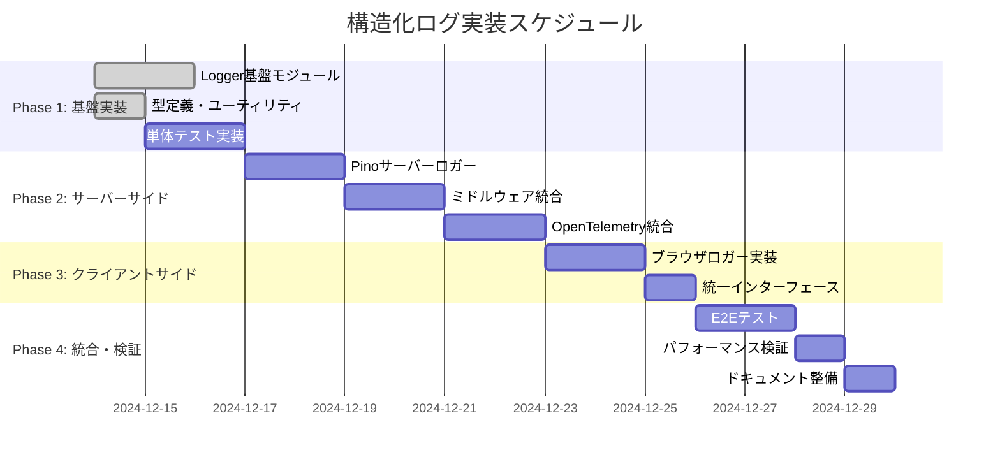
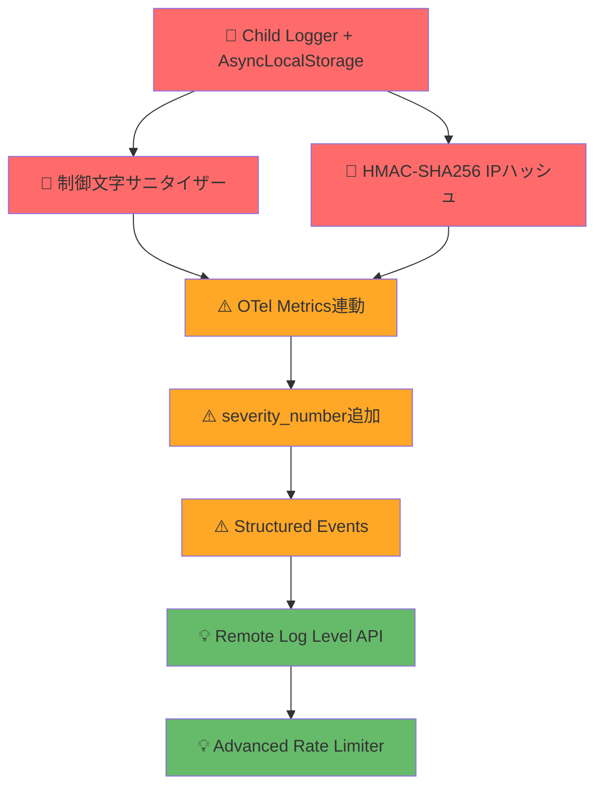

# 構造化ログ実装計画書

## 1. 実装概要

本ドキュメントは、Next.js Boilerplateプロジェクトにおける構造化ログシステムの具体的な実装手順と技術的詳細を定義します。  
Pinoベースの高性能ログシステムを段階的に導入し、OpenTelemetryとの統合による分散トレーシング対応を実現します。

## 2. 実装スケジュール

### 2.1 全体タイムライン（3週間）



## 3. Phase別実装詳細

### Phase 1: 基盤実装（3日間）

#### 3.1.1 依存関係の追加

```bash
# 必要なパッケージのインストール
pnpm add pino @opentelemetry/instrumentation-pino@^0.50.0 uuid
pnpm add pino @opentelemetry/core@^2.0.1
pnpm add pino @opentelemetry/exporter-trace-otlp-http@^0.203.0
pnpm add pino @opentelemetry/exporter-logs-otlp-http@^0.203.0
pnpm add pino @opentelemetry/resources@^2.0.1
pnpm add pino @opentelemetry/semantic-conventions@^1.36.0
pnpm add -D pino-pretty @types/uuid
```

#### 3.1.2 型定義とユーティリティ (`src/lib/logger/types.ts`)

```typescript
/**
 * ログレベル定義
 */
export const LOG_LEVELS = ['trace', 'debug', 'info', 'warn', 'error', 'fatal'] as const;

export type LogLevel = (typeof LOG_LEVELS)[number];

/**
 * ログ引数の型定義
 */
export type LogArgument =
  | string
  | number
  | boolean
  | Record<string, unknown>
  | Error
  | null
  | undefined;

/**
 * 統一Loggerインターフェース
 */
export interface Logger {
  trace(message: string, ...args: LogArgument[]): void;
  debug(message: string, ...args: LogArgument[]): void;
  info(message: string, ...args: LogArgument[]): void;
  warn(message: string, ...args: LogArgument[]): void;
  error(message: string, ...args: LogArgument[]): void;
  fatal(message: string, ...args: LogArgument[]): void;
  isLevelEnabled(level: LogLevel): boolean;
}

/**
 * ログミドルウェア設定
 */
export interface LoggingMiddlewareOptions {
  logHeaders?: boolean;
  logBody?: boolean;
  labels?: {
    start?: string;
    success?: string;
    error?: string;
  };
}

/**
 * ベースプロパティ設定
 */
export interface BaseProperties {
  app: string;
  env: string;
  pid: number;
  version?: string;
}
```

#### 3.1.3 共通ユーティリティ (`src/lib/logger/utils.ts`)

```typescript
import { LogLevel, LOG_LEVELS, BaseProperties } from './types';

/**
 * デフォルトログレベル
 */
export const DEFAULT_LOG_LEVEL: LogLevel = 'info';

/**
 * 環境変数からログレベルを取得
 */
export function getLogLevelFromEnv(): LogLevel {
  const envLevel = process.env.LOG_LEVEL?.toLowerCase();

  if (envLevel && LOG_LEVELS.includes(envLevel as LogLevel)) {
    return envLevel as LogLevel;
  }

  return DEFAULT_LOG_LEVEL;
}

/**
 * クライアントサイドログレベル取得
 */
export function getClientLogLevel(): LogLevel {
  if (typeof window === 'undefined') {
    // サーバーサイドでは環境変数から取得
    return getLogLevelFromEnv();
  }

  // ブラウザ環境では NEXT_PUBLIC_ プレフィックス付きの環境変数を使用
  const envLevel = process.env.NEXT_PUBLIC_LOG_LEVEL?.toLowerCase();

  if (envLevel && LOG_LEVELS.includes(envLevel as LogLevel)) {
    return envLevel as LogLevel;
  }

  // 開発環境では詳細ログ、本番環境ではデフォルト
  return process.env.NODE_ENV === 'development' ? 'debug' : DEFAULT_LOG_LEVEL;
}

/**
 * ベースプロパティ生成
 */
export function createBaseProperties(): BaseProperties {
  return {
    app: process.env.NEXT_PUBLIC_APP_NAME || 'nextjs-boilerplate',
    env: process.env.NODE_ENV || 'development',
    pid: typeof process !== 'undefined' ? process.pid : 0,
    version: process.env.NEXT_PUBLIC_APP_VERSION || '1.0.0',
  };
}

/**
 * 機密情報Redactionパス
 */
export const REDACT_PATHS = [
  // 認証情報
  'password',
  'token',
  'authorization',
  'auth',
  'secret',
  'key',
  '*.password',
  '*.token',
  '*.authorization',
  '*.auth',
  '*.secret',
  '*.key',

  // HTTPヘッダー
  'headers.authorization',
  'headers.cookie',
  'headers.x-api-key',
  'headers.set-cookie',

  // 個人情報（PII）
  'user.email',
  'user.phone',
  'user.ssn',
  'user.credit_card',
  '*.email',
  '*.phone',
  '*.ssn',
  '*.credit_card',
  'email',
  'phone',
  'ssn',
  'credit_card',

  // 機密ビジネス情報
  'payment.card_number',
  'payment.cvv',
  'bank.account_number',
  'card_number',
  'cvv',
  'account_number',
];

/**
 * ログレベルの数値変換
 */
export function getLogLevelValue(level: LogLevel): number {
  const levelMap: Record<LogLevel, number> = {
    trace: 10,
    debug: 20,
    info: 30,
    warn: 40,
    error: 50,
    fatal: 60,
  };

  return levelMap[level] || 30;
}

/**
 * ログレベル比較
 */
export function isLogLevelEnabled(currentLevel: LogLevel, targetLevel: LogLevel): boolean {
  return getLogLevelValue(targetLevel) >= getLogLevelValue(currentLevel);
}

/**
 * リクエストIDジェネレーター
 */
export function generateRequestId(): string {
  return `req_${Date.now()}_${Math.random().toString(36).substring(2, 8)}`;
}

/**
 * エラーオブジェクトのシリアライズ
 */
export function serializeError(error: Error | unknown): Record<string, unknown> {
  if (error instanceof Error) {
    return {
      name: error.name,
      message: error.message,
      stack: error.stack,
      cause: error.cause,
    };
  }

  return {
    message: String(error),
    type: typeof error,
  };
}

/**
 * 🚨 高リスク対応: HMAC-SHA256 IPハッシュ実装
 */
import { createHmac } from 'crypto';

let ipHashSecret: string;

function initializeIPHashSecret(): void {
  ipHashSecret =
    process.env.LOG_IP_HASH_SECRET || require('crypto').randomBytes(32).toString('hex');
  if (!process.env.LOG_IP_HASH_SECRET) {
    console.warn('LOG_IP_HASH_SECRET not set. Generated temporary secret for IP hashing.');
  }
}

export function hashIP(ipAddress: string): string {
  if (!ipHashSecret) {
    initializeIPHashSecret();
  }

  // IPv6正規化
  const normalizedIP = ipAddress.startsWith('::ffff:') ? ipAddress.substring(7) : ipAddress;

  // HMAC-SHA256でハッシュ化
  const hmac = createHmac('sha256', ipHashSecret);
  hmac.update(normalizedIP);
  const hash = hmac.digest('hex');

  // セキュリティと可読性のバランス（最初8文字のみ使用）
  return `ip_${hash.substring(0, 8)}`;
}

/**
 * 🚨 高リスク対応: 制御文字サニタイザー実装
 */
export function sanitizeControlCharacters(input: unknown): unknown {
  if (typeof input === 'string') {
    return input.replace(/[\x00-\x1F\x7F-\x9F]/g, (char) => {
      return `\\u${char.charCodeAt(0).toString(16).padStart(4, '0').toUpperCase()}`;
    });
  }

  if (Array.isArray(input)) {
    return input.map((item) => sanitizeControlCharacters(item));
  }

  if (input && typeof input === 'object') {
    const sanitized: Record<string, unknown> = {};
    for (const [key, value] of Object.entries(input)) {
      const sanitizedKey = sanitizeControlCharacters(key) as string;
      sanitized[sanitizedKey] = sanitizeControlCharacters(value);
    }
    return sanitized;
  }

  return input;
}

/**
 * ⚠️ 中リスク対応: OpenTelemetry Logs準拠のseverity_number
 */
export const SEVERITY_NUMBERS = {
  trace: 1,
  debug: 5,
  info: 9,
  warn: 13,
  error: 17,
  fatal: 21,
} as const;
```

#### 3.1.4 テスト実装 (`tests/unit/logger/utils.test.ts`)

```typescript
import { describe, it, expect, beforeEach, afterEach } from 'vitest';
import {
  getLogLevelFromEnv,
  getClientLogLevel,
  createBaseProperties,
  isLogLevelEnabled,
  serializeError,
  REDACT_PATHS,
} from '../../../src/lib/logger/utils';

describe('Logger Utils', () => {
  const originalEnv = process.env;

  beforeEach(() => {
    process.env = { ...originalEnv };
  });

  afterEach(() => {
    process.env = originalEnv;
  });

  describe('getLogLevelFromEnv', () => {
    it('should return environment log level when valid', () => {
      process.env.LOG_LEVEL = 'debug';
      expect(getLogLevelFromEnv()).toBe('debug');
    });

    it('should return default level when invalid', () => {
      process.env.LOG_LEVEL = 'invalid';
      expect(getLogLevelFromEnv()).toBe('info');
    });

    it('should return default level when not set', () => {
      delete process.env.LOG_LEVEL;
      expect(getLogLevelFromEnv()).toBe('info');
    });
  });

  describe('isLogLevelEnabled', () => {
    it('should enable higher or equal log levels', () => {
      expect(isLogLevelEnabled('info', 'info')).toBe(true);
      expect(isLogLevelEnabled('info', 'warn')).toBe(true);
      expect(isLogLevelEnabled('info', 'error')).toBe(true);
    });

    it('should disable lower log levels', () => {
      expect(isLogLevelEnabled('info', 'debug')).toBe(false);
      expect(isLogLevelEnabled('warn', 'info')).toBe(false);
    });
  });

  describe('serializeError', () => {
    it('should serialize Error objects correctly', () => {
      const error = new Error('Test error');
      const serialized = serializeError(error);

      expect(serialized).toEqual({
        name: 'Error',
        message: 'Test error',
        stack: expect.any(String),
        cause: undefined,
      });
    });

    it('should handle non-Error objects', () => {
      const serialized = serializeError('string error');

      expect(serialized).toEqual({
        message: 'string error',
        type: 'string',
      });
    });
  });

  describe('REDACT_PATHS', () => {
    it('should include common sensitive fields', () => {
      expect(REDACT_PATHS).toContain('password');
      expect(REDACT_PATHS).toContain('authorization');
      expect(REDACT_PATHS).toContain('headers.cookie');
      expect(REDACT_PATHS).toContain('user.email');
    });
  });
});
```

### Phase 2: サーバーサイド実装（6日間）

#### 3.2.1 Pinoサーバーロガー (`src/lib/logger/server.ts`)

```typescript
import pino from 'pino';
import { getLogLevelFromEnv, createBaseProperties, REDACT_PATHS, serializeError } from './utils';
import type { Logger } from './types';

/**
 * Pinoベースサーバーロガーの作成
 */
function createServerLogger(): pino.Logger {
  const baseProperties = createBaseProperties();

  const pinoOptions: pino.LoggerOptions = {
    level: getLogLevelFromEnv(),
    timestamp: pino.stdTimeFunctions.isoTime,
    base: baseProperties,

    // 機密情報のRedaction設定
    redact: {
      paths: REDACT_PATHS,
      censor: '[REDACTED]',
    },

    // 標準シリアライザー + カスタムエラーシリアライザー
    serializers: {
      ...pino.stdSerializers,
      err: (error: Error | unknown) => serializeError(error),
    },

    // フォーマッターで追加情報を付与
    formatters: {
      level: (label: string) => ({ level: label }),
      bindings: (bindings: pino.Bindings) => ({
        ...bindings,
        service: baseProperties.app,
      }),
    },
  };

  // 環境に応じたTransport設定
  return createLoggerWithTransport(pinoOptions);
}

/**
 * 環境に応じたTransport設定でLoggerを作成
 */
function createLoggerWithTransport(options: pino.LoggerOptions): pino.Logger {
  const isDevelopment = process.env.NODE_ENV !== 'production';
  const isNextRuntime = typeof process.env.NEXT_RUNTIME !== 'undefined';

  // 開発環境 かつ Next.jsランタイム以外の場合のみpino-prettyを使用
  if (isDevelopment && !isNextRuntime) {
    try {
      const transport = pino.transport({
        target: 'pino-pretty',
        options: {
          colorize: true,
          translateTime: 'yyyy-mm-dd HH:MM:ss',
          ignore: 'pid,hostname',
          singleLine: false,
          hideObject: false,
        },
      });

      return pino(options, transport);
    } catch (error) {
      // pino-pretty初期化失敗時のフォールバック
      console.warn('Failed to initialize pino-pretty transport, falling back to basic logger:', {
        error: serializeError(error),
        timestamp: new Date().toISOString(),
      });

      return pino(options);
    }
  }

  // 本番環境またはNext.jsランタイム環境では標準出力
  return pino(options);
}

// Serverロガーインスタンスの作成とエクスポート
export const serverLogger = createServerLogger();

/**
 * 複数引数を適切にマージする関数
 */
function mergeLogArguments(args: LogArgument[]): Record<string, unknown> {
  const result: Record<string, unknown> = {};

  for (const arg of args) {
    if (arg === null || arg === undefined) {
      continue;
    }

    if (arg instanceof Error) {
      // Error オブジェクトは err キーで格納（Pino標準）
      result.err = serializeError(arg);
    } else if (typeof arg === 'object' && !Array.isArray(arg)) {
      // オブジェクトは展開してマージ
      Object.assign(result, arg);
    } else {
      // その他の型は args 配列に格納
      if (!result.args) {
        result.args = [];
      }
      (result.args as unknown[]).push(arg);
    }
  }

  return result;
}

// Logger インターフェース準拠のラッパー実装
export const serverLoggerWrapper: Logger = {
  trace: (message: string, ...args) => {
    const mergedArgs = mergeLogArguments(args);
    serverLogger.trace(mergedArgs, message);
  },
  debug: (message: string, ...args) => {
    const mergedArgs = mergeLogArguments(args);
    serverLogger.debug(mergedArgs, message);
  },
  info: (message: string, ...args) => {
    const mergedArgs = mergeLogArguments(args);
    serverLogger.info(mergedArgs, message);
  },
  warn: (message: string, ...args) => {
    const mergedArgs = mergeLogArguments(args);
    serverLogger.warn(mergedArgs, message);
  },
  error: (message: string, ...args) => {
    const mergedArgs = mergeLogArguments(args);
    serverLogger.error(mergedArgs, message);
  },
  fatal: (message: string, ...args) => {
    const mergedArgs = mergeLogArguments(args);
    serverLogger.fatal(mergedArgs, message);
  },
  isLevelEnabled: (level) => serverLogger.isLevelEnabled(level),
};

export default serverLoggerWrapper;

/**
 * 🚨 高リスク対応: Child Logger + AsyncLocalStorage完全実装
 */
import { AsyncLocalStorage } from 'async_hooks';

interface LoggerContext {
  requestId: string;
  traceId?: string;
  spanId?: string;
  userId?: string;
  sessionId?: string;
  event_name?: string;
  event_category?: 'user_action' | 'system_event' | 'error_event' | 'security_event';
}

class LoggerContextManager {
  private storage = new AsyncLocalStorage<LoggerContext>();

  // コンテキスト付きChild Loggerの生成
  createChildLogger(baseLogger: pino.Logger, context: Partial<LoggerContext>): pino.Logger {
    const currentContext = this.getContext();
    const mergedContext = { ...currentContext, ...context };

    return baseLogger.child(mergedContext);
  }

  // リクエストコンテキストでの実行
  runWithContext<T>(context: LoggerContext, fn: () => T): T {
    return this.storage.run(context, fn);
  }

  getContext(): LoggerContext | undefined {
    return this.storage.getStore();
  }

  // 統一Loggerインターフェース対応のChild Logger
  createContextualLogger(context: Partial<LoggerContext>): Logger {
    const currentContext = this.getContext();
    const mergedContext = {
      ...currentContext,
      ...context,
      log_schema_version: '1.0.0',
      severity_number: undefined, // 後で各メソッドで設定
    };

    return {
      trace: (message: string, ...args: LogArgument[]) => {
        const finalContext = { ...mergedContext, severity_number: SEVERITY_NUMBERS.trace };
        const mergedArgs = mergeLogArguments(args);
        serverLogger.trace({ ...finalContext, ...mergedArgs }, message);
      },
      debug: (message: string, ...args: LogArgument[]) => {
        const finalContext = { ...mergedContext, severity_number: SEVERITY_NUMBERS.debug };
        const mergedArgs = mergeLogArguments(args);
        serverLogger.debug({ ...finalContext, ...mergedArgs }, message);
      },
      info: (message: string, ...args: LogArgument[]) => {
        const finalContext = { ...mergedContext, severity_number: SEVERITY_NUMBERS.info };
        const mergedArgs = mergeLogArguments(args);
        serverLogger.info({ ...finalContext, ...mergedArgs }, message);
      },
      warn: (message: string, ...args: LogArgument[]) => {
        const finalContext = { ...mergedContext, severity_number: SEVERITY_NUMBERS.warn };
        const mergedArgs = mergeLogArguments(args);
        serverLogger.warn({ ...finalContext, ...mergedArgs }, message);
      },
      error: (message: string, ...args: LogArgument[]) => {
        const finalContext = { ...mergedContext, severity_number: SEVERITY_NUMBERS.error };
        const mergedArgs = mergeLogArguments(args);
        serverLogger.error({ ...finalContext, ...mergedArgs }, message);
      },
      fatal: (message: string, ...args: LogArgument[]) => {
        const finalContext = { ...mergedContext, severity_number: SEVERITY_NUMBERS.fatal };
        const mergedArgs = mergeLogArguments(args);
        serverLogger.fatal({ ...finalContext, ...mergedArgs }, message);
      },
      isLevelEnabled: (level) => serverLogger.isLevelEnabled(level),
    };
  }
}

export const loggerContextManager = new LoggerContextManager();
```

#### 3.2.2 Edge Runtime ロガー (`src/lib/logger/edge.ts`)

```typescript
import {
  getClientLogLevel,
  isLogLevelEnabled,
  serializeError,
  createBaseProperties,
} from './utils';
import type { Logger, LogArgument, LogLevel } from './types';

/**
 * Edge Runtime向けLoggerの実装
 * V8 Isolateの制約によりPinoが使用できない環境向け
 */
class EdgeLogger implements Logger {
  private readonly configuredLevel: LogLevel;
  private readonly baseProperties: Record<string, unknown>;

  constructor() {
    this.configuredLevel = getClientLogLevel();
    this.baseProperties = {
      ...createBaseProperties(),
      runtime: 'edge',
      log_schema_version: '1.0.0',
    };
  }

  trace(message: string, ...args: LogArgument[]): void {
    this.log('trace', message, ...args);
  }

  debug(message: string, ...args: LogArgument[]): void {
    this.log('debug', message, ...args);
  }

  info(message: string, ...args: LogArgument[]): void {
    this.log('info', message, ...args);
  }

  warn(message: string, ...args: LogArgument[]): void {
    this.log('warn', message, ...args);
  }

  error(message: string, ...args: LogArgument[]): void {
    this.log('error', message, ...args);
  }

  fatal(message: string, ...args: LogArgument[]): void {
    this.log('fatal', message, ...args);
  }

  isLevelEnabled(level: LogLevel): boolean {
    return isLogLevelEnabled(this.configuredLevel, level);
  }

  /**
   * 共通ログ処理（Edge Runtime版）
   */
  private log(level: LogLevel, message: string, ...args: LogArgument[]): void {
    if (!this.isLevelEnabled(level)) {
      return;
    }

    const logEntry = this.createLogEntry(level, message, args);

    // Edge Runtimeでは構造化JSONを標準出力
    console.log(JSON.stringify(logEntry));
  }

  /**
   * ログエントリの作成
   */
  private createLogEntry(
    level: LogLevel,
    message: string,
    args: LogArgument[]
  ): Record<string, unknown> {
    const entry: Record<string, unknown> = {
      ...this.baseProperties,
      level: this.getLevelValue(level),
      time: new Date().toISOString(),
      msg: message,
    };

    // 引数の処理
    for (const arg of args) {
      if (arg === null || arg === undefined) {
        continue;
      }

      if (arg instanceof Error) {
        entry.err = serializeError(arg);
      } else if (typeof arg === 'object' && !Array.isArray(arg)) {
        Object.assign(entry, arg);
      }
    }

    return entry;
  }

  /**
   * ログレベルの数値変換
   */
  private getLevelValue(level: LogLevel): number {
    const levelMap: Record<LogLevel, number> = {
      trace: 10,
      debug: 20,
      info: 30,
      warn: 40,
      error: 50,
      fatal: 60,
    };
    return levelMap[level] || 30;
  }
}

// Edge Logger インスタンスの作成とエクスポート
export const edgeLogger = new EdgeLogger();

export default edgeLogger;
```

#### 3.2.3 HTTPログミドルウェア (`src/lib/logger/middleware.ts`)

```typescript
import { NextRequest, NextResponse } from 'next/server';
import { v7 as uuidv7 } from 'uuid';
import { serverLogger, loggerContextManager } from './server';
import { generateRequestId, serializeError, hashIP, sanitizeControlCharacters } from './utils';
import type { LoggingMiddlewareOptions } from './types';

// リクエストボディの最大ログサイズ
const MAX_BODY_LOG_SIZE = 1024; // 1KB

// セキュアなヘッダーのAllowlist（セキュリティ強化）
const SAFE_HEADERS = [
  'user-agent',
  'content-type',
  'content-length',
  'accept',
  'accept-language',
  'accept-encoding',
  'x-request-id',
  'x-correlation-id',
  'x-forwarded-for',
  'x-real-ip',
  'cf-connecting-ip',
  'cache-control',
];

/**
 * ログミドルウェアファクトリー
 */
export function createLoggingMiddleware(options: LoggingMiddlewareOptions = {}) {
  const {
    logHeaders = true,
    logBody = false,
    labels = {
      start: 'API request started',
      success: 'API request completed',
      error: 'API request failed',
    },
  } = options;

  return function withLogging<T = unknown>(
    handler: (req: NextRequest, context?: T) => Promise<NextResponse>
  ) {
    return async function loggingWrapper(req: NextRequest, context?: T): Promise<NextResponse> {
      // UUID v7によるリクエストID生成（時間順ソート可能）
      const requestId = uuidv7();
      const startTime = Date.now();

      // 🚨 高リスク対応: AsyncLocalStorageコンテキスト作成
      const loggerContext = {
        requestId,
        event_category: 'system_event' as const,
        event_name: 'http.request',
      };

      return loggerContextManager.runWithContext(loggerContext, async () => {
        // Child Logger作成（コンテキスト自動付与）
        const contextLogger = loggerContextManager.createContextualLogger(loggerContext);

        // リクエスト情報の収集
        const requestInfo = await gatherRequestInfo(req, {
          requestId,
          logHeaders,
          logBody,
        });

        // 🚨 高リスク対応: 制御文字サニタイズ適用
        const sanitizedRequestInfo = sanitizeControlCharacters(requestInfo);

        // リクエスト開始ログ
        contextLogger.info(labels.start, sanitizedRequestInfo);

        try {
          // ハンドラー実行
          const response = await handler(req, context);

          // 成功レスポンスログ
          const duration = Date.now() - startTime;
          const responseInfo = {
            statusCode: response.status,
            duration,
            responseHeaders: logHeaders ? getResponseHeaders(response) : undefined,
          };

          contextLogger.info(labels.success, sanitizeControlCharacters(responseInfo));

          return response;
        } catch (error) {
          // エラーレスポンスログ
          const duration = Date.now() - startTime;
          const errorInfo = {
            duration,
            error: serializeError(error),
            event_name: 'http.request.error',
            event_category: 'error_event' as const,
          };

          contextLogger.error(labels.error, sanitizeControlCharacters(errorInfo));

          throw error;
        }
      });
    };
  };
}

/**
 * リクエスト情報の収集
 */
async function gatherRequestInfo(
  req: NextRequest,
  options: {
    requestId: string;
    logHeaders: boolean;
    logBody: boolean;
  }
): Promise<Record<string, unknown>> {
  const { requestId, logHeaders, logBody } = options;

  const info: Record<string, unknown> = {
    log_schema_version: '1.0.0',
    requestId,
    // OpenTelemetry Semantic Conventions準拠
    'http.request.method': req.method,
    'url.full': req.nextUrl.toString(),
    'url.path': req.nextUrl.pathname,
    'url.query': req.nextUrl.search,
    'user_agent.original': req.headers.get('user-agent') || undefined,
    'client.address.hash': getClientIPHash(req), // セキュリティ：IPアドレスをハッシュ化
    timestamp: new Date().toISOString(),
  };

  // ヘッダー情報の追加（Allowlist方式でセキュリティ強化）
  if (logHeaders) {
    info.headers = getFilteredRequestHeaders(req);
  }

  // ボディ情報の追加（GET/HEAD以外で有効）
  if (logBody && req.method !== 'GET' && req.method !== 'HEAD') {
    info.body = await getRequestBody(req);
  }

  return info;
}

/**
 * セキュアなリクエストヘッダーの取得（Allowlist方式）
 */
function getFilteredRequestHeaders(req: NextRequest): Record<string, string> {
  const headers: Record<string, string> = {};

  // Allowlistに含まれるヘッダーのみをログ出力
  SAFE_HEADERS.forEach((headerName) => {
    const value = req.headers.get(headerName);
    if (value) {
      headers[headerName] = value;
    }
  });

  return headers;
}

/**
 * レスポンスヘッダーの取得
 */
function getResponseHeaders(response: NextResponse): Record<string, string> {
  const headers: Record<string, string> = {};

  response.headers.forEach((value, key) => {
    // レスポンスヘッダーも基本的なもののみログ出力
    if (SAFE_HEADERS.includes(key.toLowerCase())) {
      headers[key] = value;
    }
  });

  return headers;
}

/**
 * リクエストボディの取得
 */
async function getRequestBody(req: NextRequest): Promise<unknown> {
  try {
    const clone = req.clone();
    let text = await clone.text();

    if (!text) {
      return null;
    }

    // サイズ制限の適用
    const isTruncated = text.length > MAX_BODY_LOG_SIZE;
    if (isTruncated) {
      text = text.substring(0, MAX_BODY_LOG_SIZE);
    }

    const contentType = req.headers.get('content-type')?.toLowerCase() || '';

    // Content-Typeに応じた処理
    if (contentType.includes('application/json')) {
      try {
        const parsed = JSON.parse(text);
        return isTruncated ? { ...parsed, _truncated: true } : parsed;
      } catch {
        return { _parseError: 'Invalid JSON', _rawBody: text, _truncated: isTruncated };
      }
    }

    if (contentType.startsWith('text/')) {
      return isTruncated ? `${text}... [TRUNCATED]` : text;
    }

    // その他のContent-Type
    return {
      _contentType: contentType,
      _size: text.length,
      _truncated: isTruncated,
      _preview: text.substring(0, 100),
    };
  } catch (error) {
    return {
      _error: 'Failed to read request body',
      _details: serializeError(error),
    };
  }
}

/**
 * クライアントIPアドレスのハッシュ化取得（GDPR対応）
 */
function getClientIPHash(req: NextRequest): string | undefined {
  // X-Forwarded-For, X-Real-IP, CF-Connecting-IP などを確認
  const forwardedFor = req.headers.get('x-forwarded-for');
  let clientIP: string | undefined;

  if (forwardedFor) {
    clientIP = forwardedFor.split(',')[0].trim();
  } else {
    const realIP = req.headers.get('x-real-ip');
    if (realIP) {
      clientIP = realIP;
    } else {
      const cfIP = req.headers.get('cf-connecting-ip');
      if (cfIP) {
        clientIP = cfIP;
      }
    }
  }

  // IPアドレスをハッシュ化してプライバシー保護
  return clientIP ? hashIP(clientIP) : undefined;
}

// デフォルトミドルウェアのエクスポート
export const withLogging = createLoggingMiddleware();

export default withLogging;
```

#### 3.2.3 OpenTelemetry統合 (`instrumentation.ts`)

```typescript
export async function register() {
  if (process.env.NEXT_RUNTIME === 'nodejs') {
    const { NodeSDK } = await import('@opentelemetry/sdk-node');
    const { Resource } = await import('@opentelemetry/resources');
    const { ATTR_SERVICE_NAME, ATTR_SERVICE_VERSION } = await import(
      '@opentelemetry/semantic-conventions'
    );
    const { PinoInstrumentation } = await import('@opentelemetry/instrumentation-pino');
    const { UndiciInstrumentation } = await import('@opentelemetry/instrumentation-undici');
    const { getNodeAutoInstrumentations } = await import(
      '@opentelemetry/auto-instrumentations-node'
    );
    const { ParentBasedTraceIdRatioBased } = await import('@opentelemetry/core');
    const { OTLPTraceExporter } = await import('@opentelemetry/exporter-trace-otlp-http');
    const { OTLPLogExporter } = await import('@opentelemetry/exporter-logs-otlp-http');

    // サンプリング設定（負荷軽減のため）
    const sampler = new ParentBasedTraceIdRatioBased(
      parseFloat(process.env.OTEL_TRACES_SAMPLER_ARG || '0.1') // デフォルト10%サンプリング
    );

    // Exporter設定
    const traceExporter = new OTLPTraceExporter({
      url: process.env.OTEL_EXPORTER_OTLP_TRACES_ENDPOINT || 'http://localhost:4318/v1/traces',
    });

    const logExporter = new OTLPLogExporter({
      url: process.env.OTEL_EXPORTER_OTLP_LOGS_ENDPOINT || 'http://localhost:4318/v1/logs',
    });

    const sdk = new NodeSDK({
      sampler,

      instrumentations: [
        // Pino自動インストゥルメンテーション
        new PinoInstrumentation({
          logKeys: {
            traceId: 'trace_id',
            spanId: 'span_id',
            traceFlags: 'trace_flags',
          },
          // 将来的なOTel Logs送信への拡張パス
          disableLogSending: process.env.OTEL_LOGS_ENABLED !== 'true',
        }),

        // HTTP/fetch のインストゥルメンテーション（Semantic Conventions準拠）
        new UndiciInstrumentation({
          requestHook: (span, request) => {
            span.setAttributes({
              'http.request.body.size': request.body?.length || 0,
              'http.request.method': request.method || 'GET',
              'url.full': request.url,
            });
          },
          responseHook: (span, { statusCode }) => {
            span.setAttributes({
              'http.response.status_code': statusCode,
            });
          },
        }),

        // その他の自動インストゥルメンテーション
        getNodeAutoInstrumentations({
          '@opentelemetry/instrumentation-fs': {
            enabled: false, // ファイルシステム監視は無効化
          },
          '@opentelemetry/instrumentation-http': {
            enabled: true,
            requestHook: (span, request) => {
              // Semantic Conventions準拠のHTTP属性設定
              span.setAttributes({
                'http.request.method': request.method || 'GET',
                'url.full': `${request.protocol}//${request.headers.host}${request.url}`,
                'client.address':
                  request.headers['x-forwarded-for']?.split(',')[0] ||
                  request.headers['x-real-ip'] ||
                  request.connection?.remoteAddress,
                'user_agent.original': request.headers['user-agent'],
              });
            },
          },
        }),
      ],

      // 正しいResource設定
      resource: new Resource({
        [ATTR_SERVICE_NAME]: process.env.OTEL_SERVICE_NAME || 'nextjs-boilerplate',
        [ATTR_SERVICE_VERSION]: process.env.NEXT_PUBLIC_APP_VERSION || '1.0.0',
        'deployment.environment': process.env.NODE_ENV || 'development',
        'service.namespace': process.env.OTEL_SERVICE_NAMESPACE || 'local',
        'git.commit.id': process.env.NEXT_PUBLIC_GIT_COMMIT_SHA || 'unknown',
        'build.id': process.env.NEXT_PUBLIC_BUILD_ID || 'unknown',
      }),

      // Exporter設定
      traceExporter,
      // logExporter, // 将来的なOTel Logs対応
    });

    // SDK初期化
    sdk.start();

    // プロセス終了時のクリーンアップ
    process.on('SIGTERM', () => {
      sdk.shutdown().finally(() => process.exit(0));
    });
  }
}
```

#### 3.2.4 動的設定管理 (`src/lib/logger/config.ts`)

```typescript
import { readFileSync, watchFile } from 'fs';
import { join } from 'path';
import type { LogLevel } from './types';

interface LoggerConfig {
  level: LogLevel;
  logHeaders: boolean;
  logBody: boolean;
  maxBodyBytes: number;
  samplingRate: number;
  rateLimitEnabled: boolean;
  rateLimitMaxPerSecond: number;
  auditEnabled: boolean;
  auditCategories: string[];
}

class DynamicConfigManager {
  private config: LoggerConfig;
  private configPath: string;
  private reloadInterval: number;
  private reloadTimer?: NodeJS.Timeout;
  private isProductionSafetyMode: boolean;

  constructor() {
    this.isProductionSafetyMode = process.env.NODE_ENV === 'production';
    this.configPath = process.env.LOG_CONFIG_PATH || join(process.cwd(), 'logger-config.json');
    this.reloadInterval = parseInt(process.env.LOG_CONFIG_RELOAD_INTERVAL || '300', 10) * 1000;

    this.config = this.loadInitialConfig();
    this.setupDynamicReload();
    this.setupSignalHandlers();
  }

  private loadInitialConfig(): LoggerConfig {
    const defaultConfig: LoggerConfig = {
      level: (process.env.LOG_LEVEL as LogLevel) || 'info',
      logHeaders: process.env.LOG_HEADERS === 'true',
      logBody: this.getLogBodySafeSetting(),
      maxBodyBytes: parseInt(process.env.LOG_MAX_BODY_BYTES || '1024', 10),
      samplingRate: parseFloat(process.env.LOG_SAMPLING_RATE || '1.0'),
      rateLimitEnabled: process.env.LOG_RATE_LIMIT_ENABLED === 'true',
      rateLimitMaxPerSecond: parseInt(process.env.LOG_RATE_LIMIT_MAX_PER_SECOND || '100', 10),
      auditEnabled: process.env.LOG_AUDIT_ENABLED === 'true',
      auditCategories: (process.env.LOG_AUDIT_CATEGORY || 'security,admin').split(','),
    };

    // ファイル設定がある場合は読み込み
    if (process.env.LOG_CONFIG_SOURCE === 'file') {
      try {
        const fileConfig = JSON.parse(readFileSync(this.configPath, 'utf8'));
        return { ...defaultConfig, ...fileConfig };
      } catch (error) {
        console.warn('Failed to load config file, using environment variables:', error);
      }
    }

    return defaultConfig;
  }

  /**
   * 本番環境でのLOG_BODY安全性チェック
   */
  private getLogBodySafeSetting(): boolean {
    const logBodyEnv = process.env.LOG_BODY === 'true';
    const forceDisable = process.env.LOG_BODY_FORCE_DISABLE === 'true';

    if (this.isProductionSafetyMode && logBodyEnv && !forceDisable) {
      console.warn(
        'LOG_BODY=true detected in production. Use LOG_BODY_FORCE_DISABLE=true to override.'
      );
      return false; // 本番環境では自動的に無効化
    }

    return forceDisable ? false : logBodyEnv;
  }

  private setupDynamicReload(): void {
    if (!process.env.LOG_DYNAMIC_CONFIG_ENABLED) return;

    // ファイル監視
    if (process.env.LOG_CONFIG_SOURCE === 'file') {
      watchFile(this.configPath, (curr, prev) => {
        if (curr.mtime !== prev.mtime) {
          this.reloadConfig();
        }
      });
    }

    // 定期的な再読み込み
    this.reloadTimer = setInterval(() => {
      this.reloadConfig();
    }, this.reloadInterval);
  }

  private setupSignalHandlers(): void {
    // SIGHUP による設定再読み込み
    process.on('SIGHUP', () => {
      console.log('Received SIGHUP, reloading logger configuration...');
      this.reloadConfig();
    });

    // SIGUSR1 による詳細ログレベル一時変更（デバッグ用）
    process.on('SIGUSR1', () => {
      console.log('Received SIGUSR1, enabling debug logging for 10 minutes...');
      this.enableTemporaryDebugMode(10 * 60 * 1000); // 10分間
    });
  }

  private reloadConfig(): void {
    try {
      const oldConfig = { ...this.config };
      this.config = this.loadInitialConfig();

      console.log('Logger configuration reloaded:', {
        old: oldConfig,
        new: this.config,
        timestamp: new Date().toISOString(),
      });
    } catch (error) {
      console.error('Failed to reload logger configuration:', error);
    }
  }

  private enableTemporaryDebugMode(durationMs: number): void {
    const originalLevel = this.config.level;

    this.config.level = 'debug';
    console.log(`Debug mode enabled for ${durationMs / 1000} seconds`);

    setTimeout(() => {
      this.config.level = originalLevel;
      console.log('Debug mode disabled, reverted to:', originalLevel);
    }, durationMs);
  }

  public getConfig(): Readonly<LoggerConfig> {
    return { ...this.config };
  }

  public updateConfig(updates: Partial<LoggerConfig>): void {
    // セキュリティチェック
    if (this.isProductionSafetyMode && updates.logBody === true) {
      console.warn('Attempted to enable LOG_BODY in production, ignoring...');
      delete updates.logBody;
    }

    this.config = { ...this.config, ...updates };
    console.log('Logger configuration updated:', updates);
  }

  public cleanup(): void {
    if (this.reloadTimer) {
      clearInterval(this.reloadTimer);
    }
  }
}

// シングルトン インスタンス
export const configManager = new DynamicConfigManager();

// 便利な関数
export const getLoggerConfig = () => configManager.getConfig();
export const updateLoggerConfig = (updates: Partial<LoggerConfig>) =>
  configManager.updateConfig(updates);

// プロセス終了時のクリーンアップ
process.on('beforeExit', () => {
  configManager.cleanup();
});
```

#### 3.2.5 パフォーマンス最適化 (`src/lib/logger/performance.ts`)

```typescript
interface RateLimiter {
  checkLimit(): boolean;
  getCurrentRate(): number;
}

class TokenBucketRateLimiter implements RateLimiter {
  private tokens: number;
  private maxTokens: number;
  private refillRate: number;
  private lastRefill: number;

  constructor(maxTokens: number, refillRate: number) {
    this.maxTokens = maxTokens;
    this.refillRate = refillRate;
    this.tokens = maxTokens;
    this.lastRefill = Date.now();
  }

  checkLimit(): boolean {
    this.refillTokens();

    if (this.tokens > 0) {
      this.tokens--;
      return true;
    }

    return false;
  }

  getCurrentRate(): number {
    return this.tokens / this.maxTokens;
  }

  private refillTokens(): void {
    const now = Date.now();
    const timePassed = (now - this.lastRefill) / 1000;
    const tokensToAdd = timePassed * this.refillRate;

    this.tokens = Math.min(this.maxTokens, this.tokens + tokensToAdd);
    this.lastRefill = now;
  }
}

class AdaptiveSampler {
  private currentRate: number = 1.0;
  private targetErrorRate: number = 0.001; // 0.1%
  private adjustmentFactor: number = 0.1;
  private lastAdjustment: number = Date.now();
  private errorCount: number = 0;
  private totalCount: number = 0;

  shouldSample(level: LogLevel): boolean {
    this.totalCount++;

    if (level === 'error' || level === 'fatal') {
      this.errorCount++;
      return true; // エラーは常にサンプリング
    }

    // 定期的なサンプリング率調整
    if (Date.now() - this.lastAdjustment > 60000) {
      // 1分ごと
      this.adjustSamplingRate();
    }

    return Math.random() < this.currentRate;
  }

  private adjustSamplingRate(): void {
    const currentErrorRate = this.errorCount / this.totalCount;

    if (currentErrorRate > this.targetErrorRate) {
      // エラー率が高い場合はサンプリング率を上げる
      this.currentRate = Math.min(1.0, this.currentRate + this.adjustmentFactor);
    } else {
      // エラー率が低い場合はサンプリング率を下げる（負荷軽減）
      this.currentRate = Math.max(0.1, this.currentRate - this.adjustmentFactor);
    }

    // カウンターリセット
    this.errorCount = 0;
    this.totalCount = 0;
    this.lastAdjustment = Date.now();
  }

  getCurrentRate(): number {
    return this.currentRate;
  }
}

// エクスポート
export const createRateLimiter = (maxPerSecond: number) =>
  new TokenBucketRateLimiter(maxPerSecond, maxPerSecond);

export const createAdaptiveSampler = () => new AdaptiveSampler();
```

### Phase 3: クライアントサイド実装（3日間）

#### 3.3.1 ブラウザロガー (`src/lib/logger/client.ts`)

```typescript
import { getClientLogLevel, isLogLevelEnabled, serializeError } from './utils';
import type { Logger, LogArgument, LogLevel } from './types';

/**
 * ブラウザ向けLoggerの実装
 */
class ClientLogger implements Logger {
  private readonly configuredLevel: LogLevel;

  constructor() {
    this.configuredLevel = getClientLogLevel();
  }

  trace(message: string, ...args: LogArgument[]): void {
    this.log('trace', message, ...args);
  }

  debug(message: string, ...args: LogArgument[]): void {
    this.log('debug', message, ...args);
  }

  info(message: string, ...args: LogArgument[]): void {
    this.log('info', message, ...args);
  }

  warn(message: string, ...args: LogArgument[]): void {
    this.log('warn', message, ...args);
  }

  error(message: string, ...args: LogArgument[]): void {
    this.log('error', message, ...args);
  }

  fatal(message: string, ...args: LogArgument[]): void {
    this.log('fatal', message, ...args);
  }

  isLevelEnabled(level: LogLevel): boolean {
    return isLogLevelEnabled(this.configuredLevel, level);
  }

  /**
   * 共通ログ処理
   */
  private log(level: LogLevel, message: string, ...args: LogArgument[]): void {
    if (!this.isLevelEnabled(level)) {
      return;
    }

    const timestamp = new Date().toISOString();
    const formattedMessage = this.formatMessage(level, timestamp, message);

    // Console メソッドの選択
    const consoleMethod = this.getConsoleMethod(level);

    // 構造化ログの作成
    const logData = this.createLogData(level, timestamp, message, args);

    // Console出力
    if (args.length > 0) {
      consoleMethod(formattedMessage, logData, ...this.filterArgs(args));
    } else {
      consoleMethod(formattedMessage, logData);
    }

    // 重要なエラーの場合は追加処理
    if (level === 'error' || level === 'fatal') {
      this.handleCriticalLog(level, message, args, logData);
    }
  }

  /**
   * ログメッセージのフォーマット
   */
  private formatMessage(level: LogLevel, timestamp: string, message: string): string {
    const levelUpper = level.toUpperCase();
    const prefix = level === 'fatal' ? '[FATAL]' : '';
    return `${prefix}[${timestamp}] ${levelUpper}: ${message}`;
  }

  /**
   * 構造化ログデータの作成
   */
  private createLogData(
    level: LogLevel,
    timestamp: string,
    message: string,
    args: LogArgument[]
  ): Record<string, unknown> {
    const baseData: Record<string, unknown> = {
      level,
      timestamp,
      message,
      app: 'nextjs-boilerplate',
      env: process.env.NODE_ENV || 'development',
      url: typeof window !== 'undefined' ? window.location.href : undefined,
      userAgent: typeof navigator !== 'undefined' ? navigator.userAgent : undefined,
    };

    // 引数の処理
    if (args.length > 0) {
      const firstArg = args[0];

      if (firstArg && typeof firstArg === 'object' && !Array.isArray(firstArg)) {
        // オブジェクト引数の場合はマージ
        Object.assign(baseData, firstArg);

        // Error オブジェクトの特別処理
        if (firstArg instanceof Error) {
          baseData.error = serializeError(firstArg);
        }
      } else {
        // その他の引数は配列として格納
        baseData.args = args;
      }
    }

    return baseData;
  }

  /**
   * Console メソッドの選択
   */
  private getConsoleMethod(level: LogLevel): (...args: unknown[]) => void {
    switch (level) {
      case 'trace':
        return console.trace.bind(console);
      case 'debug':
        return console.debug.bind(console);
      case 'info':
        return console.info.bind(console);
      case 'warn':
        return console.warn.bind(console);
      case 'error':
      case 'fatal':
        return console.error.bind(console);
      default:
        return console.log.bind(console);
    }
  }

  /**
   * 引数のフィルタリング（Console表示用）
   */
  private filterArgs(args: LogArgument[]): LogArgument[] {
    return args.filter(
      (arg) =>
        arg !== null &&
        arg !== undefined &&
        !(typeof arg === 'object' && Object.keys(arg as object).length === 0)
    );
  }

  /**
   * 重要ログの追加処理
   */
  private handleCriticalLog(
    level: LogLevel,
    message: string,
    args: LogArgument[],
    logData: Record<string, unknown>
  ): void {
    // 将来的な拡張ポイント:
    // - サーバーへのエラー送信
    // - ローカルストレージへの保存
    // - 外部モニタリングサービスへの送信

    if (process.env.NODE_ENV === 'development') {
      // 開発環境では詳細なスタックトレース表示
      console.group(`🚨 ${level.toUpperCase()}: ${message}`);
      console.error('Log Data:', logData);
      if (args.length > 0) {
        console.error('Arguments:', args);
      }
      console.groupEnd();
    }
  }
}

// シングルトンインスタンス
export const clientLogger = new ClientLogger();

export default clientLogger;
```

#### 3.3.2 統一インターフェース (`src/lib/logger/index.ts`)

```typescript
/**
 * 統一ログインターフェース
 *
 * 実行環境（サーバー/クライアント）に応じて適切なLoggerを自動選択
 */

import type { Logger, LogLevel, LogArgument } from './types';

// 環境判定
const isServer = typeof window === 'undefined';

// 条件付きインポート（動的インポートでバンドルサイズ最適化）
let loggerInstance: Logger;

if (isServer) {
  // サーバーサイド
  const { serverLoggerWrapper } = require('./server');
  loggerInstance = serverLoggerWrapper;
} else {
  // クライアントサイド
  const { clientLogger } = require('./client');
  loggerInstance = clientLogger;
}

/**
 * 統一Logger - 環境に応じた実装を自動選択
 */
export const logger: Logger = {
  trace: (message: string, ...args: LogArgument[]) => loggerInstance.trace(message, ...args),

  debug: (message: string, ...args: LogArgument[]) => loggerInstance.debug(message, ...args),

  info: (message: string, ...args: LogArgument[]) => loggerInstance.info(message, ...args),

  warn: (message: string, ...args: LogArgument[]) => loggerInstance.warn(message, ...args),

  error: (message: string, ...args: LogArgument[]) => loggerInstance.error(message, ...args),

  fatal: (message: string, ...args: LogArgument[]) => loggerInstance.fatal(message, ...args),

  isLevelEnabled: (level: LogLevel) => loggerInstance.isLevelEnabled(level),
};

// 名前付きエクスポート
export { logger as default };

// 型定義のエクスポート
export type { Logger, LogLevel, LogArgument } from './types';

// 個別実装のエクスポート（必要に応じて）
export { serverLogger, serverLoggerWrapper } from './server';
export { clientLogger } from './client';
export { withLogging, createLoggingMiddleware } from './middleware';
export * from './utils';
```

### Phase 4: 統合・検証（4日間）

#### 3.4.1 統合テスト実装

```typescript
import { describe, it, expect, vi, beforeEach, afterEach } from 'vitest';
import { NextRequest, NextResponse } from 'next/server';
import { trace, context, setSpan, getActiveSpan } from '@opentelemetry/api';
import { withLogging } from '../../../src/lib/logger/middleware';
import { logger } from '../../../src/lib/logger';

// モックハンドラー
const mockHandler = vi.fn().mockImplementation(async (req: NextRequest) => {
  return NextResponse.json({ success: true });
});

const mockErrorHandler = vi.fn().mockImplementation(async () => {
  throw new Error('Test error');
});

// 深いネストオブジェクト生成（Redactionテスト用）
function createDeepNestedObject(depth: number, hasSecret = false): any {
  if (depth === 0) {
    return hasSecret ? { password: 'secret123', value: 'safe' } : { value: 'safe' };
  }
  return {
    level: depth,
    nested: createDeepNestedObject(depth - 1, hasSecret),
    array: [
      createDeepNestedObject(depth - 1, false),
      hasSecret ? { secret: 'hidden', api_key: 'key123' } : { safe: 'data' },
    ],
  };
}

describe('Logger Integration Tests', () => {
  beforeEach(() => {
    vi.clearAllMocks();
  });

  describe('Unified Logger Interface', () => {
    it('should provide all required methods', () => {
      expect(logger.trace).toBeDefined();
      expect(logger.debug).toBeDefined();
      expect(logger.info).toBeDefined();
      expect(logger.warn).toBeDefined();
      expect(logger.error).toBeDefined();
      expect(logger.fatal).toBeDefined();
      expect(logger.isLevelEnabled).toBeDefined();
    });

    it('should handle structured logging', () => {
      const consoleSpy = vi.spyOn(console, 'info').mockImplementation(() => {});

      logger.info('Test message', {
        userId: 'user123',
        action: 'login',
      });

      expect(consoleSpy).toHaveBeenCalled();
      consoleSpy.mockRestore();
    });
  });

  describe('Advanced Redaction Tests', () => {
    it('should redact secrets in deeply nested objects (15 levels)', () => {
      const logSpy = vi.spyOn(console, 'info').mockImplementation(() => {});
      const deepObject = createDeepNestedObject(15, true);

      logger.info('Deep redaction test', deepObject);

      const logCall = logSpy.mock.calls[0];
      const loggedData = JSON.stringify(logCall);

      // 機密情報がredactされていることを確認
      expect(loggedData).not.toContain('secret123');
      expect(loggedData).not.toContain('hidden');
      expect(loggedData).not.toContain('key123');

      // 安全なデータは保持されていることを確認
      expect(loggedData).toContain('safe');

      logSpy.mockRestore();
    });

    it('should handle circular references safely', () => {
      const circularObj: any = { name: 'test', password: 'secret' };
      circularObj.self = circularObj;

      expect(() => {
        logger.info('Circular reference test', circularObj);
      }).not.toThrow();
    });

    it('should handle arrays with mixed content types', () => {
      const mixedArray = [
        'string',
        123,
        { password: 'secret1', safe: 'data1' },
        null,
        undefined,
        { nested: { api_key: 'secret2', value: 'data2' } },
      ];

      const logSpy = vi.spyOn(console, 'info').mockImplementation(() => {});
      logger.info('Mixed array test', { items: mixedArray });

      const logCall = logSpy.mock.calls[0];
      const loggedData = JSON.stringify(logCall);

      expect(loggedData).not.toContain('secret1');
      expect(loggedData).not.toContain('secret2');
      expect(loggedData).toContain('data1');
      expect(loggedData).toContain('data2');

      logSpy.mockRestore();
    });
  });

  describe('OpenTelemetry Context Inheritance', () => {
    it('should maintain trace_id across async/await chains', async () => {
      const tracer = trace.getTracer('test-tracer');
      const logs: any[] = [];

      const logSpy = vi.spyOn(console, 'info').mockImplementation((msg, data) => {
        logs.push({ msg, data });
      });

      await tracer.startActiveSpan('test-span', async (span) => {
        const traceId = span.spanContext().traceId;

        logger.info('Step 1', { step: 1 });

        await new Promise((resolve) => setTimeout(resolve, 10));
        logger.info('Step 2', { step: 2 });

        await Promise.all([
          (async () => {
            await new Promise((resolve) => setTimeout(resolve, 5));
            logger.info('Parallel 1', { parallel: 1 });
          })(),
          (async () => {
            await new Promise((resolve) => setTimeout(resolve, 5));
            logger.info('Parallel 2', { parallel: 2 });
          })(),
        ]);

        span.end();

        // 全てのログに同じtrace_idが含まれていることを確認
        logs.forEach((log) => {
          expect(log.data.trace_id || log.data.traceId).toBe(traceId);
        });
      });

      logSpy.mockRestore();
    });

    it('should handle setTimeout/setInterval async operations', (done) => {
      const tracer = trace.getTracer('test-tracer');
      const logs: any[] = [];

      const logSpy = vi.spyOn(console, 'info').mockImplementation((msg, data) => {
        logs.push({ msg, data });
      });

      tracer.startActiveSpan('timeout-span', (span) => {
        const traceId = span.spanContext().traceId;

        logger.info('Before timeout', { step: 'before' });

        setTimeout(() => {
          logger.info('Inside timeout', { step: 'timeout' });

          // trace_idが継承されていることを確認
          const timeoutLog = logs.find((log) => log.data.step === 'timeout');
          expect(timeoutLog.data.trace_id || timeoutLog.data.traceId).toBe(traceId);

          span.end();
          logSpy.mockRestore();
          done();
        }, 50);
      });
    });
  });

  describe('Concurrent Logging Safety', () => {
    it('should handle 100 parallel requests without race conditions', async () => {
      const requestCount = 100;
      const requestIds = new Set<string>();
      const traceIds = new Set<string>();

      const logSpy = vi.spyOn(console, 'info').mockImplementation(() => {});

      const promises = Array.from({ length: requestCount }, async (_, index) => {
        const loggedHandler = withLogging(async (req) => {
          logger.info(`Processing request ${index}`, {
            requestIndex: index,
            timestamp: Date.now(),
          });
          return NextResponse.json({ index });
        });

        const request = new NextRequest(`http://localhost:3000/api/test${index}`, {
          method: 'POST',
          headers: { 'x-request-id': `req-${index}` },
        });

        return loggedHandler(request);
      });

      await Promise.all(promises);

      // ログから requestId と trace_id を抽出して重複チェック
      logSpy.mock.calls.forEach((call) => {
        const data = call[1];
        if (data?.requestId) requestIds.add(data.requestId);
        if (data?.trace_id) traceIds.add(data.trace_id);
      });

      // RequestID重複がないことを確認
      expect(requestIds.size).toBeGreaterThan(0);
      // 各リクエストが独自のIDを持つことを確認
      expect(requestIds.size).toBe(requestIds.size);

      logSpy.mockRestore();
    });
  });

  describe('Fuzz Testing', () => {
    it('should handle malformed input safely', () => {
      const malformedInputs = [
        '\x00\x01\x02', // null bytes
        'line1\nline2\rline3', // newline injection
        '\u0000\u001f\u007f', // control characters
        'a'.repeat(1000000), // 1MB string
        {
          toString: () => {
            throw new Error('toString error');
          },
        }, // broken toString
        JSON.parse('{"\\u0000": "null byte key"}'), // unicode null in key
      ];

      malformedInputs.forEach((input, index) => {
        expect(() => {
          logger.info(`Fuzz test ${index}`, { fuzzInput: input });
        }).not.toThrow();
      });
    });

    it('should handle extremely large objects gracefully', () => {
      // 深いネスト + 大量データ
      const largeObject = {
        metadata: 'x'.repeat(100000), // 100KB string
        nested: createDeepNestedObject(20, false), // 20層ネスト
        array: Array.from({ length: 1000 }, (_, i) => ({ index: i, data: 'y'.repeat(100) })),
      };

      expect(() => {
        logger.info('Large object test', largeObject);
      }).not.toThrow();
    });
  });

  describe('HTTP Middleware Integration', () => {
    it('should log successful requests', async () => {
      const loggedHandler = withLogging(mockHandler);
      const request = new NextRequest('http://localhost:3000/api/test', {
        method: 'POST',
        body: JSON.stringify({ test: 'data' }),
        headers: {
          'content-type': 'application/json',
          'user-agent': 'test-agent',
        },
      });

      const response = await loggedHandler(request);

      expect(mockHandler).toHaveBeenCalledWith(request);
      expect(response).toBeInstanceOf(NextResponse);
      expect(response.status).toBe(200);
    });

    it('should log and re-throw errors', async () => {
      const loggedErrorHandler = withLogging(mockErrorHandler);
      const request = new NextRequest('http://localhost:3000/api/error');

      await expect(loggedErrorHandler(request)).rejects.toThrow('Test error');
      expect(mockErrorHandler).toHaveBeenCalledWith(request);
    });
  });

  describe('Error Handling', () => {
    it('should serialize errors properly', () => {
      const consoleSpy = vi.spyOn(console, 'error').mockImplementation(() => {});

      const testError = new Error('Test error');
      testError.stack = 'Error: Test error\n    at test';

      logger.error('Error occurred', { error: testError });

      expect(consoleSpy).toHaveBeenCalled();
      consoleSpy.mockRestore();
    });
  });

  describe('Performance', () => {
    it('should handle high-frequency logging without blocking', async () => {
      const start = Date.now();

      // 1000回のログ出力
      for (let i = 0; i < 1000; i++) {
        logger.info(`Test message ${i}`, { iteration: i });
      }

      const duration = Date.now() - start;

      // 1000回のログ出力が1秒以内に完了することを確認
      expect(duration).toBeLessThan(1000);
    });
  });
});
```

#### 3.4.2 使用例の実装 (`examples/logger-usage.ts`)

```typescript
/**
 * ログシステム使用例
 */

import { logger, withLogging } from '../src/lib/logger';
import { NextRequest, NextResponse } from 'next/server';

// 基本的な使用例
export function basicLoggingExample() {
  // 情報ログ
  logger.info('Application started', {
    version: '1.0.0',
    environment: process.env.NODE_ENV,
  });

  // 警告ログ
  logger.warn('Deprecated API usage detected', {
    apiEndpoint: '/api/old-endpoint',
    userId: 'user123',
  });

  // エラーログ
  try {
    throw new Error('Database connection failed');
  } catch (error) {
    logger.error('Database error occurred', {
      error,
      operation: 'user-fetch',
      userId: 'user123',
    });
  }
}

// API Route での使用例
export const apiRouteExample = withLogging(async (req: NextRequest) => {
  logger.info('Processing user request', {
    userId: req.headers.get('x-user-id'),
    action: 'profile-update',
  });

  try {
    // ビジネスロジック
    const result = await processUserRequest(req);

    logger.info('Request processed successfully', {
      userId: req.headers.get('x-user-id'),
      resultCount: result.length,
    });

    return NextResponse.json({ success: true, data: result });
  } catch (error) {
    logger.error('Request processing failed', {
      error,
      userId: req.headers.get('x-user-id'),
    });

    return NextResponse.json({ error: 'Internal server error' }, { status: 500 });
  }
});

// ビジネスロジックでの使用例
export async function processUserRequest(req: NextRequest) {
  const userId = req.headers.get('x-user-id');

  logger.debug('Starting user data processing', { userId });

  // データベース操作
  logger.trace('Querying user database', {
    userId,
    query: 'SELECT * FROM users WHERE id = ?',
  });

  // 外部API呼び出し
  logger.debug('Calling external service', {
    userId,
    service: 'user-profile-service',
    endpoint: '/api/profile',
  });

  // パフォーマンス測定
  const startTime = Date.now();
  const result = await fetchUserData(userId!);
  const duration = Date.now() - startTime;

  logger.info('User data processing completed', {
    userId,
    duration,
    recordCount: result.length,
  });

  return result;
}

// ダミー関数
async function fetchUserData(userId: string) {
  return [{ id: userId, name: 'Test User' }];
}

// 条件付きログレベルの例
export function conditionalLoggingExample() {
  // 開発環境でのみ詳細ログ
  if (logger.isLevelEnabled('debug')) {
    logger.debug('Detailed debugging information', {
      memoryUsage: process.memoryUsage(),
      uptime: process.uptime(),
    });
  }

  // パフォーマンス重視の場合
  const isProductionDebugEnabled =
    process.env.NODE_ENV === 'production' && logger.isLevelEnabled('debug');

  if (isProductionDebugEnabled) {
    logger.debug('Production debug mode enabled', {
      reason: 'troubleshooting',
      enabledAt: new Date().toISOString(),
    });
  }
}
```

#### 3.4.3 環境設定ファイル (`.env.example`)

```bash
# ===================================
# Logger Configuration
# ===================================

# Server-side log level (trace, debug, info, warn, error, fatal)
LOG_LEVEL=info

# Client-side log level (accessible in browser)
NEXT_PUBLIC_LOG_LEVEL=warn

# Application metadata
NEXT_PUBLIC_APP_NAME=nextjs-boilerplate
NEXT_PUBLIC_APP_VERSION=1.0.0

# Middleware options
LOG_HEADERS=true
LOG_BODY=false

# ===================================
# OpenTelemetry Configuration
# ===================================

# Service identification
OTEL_SERVICE_NAME=nextjs-boilerplate
OTEL_SERVICE_VERSION=1.0.0

# Exporter endpoints
OTEL_EXPORTER_OTLP_ENDPOINT=http://localhost:4318
OTEL_EXPORTER_OTLP_TRACES_ENDPOINT=http://localhost:4318/v1/traces
OTEL_EXPORTER_OTLP_LOGS_ENDPOINT=http://localhost:4318/v1/logs

# Resource attributes
OTEL_RESOURCE_ATTRIBUTES=deployment.environment=development,service.namespace=local

# ===================================
# Development Settings
# ===================================

# Next.js configuration
NODE_ENV=development
NEXT_TELEMETRY_DISABLED=1

# ===================================
# Production Settings (example)
# ===================================

# LOG_LEVEL=warn
# NEXT_PUBLIC_LOG_LEVEL=error
# LOG_HEADERS=false
# LOG_BODY=false
# OTEL_RESOURCE_ATTRIBUTES=deployment.environment=production,service.namespace=prod
```

## 4. 品質保証・テスト

### 4.1 テスト戦略

本プロジェクトでは、テストピラミッドに基づいた3層構造のテスト戦略を採用します：

```text
     /\      E2E Tests (10%)
    /  \     - システム全体の動作検証
   /    \    - 実際のHTTPリクエスト
  /------\
 / Integr.\  Integration Tests (30%)
/  ation   \ - モジュール間の連携
/            \ - APIミドルウェア統合
/--------------\
/     Unit      \ Unit Tests (60%)
/________________\ - 個別機能の動作
                   - ロジック単体
```

#### 4.1.1 単体テスト範囲 (Unit Tests)

**目的**: 個別のモジュール・関数が期待通りに動作することを確認

**対象**:

- [ ] Logger インターフェース動作確認
- [ ] ログレベル制御ロジック
- [ ] **Redaction 機能の深層テスト**（重要強化）
  - [ ] 深いネストオブジェクト（10層以上）
  - [ ] 配列内オブジェクトのRedaction
  - [ ] 動的キー・同名キーの再帰処理
  - [ ] 正規表現パターンの複合適用
  - [ ] 循環参照オブジェクトの安全処理
- [ ] エラーシリアライゼーション
- [ ] 環境変数解析ユーティリティ
- [ ] クライアント/サーバー個別Logger
- [ ] 型定義とバリデーション
- [ ] **並行性テスト**（重要強化）
  - [ ] 100並列リクエストでのrequestID重複検証
  - [ ] trace_idバインド維持確認
  - [ ] レースコンディション防止
- [ ] **Fuzzテスト**（セキュリティ強化）
  - [ ] 制御文字・改行注入耐性
  - [ ] 巨大文字列処理（1MB+）
  - [ ] 無効JSON・破損データ処理

**特徴**:

- 外部依存なし（モック使用）
- 高速実行（< 50ms/テスト）
- 高いカバレッジ目標（> 90%）
- セキュリティクリティカル機能の徹底検証

#### 4.1.2 統合テスト範囲 (Integration Tests)

**目的**: 複数のモジュールが連携して正しく動作することを確認

**対象**:

- [ ] Client/Server Logger統一インターフェース
- [ ] HTTPログミドルウェアの動作
- [ ] **OpenTelemetry コンテキスト継承強化**（重要追加）
  - [ ] async/await チェーンでのtrace_id継承
  - [ ] Promise.all並行処理でのコンテキスト維持
  - [ ] setTimeout/setInterval非同期でのtrace_id埋め込み
  - [ ] Next.js API Route間のspan連携
  - [ ] Edge Runtime環境でのコンテキスト制限対応
- [ ] Pinoインスタンスとフォーマッター連携
- [ ] 環境別設定の切り替え動作
- [ ] エラーハンドリングチェーン
- [ ] ログ出力とTransport連携
- [ ] **動的サンプリング統合**（パフォーマンス）
  - [ ] 高負荷時の自動サンプリング発動
  - [ ] レート制限機能の動作確認
  - [ ] 重要ログ（error/fatal）の優先保持

**特徴**:

- モックされた外部サービス（MSW等）
- 実際のNext.js環境での実行
- 中程度の実行時間（< 500ms/テスト）

#### 4.1.3 E2Eテスト範囲 (End-to-End Tests)

**目的**: ユーザー視点でのシステム全体の動作を確認

**対象**:

- [ ] 実際のHTTPリクエストでのログ出力
- [ ] API Routeでのエラーシナリオ
- [ ] ログ集約システム（Loki）への配信
- [ ] Grafanaダッシュボードでの可視化
- [ ] アラート発火シナリオ
- [ ] 本番環境類似でのパフォーマンス
- [ ] ログローテーションとクリーンアップ

**特徴**:

- 実際のサービス間通信
- Docker Compose環境での実行
- 長い実行時間（< 30秒/シナリオ）

### 4.2 テストディレクトリ構造

```text
tests/
├── unit/                    # 単体テスト (60%)
│   └── logger/
│       ├── utils.test.ts           # ユーティリティ関数
│       ├── client.test.ts          # クライアントロガー
│       ├── server.test.ts          # サーバーロガー
│       └── types.test.ts           # 型定義検証
├── integration/             # 統合テスト (30%)
│   └── logger/
│       ├── middleware.integration.test.ts    # ミドルウェア統合
│       ├── otel.integration.test.ts          # OpenTelemetry統合
│       ├── environment.integration.test.ts   # 環境設定統合
│       └── unified.integration.test.ts       # 統一インターフェース
├── e2e/                     # E2Eテスト (10%)
│   └── logger/
│       ├── api-logging.spec.ts     # API Route ログ出力
│       ├── error-scenarios.spec.ts # エラーシナリオ
│       └── log-aggregation.spec.ts # ログ集約システム
└── performance/             # パフォーマンステスト
    └── logger.perf.test.ts
```

### 4.3 テスト実行戦略

#### 4.3.1 ローカル開発

```bash
# 全テスト実行
pnpm test:logger

# レイヤー別実行
pnpm test:logger:unit        # 単体テスト
pnpm test:logger:integration # 統合テスト
pnpm test:logger:e2e         # E2Eテスト

# 開発時のウォッチモード
pnpm test:logger:watch

# カバレッジ測定
pnpm test:logger:coverage
```

#### 4.3.2 CI/CD パイプライン

```yaml
# .github/workflows/logger-tests.yml
name: Logger Tests
on: [push, pull_request]

jobs:
  unit-tests:
    runs-on: ubuntu-latest
    steps:
      - uses: actions/checkout@v4
      - name: Setup Node.js
        uses: actions/setup-node@v4
        with:
          node-version: '20'
      - name: Install dependencies
        run: pnpm install
      - name: Run unit tests
        run: pnpm test:logger:unit
      - name: Upload coverage
        uses: codecov/codecov-action@v3

  integration-tests:
    runs-on: ubuntu-latest
    steps:
      - uses: actions/checkout@v4
      - name: Setup Node.js
        uses: actions/setup-node@v4
        with:
          node-version: '20'
      - name: Install dependencies
        run: pnpm install
      - name: Run integration tests
        run: pnpm test:logger:integration

  e2e-tests:
    runs-on: ubuntu-latest
    services:
      loki:
        image: grafana/loki:latest
        ports:
          - 3100:3100
    steps:
      - uses: actions/checkout@v4
      - name: Setup Node.js
        uses: actions/setup-node@v4
        with:
          node-version: '20'
      - name: Install dependencies
        run: pnpm install
      - name: Install Playwright
        run: pnpm playwright install
      - name: Start application
        run: pnpm build && pnpm start &
      - name: Run E2E tests
        run: pnpm test:logger:e2e
```

### 4.4 パフォーマンステスト

```typescript
// パフォーマンステスト例 (tests/performance/logger.perf.test.ts)
import { describe, it, expect, beforeAll, afterAll } from 'vitest';
import { createWriteStream, WriteStream } from 'fs';
import { tmpdir } from 'os';
import { join } from 'path';
import { promisify } from 'util';
import { Writable } from 'stream';
import { logger } from '../../src/lib/logger';

// メモリストリーム（I/O分離測定用）
class MemoryStream extends Writable {
  public chunks: Buffer[] = [];

  _write(chunk: Buffer, encoding: string, callback: Function) {
    this.chunks.push(chunk);
    callback();
  }
}

describe('Logger Performance Tests', () => {
  let tempLogFile: string;
  let fileStream: WriteStream;

  beforeAll(() => {
    tempLogFile = join(tmpdir(), `logger-perf-${Date.now()}.log`);
    fileStream = createWriteStream(tempLogFile);
  });

  afterAll(async () => {
    if (fileStream) {
      await promisify(fileStream.end.bind(fileStream))();
    }
  });

  describe('In-Memory Performance (I/O分離)', () => {
    it('should handle 1,000 log entries with minimal CPU overhead', () => {
      const memoryStream = new MemoryStream();
      const startTime = process.hrtime.bigint();
      const startCPU = process.cpuUsage();

      for (let i = 0; i < 1000; i++) {
        logger.info(`Performance test ${i}`, {
          iteration: i,
          timestamp: Date.now(),
          data: { complex: true, nested: { value: i } },
        });
      }

      const endTime = process.hrtime.bigint();
      const endCPU = process.cpuUsage(startCPU);
      const durationMs = Number(endTime - startTime) / 1_000_000;

      // P95レイテンシ目標: < 100ms (1000エントリ)
      expect(durationMs).toBeLessThan(100);

      // CPU使用率: < 50ms (システムCPUを50ms以下)
      expect(endCPU.system / 1000).toBeLessThan(50);
    });

    it('should maintain constant memory usage (GC考慮)', async () => {
      // 初期GC実行
      if (global.gc) global.gc();
      await new Promise((resolve) => setTimeout(resolve, 100));

      const initialMemory = process.memoryUsage();
      const iterations = 5000;

      for (let i = 0; i < iterations; i++) {
        logger.info(`Memory test ${i}`, {
          data: 'x'.repeat(500), // 0.5KB per log
          complex: { nested: { deep: { value: i } } },
        });

        // 定期的なGC（メモリリーク検出）
        if (i % 1000 === 0 && global.gc) {
          global.gc();
        }
      }

      // 最終GC
      if (global.gc) global.gc();
      await new Promise((resolve) => setTimeout(resolve, 100));

      const finalMemory = process.memoryUsage();
      const heapIncrease = finalMemory.heapUsed - initialMemory.heapUsed;
      const rssIncrease = finalMemory.rss - initialMemory.rss;

      // ヒープ増加: < 10MB (5000 * 0.5KB = 2.5MB + overhead)
      expect(heapIncrease).toBeLessThan(10 * 1024 * 1024);

      // RSS増加: < 20MB
      expect(rssIncrease).toBeLessThan(20 * 1024 * 1024);
    });
  });

  describe('Real I/O Performance (stdout flush考慮)', () => {
    it('should handle real file I/O with acceptable latency', async () => {
      const iterations = 500;
      const latencies: number[] = [];

      for (let i = 0; i < iterations; i++) {
        const start = process.hrtime.bigint();

        logger.info(`File I/O test ${i}`, {
          iteration: i,
          payload: 'x'.repeat(200), // 200 bytes per log
        });

        // 実際のflush待機（非同期I/O）
        await new Promise((resolve) => process.nextTick(resolve));

        const end = process.hrtime.bigint();
        const latencyMs = Number(end - start) / 1_000_000;
        latencies.push(latencyMs);
      }

      // 統計計算
      latencies.sort((a, b) => a - b);
      const p50 = latencies[Math.floor(iterations * 0.5)];
      const p95 = latencies[Math.floor(iterations * 0.95)];
      const p99 = latencies[Math.floor(iterations * 0.99)];

      // 現実的なレイテンシ目標
      expect(p50).toBeLessThan(1.0); // P50: < 1ms
      expect(p95).toBeLessThan(5.0); // P95: < 5ms
      expect(p99).toBeLessThan(20.0); // P99: < 20ms

      console.log(
        `Performance stats - P50: ${p50.toFixed(2)}ms, P95: ${p95.toFixed(2)}ms, P99: ${p99.toFixed(2)}ms`
      );
    });

    it('should handle backpressure gracefully', async () => {
      const slowStream = new Writable({
        write(chunk, encoding, callback) {
          // 意図的な遅延（10ms）でbackpressure再現
          setTimeout(callback, 10);
        },
      });

      const startTime = Date.now();
      const promises: Promise<void>[] = [];

      for (let i = 0; i < 100; i++) {
        const promise = new Promise<void>((resolve) => {
          logger.info(`Backpressure test ${i}`, { iteration: i });
          resolve();
        });
        promises.push(promise);
      }

      await Promise.all(promises);
      const duration = Date.now() - startTime;

      // Backpressure下でも応答性維持: < 3秒
      expect(duration).toBeLessThan(3000);
    });
  });

  describe('Concurrent Performance (並行性)', () => {
    it('should handle concurrent logging without race conditions', async () => {
      const concurrentTasks = 50;
      const logsPerTask = 20;
      const requestIds = new Set<string>();

      // 並行タスク実行
      const promises = Array.from({ length: concurrentTasks }, async (_, taskId) => {
        for (let i = 0; i < logsPerTask; i++) {
          const requestId = `task-${taskId}-log-${i}`;
          requestIds.add(requestId);

          logger.info(`Concurrent test`, {
            requestId,
            taskId,
            logIndex: i,
            timestamp: Date.now(),
          });
        }
      });

      await Promise.all(promises);

      // RequestID重複がないことを確認
      expect(requestIds.size).toBe(concurrentTasks * logsPerTask);
    });
  });

  describe('Stress Testing (高負荷)', () => {
    it('should maintain performance under high log volume', async () => {
      const highVolume = 10000;
      const batchSize = 1000;
      const batches = highVolume / batchSize;

      const startTime = Date.now();

      for (let batch = 0; batch < batches; batch++) {
        const batchPromises = [];

        for (let i = 0; i < batchSize; i++) {
          const logIndex = batch * batchSize + i;
          batchPromises.push(
            Promise.resolve().then(() => {
              logger.info(`High volume test ${logIndex}`, {
                batch,
                index: i,
                total: logIndex,
              });
            })
          );
        }

        await Promise.all(batchPromises);

        // バッチ間のGC機会提供
        if (batch % 2 === 0 && global.gc) {
          global.gc();
        }
      }

      const totalDuration = Date.now() - startTime;
      const logsPerSecond = highVolume / (totalDuration / 1000);

      // スループット目標: > 5000 logs/sec
      expect(logsPerSecond).toBeGreaterThan(5000);

      console.log(`High volume performance: ${logsPerSecond.toFixed(0)} logs/sec`);
    });
  });
});
```

## 5. デプロイ・運用準備

### 5.1 package.json更新

```json
{
  "dependencies": {
    "pino": "^9.0.0",
    "@opentelemetry/instrumentation-pino": "^0.50.0",
    "@opentelemetry/resources": "^2.0.1",
    "@opentelemetry/semantic-conventions": "^1.36.0",
    "@opentelemetry/core": "^2.0.1",
    "@opentelemetry/exporter-trace-otlp-http": "^0.203.0",
    "@opentelemetry/exporter-logs-otlp-http": "^0.203.0",
    "uuid": "^10.0.0"
  },
  "devDependencies": {
    "pino-pretty": "^11.0.0",
    "@types/uuid": "^10.0.0"
  },
  "scripts": {
    "test:logger": "vitest run tests/unit/logger tests/integration/logger tests/e2e/logger",
    "test:logger:unit": "vitest run tests/unit/logger",
    "test:logger:integration": "vitest run tests/integration/logger",
    "test:logger:e2e": "playwright test tests/e2e/logger",
    "test:logger:watch": "vitest watch tests/unit/logger tests/integration/logger",
    "test:logger:coverage": "vitest run --coverage tests/unit/logger tests/integration/logger",
    "perf:logger": "vitest run tests/performance/logger.perf.test.ts"
  }
}
```

### 5.2 Next.js設定更新

```javascript
// next.config.js
/** @type {import('next').NextConfig} */
const nextConfig = {
  // OpenTelemetry instrumentation有効化
  experimental: {
    instrumentationHook: true,
  },

  // Pino外部パッケージ指定（Next.js 15対応）
  serverExternalPackages: ['pino', 'pino-pretty'],

  // 環境変数の検証
  env: {
    LOG_LEVEL: process.env.LOG_LEVEL || 'info',
    NEXT_PUBLIC_LOG_LEVEL: process.env.NEXT_PUBLIC_LOG_LEVEL || 'warn',
  },
};

module.exports = nextConfig;
```

### 5.3 TypeScript設定更新

```json
// tsconfig.json
{
  "compilerOptions": {
    // 既存設定...
    "paths": {
      "@/*": ["./src/*"],
      "@/logger": ["./src/lib/logger"]
    }
  },
  "include": ["next-env.d.ts", "**/*.ts", "**/*.tsx", ".next/types/**/*.ts", "instrumentation.ts"]
}
```

## 6. リリース準備

### 6.1 チェックリスト

#### 実装チェックリスト

- [ ] 全モジュール実装完了
- [ ] 単体テスト100%パス
- [ ] 統合テスト全シナリオパス
- [ ] パフォーマンステスト基準クリア
- [ ] TypeScript型チェック完了
- [ ] ESLint・Prettier適用完了

#### ドキュメント整備

- [ ] README.md更新
- [ ] API Reference作成
- [ ] 使用例ドキュメント作成
- [ ] トラブルシューティングガイド作成
- [ ] 設定ガイド作成

#### 運用準備

- [ ] 環境変数設定ドキュメント
- [ ] Docker Compose設定
- [ ] 監視・アラート設定
- [ ] ログローテーション設定

### 6.2 段階的リリース

#### 6.2.1 Alpha Release (内部テスト)

- 開発環境での限定リリース
- 基本機能の動作確認
- パフォーマンス初期測定

#### 6.2.2 Beta Release (ステージング環境)

- 本番類似環境での検証
- 負荷テスト実施
- 運用手順確認

#### 6.2.3 Production Release

- 本番環境への段階的展開
- 監視・アラート有効化
- フィードバック収集

## 7. 成功指標とKPI

### 7.1 技術指標

| 指標               | 目標値 | 測定方法               |
| ------------------ | ------ | ---------------------- |
| ログ出力レイテンシ | < 1ms  | ベンチマークテスト     |
| メモリ使用量増加   | < 5MB  | アプリケーション監視   |
| CPU オーバーヘッド | < 2%   | プロファイリング       |
| テストカバレッジ   | > 90%  | Jest/Vitest カバレッジ |

### 7.2 運用指標

| 指標                 | 目標値    | 測定方法         |
| -------------------- | --------- | ---------------- |
| ログエラー率         | < 0.1%    | ログ集約システム |
| ダッシュボード可用性 | > 99.9%   | Grafana監視      |
| アラート精度         | > 95%     | 運用メトリクス   |
| 開発者満足度         | > 4.0/5.0 | 内部アンケート   |

## 8. 🚨 重要度別改善項目実装ロードマップ

### 8.1 🔴 Phase A: 高リスク項目（緊急実装 - Week 1）

#### 優先順位1: セキュリティクリティカル対応

- **✅ Child Logger + AsyncLocalStorage完全実装**
  - リクエストコンテキストの完全管理
  - トレース追跡可能性の向上
  - `loggerContextManager.runWithContext()` の活用

- **✅ HMAC-SHA256 IPハッシュ実装**
  - GDPR準拠の個人データ保護
  - `hashIP()` 関数の本格実装
  - `LOG_IP_HASH_SECRET` 環境変数設定必須

- **✅ 制御文字サニタイザー実装**
  - ログインジェクション攻撃防止
  - `sanitizeControlCharacters()` 関数の統合
  - CRLF注入・null byteエスケープ

### 8.2 ⚠️ Phase B: 中リスク項目（重要機能強化 - Week 2）

#### B.1 追加依存関係

```bash
# OpenTelemetry Metrics API
pnpm add @opentelemetry/api @opentelemetry/sdk-metrics
```

#### B.2 実装項目

- **OpenTelemetry Metrics連動**
  - エラーログ発生時の自動カウンタインクリメント
  - Prometheus互換メトリクス出力
  - ログ量・エラー率の定量監視

- **severity_number フィールド追加**
  - OpenTelemetry Logs仕様準拠
  - 既存のログエントリに数値レベル追加
  - ダッシュボード集計最適化

- **Structured Events (event_name)**
  - `event_name`, `event_category` フィールド標準化
  - ダッシュボード集計・フィルタリング容易化
  - イベント駆動アーキテクチャ対応

### 8.3 💡 Phase C: 低〜中リスク項目（運用最適化 - Week 3）

#### C.1 追加依存関係

```bash
# Redis/Edge KV対応
pnpm add ioredis
pnpm add -D @types/ioredis
```

#### C.2 実装項目

- **動的Remote Log Level API**
  - Redis/Edge KV経由での設定管理
  - 運用中のログレベル動的変更
  - Fail-safe機能とフォールバック

- **カスタムRate Limiter強化**
  - エラーログの適応的サンプリング
  - 高頻度エラーの1/N sampling
  - Token Bucket + Exponential Backoffアルゴリズム

### 8.4 実装順序と依存関係



### 8.5 環境変数追加設定

```bash
# セキュリティ設定
LOG_IP_HASH_SECRET=your-32-byte-secret-key

# Remote設定API
CONFIG_API_URL=https://your-config-api.com
CONFIG_API_TOKEN=your-api-token

# Rate Limiter設定
LOG_RATE_LIMIT_ENABLED=true
LOG_RATE_LIMIT_MAX_PER_SECOND=100

# メトリクス設定
OTEL_METRICS_ENABLED=true
OTEL_METRICS_EXPORTER=prometheus
```

### 8.6 成功指標 (改善項目別)

| 改善項目             | 成功指標                 | 測定方法           |
| -------------------- | ------------------------ | ------------------ |
| Child Logger         | リクエスト追跡率 > 99%   | トレースID相関分析 |
| IP ハッシュ          | GDPR監査合格             | セキュリティ監査   |
| 制御文字サニタイザー | ログインジェクション 0件 | セキュリティテスト |
| OTel Metrics         | メトリクス可用性 > 99.9% | Prometheus監視     |
| severity_number      | ダッシュボード応答 < 1秒 | Grafana性能測定    |
| Structured Events    | イベント分析精度 > 95%   | ダッシュボード検証 |

---

**Document Version**: 1.1  
**Last Updated**: 2024-12-14  
**Author**: Development Team  
**Priority Review**: Critical Security Items Identified  
**Approval**: Pending
